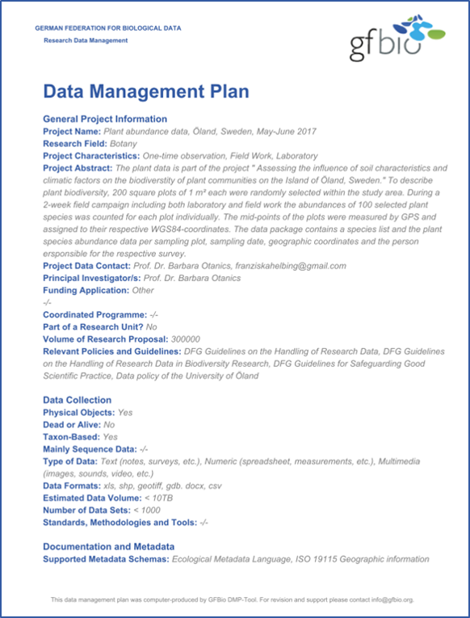
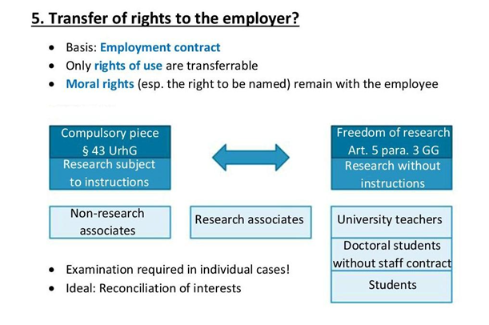

<!--

language: en

narrator: English Female

author:

comment: NFDI4Biodiversity Self-Study Unit - Research Data Management for Biodiversity Data

version: 0.1

-->

# Preface

[qr-code](https://nfdi4biodiversity.org "Checkout the [NFDI4Biodiversity](https://nfdi4biodiversity.org) website!")

# **1. Introduction**

Biodiversity data encompass a vast and interdisciplinary collection of information, spanning all living species and the entire spectrum of life that has ever existed. This remarkable diversity within biodiversity data makes it a highly heterogeneous field. These datasets range from laboratory-generated data, such as results from chemical assays, biological tests, and DNA sequencing, to taxonomic records, as well as spatial and temporal data collected during field experiments, and comprehensive insights into entire ecosystems [^1][^2][^3] . Furthermore, biodiversity data extend their reach into time, including data collected from the distant past, like fossils, and continue into the present while even venturing into predictive models of the future. The complexity of biodiversity data doesn't stop there; these datasets manifest in various formats, including images, photographs, sounds, sensor data, and more. The confluence of this diversity, alongside the increasing automation processes and digitalization of data acquisition, has resulted in a deluge of heterogeneous data, necessitating progressively complex organisation, coordination, and analysis methods.

To address these challenges, Germany has established the National Research Data Infrastructure (NFDI), a pivotal initiative. Within this framework, the consortium "NFDI4Biodiversity" plays a central role. This collaborative effort brings together experts and resources to develop innovative strategies and tools for managing, coordinating, and extracting meaningful insights from the wealth of biodiversity data available today. These efforts are essential in supporting research and conservation endeavours in this field.

In the ever-evolving realms of ecology and environmental science, data play a pivotal role for generating new knowledge. From collecting data in the field to conducting experiments in the lab, researchers generate vast amounts of data. This data holds the key to understanding our natural world, from the intricate ecosystems that surround us to the impact of human activities on the environment. However, the value of this data is fully realised only when it is properly managed, organised, and shared, according to the FAIR [^4] and CARE-principles [^5]. This self-learning unit is designed to empower you with the knowledge and skills you need to learn independently and effectively. Throughout this document, we will explore topics such as data collection best practices, data organisation and documentation, data storage and security, ethical considerations, and the importance of data sharing and collaboration in advancing ecological and environmental research. Whether you are a seasoned researcher looking to enhance your data management practices or a student taking your first steps into this exciting domain, you'll find valuable insights and practical guidance here, to promote data diversity for biodiversity.

As you progress through this unit, you'll become proficient in managing data effectively and contribute to the advancement of ecological and environmental science by ensuring that your research data is findable, accessible, interoperable, and reusable. These skills are not only valuable for your work but also for the broader scientific community and society as a whole. Ecology and environmental science rely heavily on data to understand the natural world and address environmental challenges - data diversity for biodiversity.

[^1]: American Museum of Natural History. (2023). What is Biodiversity? Available at: https://www.amnh.org/research/center-for-biodiversity-conservation/what-is-biodiversity. Last accessed 24 November 2023.

[^2]: Biodiversity Data Journal. (2023). Biodiversity Data Journal. Available at: https://bdj.pensoft.net/. Last accessed 24 November 2023

[^3]: National Geographic. (2023). Biodiversity. Available at: https://education.nationalgeographic.org/resource/biodiversity. Last accessed 24 November 2023.)

[^4]: Wilkinson, M.D., Dumontier, M., Aalbersberg, Ij.J., Appleton, G., Axton, M., Baak, A., et al. (2016). The FAIR Guiding Principles for scientific data management and stewardship. Sci Data, 3, 160018. http://"]https://doi.org/10.1038/sdata.2016.18

[^5]: Carroll, S.R., Garba, I., Figueroa-Rodríguez, O.L., Holbrook, J., Lovett, R., Materechera, S., et al. (2020). The CARE Principles for Indigenous Data Governance. Data Science Journal, 19, 43. https://doi.org/10.5334/dsj-2020-043

# **2. Basics in Research Data Management**

After completing this chapter, you will be able to...

    {{1}}
...explain the relevance of research data management for biodiversity data

    {{2}}
...name the four FAIR principles

    {{3}}
...contextualise how biodiversity research may raise ethical concerns related to indigenous data

## 2.1. Relevance of research data management: FAIR and CARE

Collecting biodiversity data takes a lot of energy and resources. This makes biodiversity data not only valuable for the scientist who collected it, but also to support further research and to inform policy on conservation, natural resources, land use, agriculture and more [^1][^2]. It is important to create a maximum output of this valuable data to protect nature, wildlife and endangered species, to prevent overfishing and extinctions as a way to counteract the climate crisis and biodiversity crisis [^3]. Thus, biodiversity data need to be carefully handled, preserved, and shared, by making them **F**indable, **A**ccessible, **I**nteroperable and **R**eusable (FAIR) [^4], and considering CARE-Principles (**C**ollective Benefit, **A**uthority to Control, **R**esponsibility, and **E**thics) [^5].

, figure SPM3, p. 26, Copyright © IPBES 2019 ")

To put good research practice [^6] and the FAIR principles into practice effective research data management (RDM) is needed. This requires a comprehensive approach that encompasses the planning, collection, storage, analysis, and collaborative sharing of diverse biodiversity data through a well-structured and coordinated research data management strategy [^7]. For research in the biodiversity field, research data management is even more important as non-repeatability and the need to rely on old data, e.g. for trend analysis, is of utmost relevance.

!?[This video](https://youtu.be/s2N2Nh0YNio "This video, published by GFBio, 2020, explains the challenges and solutions of dealing with heterogeneous data.")

[^1]: Biodiversity Data Journal. (2023). Biodiversity Data Journal. Available at: https://bdj.pensoft.net/. Last accessed 24 November 2023.
[^2]: Haase, P., Tonkin, J.D., Stoll, S., Burkhard, B., Frenzel, M., Geijzendorffer, I.R., et al. (2018). The next generation of site-based long-term ecological monitoring: Linking essential biodiversity variables and ecosystem integrity. Science of The Total Environment, 613–614, 1376–1384. https://doi.org/10.1016/j.scitotenv.2017.08.111
[^3]: Brondízio, E.S., Settele, J., Díaz, S. & Ngo, H.T. (Eds.). (2019). The global assessment report of the intergovernmental science-policy platform on biodiversity and ecosystem services. Intergovernmental Science-Policy Platform on Biodiversity and Ecosystem Services (IPBES), Bonn. https://doi.org/10.5281/zenodo.3831673
[^4]: Wilkinson, M.D., Dumontier, M., Aalbersberg, Ij.J., Appleton, G., Axton, M., Baak, A., et al. (2016). The FAIR Guiding Principles for scientific data management and stewardship. Sci Data, 3, 160018. https://doi.org/10.1038/sdata.2016.18
[^5]: Carroll, S.R., Garba, I., Figueroa-Rodríguez, O.L., Holbrook, J., Lovett, R., Materechera, S., et al. (2020). The CARE Principles for Indigenous Data Governance. Data Science Journal, 19, 43. https://doi.org/10.5334/dsj-2020-043
[^6]: DFG. (2022). Guidelines for Safeguarding Good Research Practice. Code of Conduct. https://doi.org/10.5281/zenodo.6472827
[^7]: Members of the Working Group on Data Management of the DFG Senate Commission on Biodiversity Research. (n.d.). Guidelines on the Handling of Research Data in Biodiversity Research. https://www.dfg.de/download/pdf/foerderung/grundlagen_dfg_foerderung/forschungsdaten/guidelines_biodiversity_research.pdf

### 2.1.1. FAIR principles

The FAIR principles play a pivotal role in Research Data Management, emphasising the broad and diverse utilisation of research data while striving to minimise redundant research efforts. Consequently, research data should remain accessible without undue restrictions for an extended duration. This applies to the use of research data collected by the researchers themselves, but also to research data that researchers make available to each other.

The FAIR principles were developed in 2014 in a workshop at the Lorentz Center in the Netherlands and published for the first time in March 2016 in the journal Scientific Data[^1].

Data has to adhere to certain properties to be **F**indable, **A**ccessible, **I**nteroperable and **R**eusable, for example machine-readability, being deposited in a trusted repository etc. The FAIR principles have been significantly refined recently [^2]; in addition, tools have been developed to evaluate your data according to FAIR[^3]. Ultimately, the entire research data management is geared towards fulfilling these concrete verge requirements of the FAIR principles.

[^1]:Wilkinson, M.D., Dumontier, M., Aalbersberg, Ij.J., Appleton, G., Axton, M., Baak, A., et al. (2016). The FAIR Guiding Principles for scientific data management and stewardship. Sci Data, 3, https://www.doi.org/160018.
[^2]:Carroll, S.R., Garba, I., Figueroa-Rodríguez, O.L., Holbrook, J., Lovett, R., Materechera, S., et al. (2020). The CARE Principles for Indigenous Data Governance. Data Science Journal, 19, 43. https://doi.org/10.5334/dsj-2020-043
[^3]: Lang, K., Assmann, C., Neute, N., Gerlach, R. & Rex, J. (2023). FAIR Assessment Tools Overview.

### 2.1.2 CARE principles

The CARE principles (**C**ollective Benefit, **A**uthority to Control, **R**esponsibility, and **E**thics), an addition to the FAIR principles, were introduced by the Global Indigenous Data Alliance (GIDA) in 2019 to address ethical concerns related to indigenous data[^1]. They emphasise the rights of Indigenous Peoples in relation to their data, including information about their language, customs, and territories. It is true that the application of the CARE principles in Germany is still in its infancy. The Government has established the so called [3-way-strategy](https://www.kmk.org/fileadmin/Dateien/pdf/PresseUndAktuelles/2020/201014_Kontaktstelle-Sammlungsgut_Konzept_3-Wege-Strategie.pdf) to provide for access, transparency and cooperation with regard to artefacts of indigenous provenance [^2]. At the same time, they are certainly relevant for biodiversity data. For example, specimens from natural history museums have sometimes been acquired in such a way that they might contradict the CARE principles. The process of coming to terms with these relationships is just beginning and will certainly become more relevant to the biodiversity community in the future. These CARE Principles collectively aim to promote the responsible and ethical use of indigenous data, safeguarding the rights and interests of Indigenous Peoples.

[^1]: Carroll, S.R., Garba, I., Figueroa-Rodríguez, O.L., Holbrook, J., Lovett, R., Materechera, S., et al. (2020). The CARE Principles for Indigenous Data Governance. Data Science Journal, 19, 43. https://doi.org/10.5334/dsj-2020-043
[^2]: Kultusministerkonferenz. (2020). Zugang – Transparenz – Kooperation. Leitlinien einer „3 Wege-Strategie“ für die Erfassung und digitale Veröffentlichung von Sammlungsgut aus kolonialen Kontexten in Deutschland.

## 2.2. The data life cycle

![The image is a circular, color-coded diagram resembling a pie chart with six segments, each representing a different step in the research data management cycle, as indicated by the acronym "RDMkit" in the bottom right corner. Starting from the top right and moving clockwise, each segment has an icon and a label:"Plan" - Illustrated with a pencil icon and colored in orange."Collect" - Depicted with a flask icon and colored in yellow."Process" - Represented by three circles connected by lines, suggesting a process flow, and colored in green "Analyse" - Shown with a bar chart icon and colored in darker green. "Preserve" - Indicated with a database or stack icon and colored in blue. "Share" - Represented by a share icon, two connected dots with a line, and colored in purple. "Reuse" - Illustrated with a circular arrow, implying recycling or reuse, and colored in red. The segments create a cycle around a central white empty circle, suggesting that each step leads to the next in a continuous loop. This diagram likely serves as a visual guide for the stages of managing research data, from planning to reusing data.](https://rdmkit.elixir-europe.org/images/data_life_cycle_9.png "Figure 2. The data life cycle.")

 Source: [RDMkit by ELIXIR-CONVERGE](https://rdmkit.elixir-europe.org/data_life_cycle), [CC BY 4.0](https://creativecommons.org/licenses/by/4.0/).

The data life cycle (DLC) is a conceptual tool which helps to understand the different steps that data follow from data generation to knowledge creation and specifically focuses on the role of data. It strongly suggests that a professional approach to research data management involves more than just collection and analysis, but begins with detailed planning. In order to cope with the heterogeneity of biological datasets, data users, and data producers, a large variety of DLC´s are commonly used within the community. DLC´s often include between 5 and 10 steps, depending on the institution and respective research mission. However, the message and content are quite similar across DLC´s and disciplines. All DLCs share the commonality of adhering to the FAIR principles at each individual step. The differentiation between research domains relates to specific tools and services that are used within the respective community. Figure 2 displays the exemplary DLC RDM-Kit developed by a diverse community of experts and educators spanning various disciplines within the life sciences. The RDM-Kit is a suitable DLC for introducing RDM to a wider audience. The seven phases of a data cycle according to the RDM-Kit are planning, collecting, processing, analysing, preserving, sharing and reusing; an unlimited number of subsequent cycles can follow. Each step of the DLC contains further explanations and specifications in order to cope with the challenges in biodiversity research. Ideally, the FAIR principles should be considered throughout the life cycle of research data. However, the realisation might vary depending on the type of conducted research, the type of collected data and the type of researchers. Here, we focus on the steps that are specifically important for researchers, which work with biodiversity and environmental data.

As a researcher, it is worthwhile to always consider all phases when making decisions and to find out at an early stage which tools and options are available to optimise your practice in dealing with research data. It starts with the planning, then the data is collected, processed and analysed. The life cycle continues with the preservation and sharing of data, until it re-enters the process by data reuse.

!?

This video,[^1]explains the research data lifecycle.

[^1]: published by Ghent University Data Stewards, 2020

## 2.3 Questions

Which of the following statements is a goal of research data management? Choose the correct answer.

<!-- data-randomize data-max-trials="3" data-show-solution-button="0"-->
- [( )] Reducing the amount of research data
- [( )] Preventing active re-use of one's own research data by other researchers
- [( )] Making any research data available to all without technical restrictions
- [(X)] Minimising data loss

What is **not** part of this unit? Choose the correct answer.

<!-- data-randomize data-max-trials="3" data-show-solution-button="0"-->
- [( )] Principles to make data findable, accessible, interoperable and reusable
- [( )] Contents of a data management plan
- [(X)] Legally binding information on your research data
- [( )] Metadata and the use of metadata standards

Select the correct abbreviations.

<!-- data-randomize data-max-trials="3" data-show-solution-button="0"-->
- [[DLC] (ELN) (GBIF) (ROR) (NFDI) [FAIR] (EOSC)]
- [ (X)   ( )   ( )    ( )   ( )    ( )     ( )  ]  Data Life Cycle
- [ ( )   (X)   ( )    ( )   ( )    ( )     ( )  ] Electronic Laboratory Notebook
- [ ( )   ( )   (X)    ( )   ( )    ( )     ( )  ] Global Biodiversity Information Facility
- [ ( )   ( )   ( )    (X)   ( )    ( )     ( )  ] Research Organisation Registry
- [ ( )   ( )   ( )    ( )   (X)    ( )     ( )  ] Nationale Forschungsdateninfrastruktur
- [ ( )   ( )   ( )    ( )   ( )    (X)     ( )  ] Findable, Accessible, Interoperable, Re-usable
- [ ( )   ( )   ( )    ( )   ( )    ( )     (X)  ] European Open Science Cloud

# **3. Planning Research Projects**

## 3.1. Introduction and learning objectives

Let's have a look at the first step in the data life cycle: planning is essential for good results. This requires careful consideration, consultation, and research. A data management plan helps to organise and define the key issues.

After completing this chapter, you will be able to...

...define the key aspects of your planning process

...decide how to structure your data management plan

...find a suitable tool to help you create a data management plan

## 3.2. Relevant Aspects for Planning

When it comes to research data management, many research funders already require a so-called data management plan (DMP) when the application is submitted. However, even without explicit requirements, it is beneficial to document in advance exactly how the data are to be handled. This creates commitment and uniformity (especially in projects with several participants or partners) and can serve as a reference, a checklist, and as documentation.

In general, the following aspects could be relevant for planning:

1.  Determine study design
2.  Assemble project team and clarify roles
3.  Set up a schedule
4.  Plan data management (formats, storage locations, file naming, collaborative platforms, etc.)
5.  Review existing literature and data
6.  Reuse of existing data, if applicable and accessible
7.  Clarify authorship and data ownership
8.  Coordinate access possibilities and conditions

Creating a DMP for your research project is the initial step of the data life cycle and the starting point of your research data management [^1][^2].

[^1]: ELIXIR converge. (2023e). Data management plan. RDMkit. Available at: https://rdmkit.elixir-europe.org/data_management_plan. Last accessed 24 November 2023.
[^2]: GFBio. (2022). How to create a data management plan (DMP)? gfbio. Available at: https://www.gfbio.org/how-to-create-a-dmp. Last accessed 15 September 2022.

## 3.3. Data management plan (DMP)

In your data management plan (DMP), you define the strategy on how to manage your data and documentation during the whole project.

A DMP is a comprehensive document that outlines the activities to be performed and their implementation during all phases of the data life cycle to ensure the data remain accessible, usable, and comprehensible (understandable). Of course, this also includes basic information such as the project name, third-party funders, project partners, among others.

The DMP thus records how the research data are handled during and after the research project. To create a substantial DMP, it is necessary to systematically address topics such as data management, metadata (structured data that describe the data), data retention and data analysis. It makes sense to create the DMP before starting the data collection because it forms the basis for decisions concerning data storage, backup, and processing, among other aspects. Nevertheless, a DMP is not a static document, but rather a dynamic document that is constantly updated and provides assistance throughout your whole project.

The DMP contains general information about the project and the way of documentation, descriptions of the used and collected data, used metadata, and ontologies (Figure 3). Furthermore, it includes information about data storage, data security, and preservation during and after the project, sharing of the data, and publication. The responsibilities, costs, and resources needed are listed as well as information about ethical and legal issues [^1]. This is also important to meet the Nagoya protocol needs, e.g. permits for collecting samples.

This video [^2] explains why you should create a DMP at the beginning of your project:
!?

[^1]: ELIXIR converge. (2023b). Data Life Cycle - Planning. RDMkit. Available at: https://rdmkit.elixir-europe.org/planning. Last accessed 4 October 2022.
[^2]: published by GFBio, 2020

### 3.3.1. Content of a data management plan

The DMP contains information about the data, the data format, how the data are handled and how the data are to be interpreted. Recently, a [DFG checklist](https://www.dfg.de/download/pdf/foerderung/grundlagen_dfg_foerderung/forschungsdaten/forschungsdaten_checkliste_en.pdf) has provided further guidance on these aspects [^1]. To decide which aspects should be included, the following questions can be helpful:

-   What data are created?
-   How and when do you collect the data? And, which legal regulations are relevant for your research project? For example, are permits required for collecting samples, is the Nagoya protocol relevant and permits to import or export samples are needed?
-   How do you process the data?
-   What format do you have for data storage and why?
-   Do you use file naming standards?
-   How do you ensure the quality of the data? This refers to the collection as well as to the analysis and processing
-   Do you use existing data? If so, where does it come from? How will existing and newly collected data be combined and what is the relationship between them?
-   Who is responsible for data management?
-   Are there any obligations, e.g. by third-party funding bodies or other institutions, regarding the sharing of the data created? (legal requirements also play a role here)
-   How will the research data be shared? From when on, and for how long will it be available?
-   How will the research data and objects be archived and is it mandatory (e.g. DFG requires storing data)? (When you plan to add your data and objects to a collection, curators should be already contacted during the planning phase, also keep the storage regulations for physical objects in mind).
-   What costs arise for the RDM (these include e.g. personnel costs, hardware and software costs, possible costs for a repository) and how are these costs covered?
-   What ethical and data protection issues need to be taken into account?
-   Is it necessary for political, commercial, or patent reasons to make the research data accessible only after a certain blocking period (Embargo)?
-   How will the data be used in the future?
-   In what way should the data be cited? Can the data be made unambiguous and permanently traceable using a persistent identifier?

There are different DMP templates available which you can use. Before writing your DMP check with your funding agency or institution whether a specific DMP template is required. If not, here are two examples:

1.  GFBio services provide expert guidance and assistance on standards and suitable archives. You can use the [GFBio DMP Tool](https://dmp.gfbio.org/) online, or refer to the [GFBio Model Data Management Plan (DMP)](https://data.goettingen-research-online.de/dataset.xhtml?persistentId=doi:10.25625/W3YEEQ) for basic structuring.
2.  The HU Berlin offers standardised [DMP templates](https://www.cms.hu-berlin.de/de/dl/dataman/arbeiten/dmp_erstellen) for different funders (Horizon 2020, BMBF, DFG, Volkswagenstiftung).

[^1]: DFG. (2022). Guidelines for Safeguarding Good Research Practice. Code of Conduct. https://doi.org/10.5281/zenodo.6472827

### 3.3.2. Benefits of a DMP

A DMP will make your project more efficient, simplify your own reuse of the data, and help you make your data findable, accessible, interoperable and reusable, also called FAIR. It will help you to plan the costs of equipment and resources, identify problems and find solutions at an early stage. It will also clarify responsibilities and roles in the project team and facilitate data preservation, sharing and reuse. It is good research practice to write a data management plan and thus take care of your research data. Currently, it is frequently a requirement by research organisations and funders [^1][^2].

Overall, the DMP will save you time later on in the publishing process and prevents data loss - the main winner of creating a DMP is you! If you consider in advance how the data should be processed, stored, and filed, you probably won't have to reorganise your data. If, for example, it is already clear during data collection how the data is to be archived later, it can be formatted and stored right away in such a way that the transfer to the later archive is as simple as possible. Some domain-specific data centers strongly encourage you to contact them early on in a project to determine concrete requirements for taking on your data. There is a strong benefit of going towards FAIRness with a DMP: A DMP will allow you to gather in one document how to deal with the heterogeneous biodiversity data from collections, research, etc. and will serve as a model for understanding this information and disseminating it.

[^1]: ELIXIR converge. (2023b). Data Life Cycle - Planning. RDMkit. Available at: https://rdmkit.elixir-europe.org/planning. Last accessed 4 October 2022.
[^2]: forschungsdaten.info. (2023b). Der Daten­manage­ment­plan. Eine Wegbeschreibung für Daten. Forschungsdaten und Forschungsdatenmanagement. Available at: https://forschungsdaten.info/themen/informieren-und-planen/datenmanagementplan/. Last accessed 15 September 2022.

## 3.4. Tools for data management

There is now a whole range of tools to support researchers during each step of the data lifecycle. Data Management Planning tools, for example, facilitate the creation of data management plans either using text modules ([RDMO Organiser on GitHub](https://rdmorganiser.github.io/en/), [RDMO University Marburg](https://rdmo.uni-marburg.de/)) or one is guided through a catalogue of questions. There are usually different templates for different funders and purposes that often provide web-based DMP tools that help you to draft your own suitable DMP [^1]. GFBio, for instance, offers a Data Management Plan Tool ([GFBio DMP-Tool](https://dmp.gfbio.org/), [DMP Tool](https://dmptool.org/), [DMP online](https://dmponline.dcc.ac.uk/)) that is tailored to create customised DMPs according to DFG guidelines based on the requirements of biodiversity, ecological, and environmental projects. Further, GFBio offers professional support. Thus, your DMP will be cross-checked by experts in the field.

.") 

Furthermore, there are Data Management tools which support data management during the active project phase. Data management tools are software applications or platforms designed to efficiently collect, store, organise, process, and analyse data, but they often have to be set up and hosted by your institution or project partners. Here's a brief explanation of key aspects of data management tools:

**Data Collection:** Data management tools often provide capabilities to collect data from various sources, including databases, sensors, forms, and external APIs. They streamline the process of gathering information and ensure data is standardised for consistency.

**Data Storage:** These tools often provide storage solutions, such as databases, data warehouses, or cloud-based storage. Data is typically organised into structured formats for easy retrieval.

**Data Organisation:** Data management tools allow users to categorise and label data, assign metadata (information about the data), and create data dictionaries to maintain order and accessibility.

**Data Processing:** Many tools include data transformation and processing features for tasks like cleaning, aggregating, and merging data. This ensures data is accurate and ready for analysis.

**Data Analysis:** Advanced data management tools often integrate with analytics and visualisation tools, enabling users to derive insights, generate reports, and make data-driven decisions.

**Data Security:** Security features like encryption, access control, and authentication are critical to protect sensitive data from unauthorised access or breaches.

**Data Backup and Recovery:** Reliable tools include data backup and recovery mechanisms to prevent data loss due to accidents or system failures.

**Data Compliance:** Data management tools often assist in compliance with data regulations by providing features for data anonymization, audit trails, and consent management.

**Data Collaboration:** Some tools offer collaboration features, allowing teams to work together on data-related tasks, share insights, and maintain version control.

**Data Governance:** Data governance features help organisations establish policies, standards, and procedures for managing data, ensuring data quality, and maintaining data integrity.

**Integration:** Data management tools often integrate with other software and systems, enhancing their capabilities and enabling data flow between different parts of an organisation.

GFBio recommends two major systems with [tools](https://www.gfbio.org/tools/) for biodiversity data management: [Diversity Workbench](https://diversityworkbench.net/Portal/Diversity_Workbench) (DWB) and [BExIS2](https://bexis2.github.io/software/features) and offers training for both. DWB facilitates efficient data entry, storage, and management for biodiversity research, encompassing various data types. It enforces data standardisation to maintain consistency. BExIS2 specialises in managing large-scale biodiversity data, integrating diverse sources for easier analysis. It emphasises metadata and documentation to provide context for datasets. Both systems can further help you during data collection. In addition, various tools exist which help you collecting and managing your data in the lLab as well as in the field such as [Smatrix](https://smatrix.systems/), [RightField](https://rightfield.org.uk/) and Laboratory Information Management Systems (LIMS) or Electronic Lab Notebooks [^2][^3][^4][^5]. Smatrix and RightField aid in data collection and structuring, while LIMS systems provide comprehensive solutions for data organisation and management within laboratory environments. ELNs, on the other hand, offer digital platforms for recording, storing, and sharing experimental findings, streamlining the research process. Together, these tools play a pivotal role in advancing data management capabilities.

[^1]: ELIXIR converge. (2023e). Data management plan. RDMkit. Available at: https://rdmkit.elixir-europe.org/data_management_plan. Last accessed 24 November 2023.
[^2]:ELIXIR converge. (2022b). Data Life Cycle - Collecting. RDMkit. Available at: https://rdmkit.elixir-europe.org/collecting. Last accessed 4 October 2023.
[^3]: GFBio. (2023c). GFBio Training Materials: Data Life Cycle Fact-Sheet: Data Life Cycle: Collect. GFBio. Available at: https://www.gfbio.org/training/material/data-life-cycle/collect/. Last accessed 27 November 2023.
[^4]: Wolstencroft, K., Owen, S., Horridge, M., Krebs, O., Mueller, W., Snoep, J.L., et al. (2011). RightField: embedding ontology annotation in spreadsheets. Bioinformatics, 27, 2021–2022. https://www.doi.org/10.1093/bioinformatics/btr312
[^5]: ZB Med. (2023). ELN Finder. TU Darmstadt. Available at: https://eln-finder.ulb.tu-darmstadt.de/home. Last accessed 30 October 2023.

## 3.5 QuestionsWhich of these aspects are part of a data management plan?

<!-- data-randomize data-max-trials="3" data-show-solution-button="0"-->
- [[X]] Naming those responsible for data management
- [[ ]] Vote of an ethics committee
- [[X]] Information on data archiving
- [[X]] Costs of data management and data storage
- [[X]] Information on storage and backup during the project
- [[ ]] Description of the benefits of the data management plan
- [[X]] Information on data publication

Which statement is true?

<!-- data-randomize data-max-trials="3" data-show-solution-button="0"-->
- [(X)] A data management plan saves time and helps me to minimize data loss.
- [( )] I only need to create a DMP if I expect large amounts of data.
- [( )] The DMP is primarily a control instrument for funding institutions.

# **4. Collecting Data**

## 4.1. Introduction and learning objectives

Data collection is an important step of the data life cycle as it is the basis of knowledge creation. Data is collected regarding specific methods, settings and instruments. To generate comprehensible and reusable data, it is necessary to document data acquisition using metadata.

It is also possible to reuse already collected data and to integrate it into your own project. However, be aware that data integration can be very tedious. This can be data from your previous research project or data from repositories [^1][^2].

Since in biology, taxonomic designations can vary depending on the source and concept used, harmonisation is necessary in some cases.

After completing this chapter, you will be able to\...

...select appropriate tools to assist you in the data collection process.

\...recognise metadata and the benefits of metadata

\...name important categories of metadata

\...name selected metadata standards

\...create your own metadata

...select a suitable tool for handling metadata

\...describe your research data via metadata so that your research data can be used in the future and by machine-reading systems

...name the important elements of taxonomic information that are necessary to merge different species data sets

[^1]: ELIXIR converge. (2022b). Data Life Cycle - Collecting. RDMkit. Available at: https://rdmkit.elixir-europe.org/collecting. Last accessed 4 October 2023.
[^2]: GFBio. (2023c). GFBio Training Materials: Data Life Cycle Fact-Sheet: Data Life Cycle: Collect. GFBio. Available at: https://www.gfbio.org/training/material/data-life-cycle/collect/. Last accessed 27 November 2023.

## 4.2. Data search

Often, already existing data can help answer your research question. Searching for such data is easier with well-maintained and annotated (= enriched with metadata) data. This applies for both data providers and subsequent users. Making research data available beyond a research project allows other researchers and research groups to retrieve the data when it has become relevant for research again.

If you want to reuse already existing data, you can use different search tools, including:

-   [GFBio search tool](https://www.gfbio.org/search) ([video tutorials](https://www.youtube.com/playlist?list=PLE9wx7mxT8gtj2b5wty9XDAR9AkvTDvxK))

-   [GBIF](https://www.gbif.org/) - Free and open access to biodiversity data (especially occurrence data)

-   [PANGAEA](https://www.pangaea.de/) - Earth, environmental and biodiversity data

-   [BacDive](https://bacdive.dsmz.de/) - Database for standardised bacterial information

It is always important to check the copyrights and licences before reusing data and seek permission when necessary.

## 4.3. Data collection

Overall, the data collection should cover the following aspects:

-   Standardised sampling protocols

-   Carrying out the experiments, observations, measurements, simulations, etc.

    -   at the same time: metadata collection and creation

    -   at the same time: documentation of the data collection

-   Generation of digital raw data (e.g. by digitising or transcribing)

-   Storage of the data in a uniform format

-   Systematic and consistent folder structure

-   Backup and management of data

It is important to create an experimental design in advance with a collection strategy on which data will be collected (What? Where? When? Who? How?) including calibration, controls, repetitions, randomisation, etc. You need to determine suitable metadata standards and methodologies, and to consider how and where to store the data and how to capture provenance (e.g. of samples and instruments). Be always aware of the data quality. If you work with sensitive, confidential, or human-related data, consider aspects such as permissions or consent, data protection, and data security.

In addition, errors occurring during data collection affect the downstream research process and in the worst-case lead to incorrect results without notice. This makes it all the more important to be careful during the data collection phase.

### 4.3.1. Electronic lab notebooks (ELNs)

An Electronic Lab Notebook (ELN) is a software tool, which replicates a page in a paper lab notebook. You can write your observations, notes, protocols and more using your computer. An ELN has several advantages: Your notes are conserved and your colleagues or followers can repeat the same experiments, data can easily be linked with the experiment, are more traceable, more secure as well as reusable. Hence, good data management and implementation of the FAIR principles is facilitated. Some ELNs can also benefit your teamwork, for example, handle equipment use and booking, or manage inventories of supplies, chemicals or samples. There are different ELNs, with advantages and disadvantages. Some are generic, some are specialised for certain disciplines or provide specific functions e.g. drawing of chemical structures [^1]. However, there is no ELN specifically for biodiversity and environmental data. The establishment of an ELN depends to a large extent on the individual possibilities in the working group/institution and, above all, on its own data types. The [ELN Finder](https://eln-finder.ulb.tu-darmstadt.de/search) can help you decide which ELN fits your requirements [^2]. A free and very flexible solution that has proven itself in the natural sciences is the cloud-based ELN [eLabFTW](https://www.elabftw.net/).

[This video](https://youtu.be/HktyUDcDU7o) (published by NCSU BIT, 2017) shows you how to use electronic lab notebooks.

eLabFTW is a free, secure and open source ELN for research teams. You can document your experiments and manage your lab. There is a big [github community,](https://github.com/elabftw/elabftw) where you can find a lot of information.

[This video](https://www.youtube.com/watch?v=oEsJmlKy4WE) (published by The NOMAD Laboratory, 2022) shows you how to set up eLabFTW.

[^1]: NFDI4Chem. (2023). Electronic Lab Notebooks (ELNs). NFDI4Chem Knowledge Base. Available at: https://knowledgebase.nfdi4chem.de/knowledge_base/docs/eln/. Last accessed 4 October 2023.
[^2]: TU Darmstadt. (2023). ELN Finder. ELN Finder. Available at: https://eln-finder.ulb.tu-darmstadt.de/search. Last accessed 21 November 2023.

### 4.3.2. Metadata and standards

A crucial step in RDM is to describe your data in a way that you and other researchers can understand, find, reuse and properly cite your data. Making your data FAIR means that you need to describe the data in a structured and detailed way. A structured description of the data is called metadata. It contains information about the subject and the creator of the data, such as why, how, where and when the data was generated and what the content of the data is. To avoid errors and to create compatible and interoperable metadata, specific metadata standards can be used [^1][^2].

[^1]: ELIXIR converge. (2023f). Documentation and metadata. RDMkit. Available at: https://rdmkit.elixir-europe.org/metadata_management. Last accessed 2 October 2023.
[^2]: GFBio. (2023d). GFBio Training Materials: Data Life Cycle Fact-Sheet: Data Life Cycle: Describe. GFBio. Available at: https://www.gfbio.org/training/material/data-life-cycle/describe/. Last accessed 27 November 2023.

#### 4.3.2.1. Metadata

Metadata describes your data in detail. It should contain the technical details (names of datasets and data files, the file formats) and information about the data structure and processing (versioning, hard- and software, methods, tools, instruments, etc.). The descriptive metadata should further contain information about scientists/collectors and contact persons involved as well as the scientific background of the data: the hypothesis, standards, calibrations, spatial and temporal information, units, formats, codes and abbreviations [^1][^2]. Furthermore, each data set is accompanied by administrative information such as stakeholders, funding, access rights, etc.

Metadata ensures that research data can continue to be used today and in the future, even if the people involved in the experiments at the time are now busy with other research priorities or no longer available to provide more detailed information about the earlier experiments. Without metadata, such research data is often worthless, as it is incoherent and incomprehensible.

In order to assign metadata correctly and to be able to continue to use your data correctly and in an orderly manner, it is best to document metadata right from the start of the research project. However, metadata must be created at the latest when your research data is to be deposited in a repository, published, or archived for the long term.

Often, however, it is no longer possible to create certain metadata retrospectively. This can be the case, for example, in a long project when it is necessary to explain the provenance (origin) of the data precisely for others.

[^1]: ELIXIR converge. (2023f). Documentation and metadata. RDMkit. Available at: https://rdmkit.elixir-europe.org/metadata_management. Last accessed 2 October 2023.
[^2]: GFBio. (2023d). GFBio Training Materials: Data Life Cycle Fact-Sheet: Data Life Cycle: Describe. GFBio. Available at: https://www.gfbio.org/training/material/data-life-cycle/describe/. Last accessed 27 November 2023.

#### 4.3.2.2. Metadata structure

Metadata always have a certain internal structure, even though the actual application can take different forms (e.g. from a simple text document to a table form to a very formalised form as an XML file that follows a certain metadata standard). The structure itself depends on the described data (for example, use of headers and legends in Excel spreadsheets versus a formalised description of a literary work in an OPAC), the intended use and the standards used. Generally speaking, metadata describe (digital) objects in a formalised and structured way. Such digital objects also include research data.

It makes sense, but is not absolutely necessary, for metadata to be readable not only by humans, but also by machines, so that research data can be processed by machines and automatically. Machines are primarily computers in this case, which is why one can also speak more precisely of readability for a computer. To achieve this, the metadata must be available in a machine-readable markup language. Research-specific standards in the markup language XML (Extensible Markup Language) are often used for this, but there are also others such as JSON (JavaScript Object Notation). When submitting (research data) publications, in most cases there is the option of entering the metadata directly into a prefabricated online form. Often it can take a substantial amount of time until a publication is submitted. Thus, it is important that metadata are collected and stored right when data are collected. A detailed knowledge of XML, JSON or other markup languages is therefore not necessarily required when creating metadata for your own project, but it can contribute to understanding how the research data is processed.

Machine readability is an essential point and becomes important, for example, when related research data are to be found by keyword search or compared with each other. A machine-readable file can be created using special programs. In the section "How do I create my metadata" you will be introduced to appropriate programs.

#### 4.3.2.3. Metadata categories

There are many categories that can and often need to be described by metadata (Figure 4). Depending on the field and research data, these categories can differ greatly, but some are considered standard categories for all disciplines.

In the context of a citable publication, the inclusion of a 'persistent identifier' (PID) within the metadata is essential. An identifier is used for permanent and unmistakable identification (see [chapter 6.4](https://docs.google.com/document/d/1fSZOVMDWA7U3TC8gL6jCsBiHsuc4NLJWnj7Qas9kAeo/edit#heading=h.3o7alnk)). Furthermore, the metadata should indicate who the author of the data is. In the case of research groups, all those involved in the work or who may have rights to the research data should be named. The latter should, of course, include third-party funders like the DFG, BMBF or companies that may have contributed to the funding of the research. Always make sure that the names are complete and unambiguous. If a researcher ID (e.g. ORCID) is available, this should be mentioned (see [chapter 6.4](https://docs.google.com/document/d/1fSZOVMDWA7U3TC8gL6jCsBiHsuc4NLJWnj7Qas9kAeo/edit#heading=h.3o7alnk)).

The research topic should be described in as much detail as necessary. For best findability of the research data, it can also be useful to mention keywords that can then be used in a digital database search to achieve better results. Keywords should complement the publication title, not repeat it.

Furthermore, for the traceability of the research data, clear information is needed for parameters such as place/time/temperature/social setting, and any other conditions that make sense for the data. This also includes instruments and devices used with their exact configurations.

If specific software was used to create the research data, the name of the software must also be mentioned in the metadata. Of course, this also includes naming the software version used, as this makes it easier for researchers to repeat analyses e.g. with older versions of R, or to understand later why this data can no longer be reproduced or opened in the case of very old data.

Some metadata requirements are always the same. This also applies to the categories just listed, which are very generic. For such cases, there are subject-independent metadata standards. Other requirements can differ greatly between different disciplines. Therefore, there are subject-specific standards that cover these requirements.

![The image is a colorful diagram with an octagonal shape made up of several smaller segments, centered around the concept of "Research data," which is written in the middle of a yellow hexagonal core.
Around this core are six orange hexagons with the questions "What," "Who," "Where," "When," "Why," and "With what," each pointing to the central concept.
Surrounding these question hexagons are larger blue segments with more specific details related to the questions:
"What" points to "Research subject" and "Unambiguous attribution of research data."
"Who" points to "Researcher with persistent ID" and "DOI for research data and metadata."
"Where" points to "Geographical features," "Country," "Society," and "Laboratory conditions."
"When" points to "Date of the survey," "Day/night," and "Season."
"Why" points to "Research question and hypothesis."
"With what" points to "Devices and measurement technology used," "Documentation of the procedure," and "Settings of devices and techniques used."
Each of these blue segments also contains smaller text detailing various aspects of research data management, such as rights of use, citation guidelines, possible uses of data, co-authors, and parameters.
The overall diagram serves as a visual guide to the considerations and components of managing and understanding research data, emphasizing the interconnectedness of these elements.](figure4_metadata_categories_FOKUSproject.png)Figure 4. Different categories of metadata to describe the actual research data. Source: [FOKUS](https://www.uni-marburg.de/en/hefdi/about-hefdi/projects/fokus), by Henrike Becker, [CC BY 4.0](https://creativecommons.org/licenses/by/4.0/), English translation by HeFDI.

#### 4.3.2.4. Metadata standards

One very important aspect of metadata already mentioned at the beginning is its readability for humans and machines. The large number of different metadata needed to describe research data can become a problem in view of the additional large number of different scientific communities, each with their own needs. On the one hand, there is metadata that is necessary across scientific fields (e.g., name of author, title, date of creation, etc.), but on the other hand there is also subject-specific metadata that depends on the research area or even the research subject.

Imagine that research group 1 has created a lot of research data over several experiments of the same kind with different room temperatures. Research group 2 has conducted the same experiment with the same substances at the same room temperature and different levels of oxygen in the air and has also created research data. Research group 1 refers to the parameter "room temperature" as "rtemp" in their metadata, but research group 2 only refers to it as "temp". How do the researchers of research group 1 and how does a computer system know that the value "temp" of research group 2 is the value "rtemp" of research group 1? It's just not easily possible and thus reduces the usefulness of the data.

So how can it be ensured that both research groups use the same vocabulary (= terminology) when describing their metadata, so that in the end it is not only readable but also interpretable? For such cases, metadata standards have been and are being developed by various research communities to ensure that all researchers in a scientific discipline use the same descriptive vocabulary. This ensures interoperability between research data, which plays a crucial role in expanding knowledge when working with data.

Metadata standards thus enable a uniform design of metadata. They are a formal definition, based on the conventions of a research community, about how metadata should be collected and recorded. Despite this claim, metadata standards do not represent a static collection of rules for collecting metadata. They are dynamic and adaptable to individual needs. This is particularly necessary because research data in projects with new research methods can be very project-specific and therefore the demands on their metadata are just as strongly project-specific.

There are many different metadata standards, some are more generic (e.g. [Dublin Core](https://www.dublincore.org/specifications/dublin-core/)), others are for specific disciplines (e.g. [ABCD](https://abcd.tdwg.org/), [Darwin Core](https://dwc.tdwg.org/), [EML](https://eml.ecoinformatics.org/), [MIxS](https://rdamsc.bath.ac.uk/msc/m108) or [SDD](https://www.tdwg.org/standards/sdd/) for biological data) or data types (e.g. [MIABIS](https://github.com/BBMRI-ERIC/miabis/blob/master/README.md) for biosamples, [MIAME](https://doi.org/10.1038/ng1201-365) for microarrays, [MIAPPE](https://www.miappe.org/) for plant phenotyping experiments). To decide which standard to use, you can have a look at the repository where you want to deposit your data, to see if they have guidelines, checklists or best practices. Some repositories (e.g. GenBank). If you are unsure which repository you are going to use, you can check the following websites for more information about the right metadata [^1]:

-   [Digital Curation Centre (DCC) -- List of Disciplinary Metadata Standards](https://www.dcc.ac.uk/guidance/standards/metadata/list)

-   [Research Data Alliance (RDA) - Metadata Standards Catalog](https://rdamsc.bath.ac.uk/)

-   [FAIRsharing.org - Standards](https://fairsharing.org/search?fairsharingRegistry=Standard)

-   [Data submission templates for biodiversity, ecological and collection data - GFBio Data Cent](https://gfbio.biowikifarm.net/wiki/Data_submission_templates_for_biodiversity,_ecological_and_collection_data)ers

[^1]: ELIXIR converge. (2023f). Documentation and metadata. RDMkit. Available at: https://rdmkit.elixir-europe.org/metadata_management. Last accessed 2 October 2023.

#### 4.3.2.5. Controlled vocabularies and authority files

As you have seen so far, metadata standards define the categories with which data can be described in more detail. On the one hand, these include interdisciplinary categories such as title, author, date of publication, type of study, etc., but on the other hand they also include subject-specific categories such as substance temperature in chemistry or materials science. However, there is no definition or validity check of how you fill the respective categories with information.

What date format do you use? Is the temperature given in Celsius or Fahrenheit and with "°" or "degrees"? Is it a "survey" or a "questionnaire"? These questions seem superficial at first glance, but predefined and uniform terms and formats are closely related to machine processing, search results and linkage with other research data. For example, if the date format does not correspond to the format a search system works with, the research data with the incompatible format will not be found. If questionnaires are searched for, but the term "survey" is used in the metadata, it is not certain that the associated research data will also be found.

For the purpose of linguistic standardisation in the description of metadata, so-called controlled vocabularies have been developed. In the simplest form, these can be pure word lists that regulate the use of language in the description of metadata, but also complex, structured thesauri. Thesauri are word networks that contain words and their semantic relations to other words. This makes it possible, among other things, to unambiguously resolve polysemous (ambiguous) terms (see e.g. [Thesaurus of Plant Traits](https://top-thesaurus.org/)). A semantic thesaurus, often referred to as a semantic network, is a structured vocabulary or knowledge representation system that goes beyond traditional thesauri by capturing not only hierarchical relationships (such as broader terms and narrower terms) between concepts or terms but also semantic relationships, associations, and meaning. It is designed to provide a richer and more contextually meaningful representation of the terms or concepts within a specific domain or knowledge area. Thesauri primarily focus on managing and facilitating the retrieval of words or terms used in documents or databases. Their main purpose is to help users find synonyms, related terms, and broader or narrower terms to improve information retrieval and search. In contrast, ontologies, such as [ENVO](https://sites.google.com/site/environmentontology/home) or the unit ontologies (e.g. [UO](https://www.ebi.ac.uk/ols4/ontologies/uo)) are used to represent and define complex relationships and concepts within a specific domain. They aim to capture the semantics and meaning of concepts, enabling a more comprehensive understanding within a specific domain or subject area. They serve as a formal and standardised framework for organising and categorising information, making data more accessible, interoperable, and understandable across various applications and disciplines. By providing a common vocabulary and a set of defined relationships, ontologies are invaluable tools in fields such as information retrieval, data integration, artificial intelligence, and the Semantic Web. They enable researchers and systems to achieve a shared understanding of complex domains, fostering more efficient data management and knowledge exchange. [This video](https://youtu.be/WHyQitAo4ac) [^1] explains the importance of semantic search engines to find relevant data.

Ontologies and thesauri are distinct systems for structuring and categorising information. Ontologies serve to represent complex relationships and concepts within a specific domain. In contrast, thesauri primarily aid in word or term retrieval, offering synonyms, related terms, and hierarchical relationships to enhance information search and indexing. Ontologies provide a comprehensive, detailed representation of knowledge, while thesauri are more focused on managing and organising terms for search and categorization. The choice between the two depends on the specific needs and goals of a given project or application.

As a researcher or research group, how can you ensure the use of consistent terms and formats? As an individual in a scientific discipline, it is worth asking about controlled vocabularies within that discipline at the beginning of a research project. A simple search on the internet is usually enough. Even in a research group with a research project lasting several years, a controlled vocabulary should be searched for before the project begins and before the first analysis. If none can be found, it is worthwhile, depending on the number of researchers involved in the project and the number of sites involved, to create an internal project document for the uniform coordination of the terms and technical terms used, which should be used in the respective metadata categories.

GFBio provides a [Terminology Service containing a](https://terminologies.gfbio.org/browse/)collection of terminologies that are relevant in the field of biology and environmental sciences. This service acts as a resource, providing researchers with a common framework for defining and categorising various aspects of biodiversity, including species names, ecological interactions, and ecosystem processes. By utilising GFBio's Terminology Service, scientists can ensure consistency and precision in their research, promoting clarity and enabling seamless integration and comparison of biodiversity data across different studies. This unified approach to vocabulary and terminology strengthens collaboration and understanding within the scientific community, advancing our knowledge and conservation efforts in the diverse and intricate world of biodiversity.

In addition to controlled vocabularies, there are also many authority files which, in addition to uniform naming, make many entities uniquely referenceable. For example [ORCID](https://orcid.org/), short for Open Researcher and Contributor ID, which identifies academic and scientific authors via a unique code. The specification of such an ID distinguishes any frequently occurring and therefore ambiguous names and should hence be used as a matter of preference.

Probably the best-known standards file in Germany is the Gemeinsame Normdatei ([GND](https://gnd.network/Webs/gnd/EN/Home/home_node.html), eng. Integrated Authority File), which is maintained by the Deutsche Nationalbibliothek ([DNB](https://www.dnb.de/), eng. German National Library), among others. It describes not only persons, but also "corporate bodies, conferences, geographies, subject terms and works related to cultural and scientific collections". Each entity in the GND is given its own GND ID, which uniquely references that entity. For example, Charles Darwin has the ID 118523813 and Alfred Russel Wallace has the ID 118806009 in the GND. These IDs can be used to reference Darwin and Wallace unambiguously in metadata with reference to the GND (e.g. Darwin in the [DNB](https://d-nb.info/gnd/118523813), Wallace in [Wikidata](https://www.wikidata.org/wiki/Q160627)). Another example from research is the so-called [Research Organization Registry](https://ror.org/) (ROR), that provides an unique identifier for each research organisation.

[GeoNames](https://www.geonames.org/) is an online encyclopaedia of places, also called a gazetteer. It contains all countries and more than 11 million place names that are assigned a unique ID. This makes it possible, for example, to directly distinguish between places with the same name without knowing the officially assigned municipality code (in Germany, the postcode). For example, Manchester in the UK (2643123), Manchester in the state of New Hampshire in the US (5089178) and Manchester in the state of Connecticut in the US (4838174) can be clearly distinguished.

In general, investigate about specific requirements as soon as you know where you want to store or publish your research data. Once you know these requirements, you can create your own metadata. When referring to specific commonly known entities, always try to use a unique ID, specifying the thesaurus used.

If you want to know whether a controlled vocabulary or ontology already exists for your scientific discipline or a specific subject area, you can carry out a search at [BARTOC](https://bartoc.org/), the "Basic Register of Thesauri, Ontologies & Classifications" as a first step. As a second step, [BioPortal](https://bioportal.bioontology.org/) and the [EMBL-EBI Ontology Lookup Service](https://www.ebi.ac.uk/ols4/) are very suitable resources for our domain.

[^1]:(published by GFBio project, 2017)

#### 4.3.2.6. Creation of your metadata

Metadata can be created manually or using specific tools. Tools, also for subject-specific metadata, are available online and often free to use. However, ask colleagues or data managers at your institution about established routines or licences for proprietary software commonly used in your research area. The following tools for creating metadata are only a selection (also Table 2). Maintaining tools and software packages is a lot of work, so some tools may be discontinued after a while. The important step is to add metadata to your data. Which tools you use is secondary.

A simple way to create metadata is to use a table with the elements of your chosen metadata standard as columns. You can use any spreadsheet software to set this up. For example, GBIF provides templates for [occurrence data](https://ipt.gbif.org/manual/en/ipt/latest/occurrence-data#templates), [checklist data](https://ipt.gbif.org/manual/en/ipt/latest/checklist-data#templates), [sampling event data](https://ipt.gbif.org/manual/en/ipt/latest/sampling-event-data#templates) and [resource metadata](https://ipt.gbif.org/manual/en/ipt/latest/resource-metadata#template) following the metadata standard [Darwin Core](https://dwc.tdwg.org), an extension of Dublin Core that facilitates the sharing of information about biological diversity. GFBio provides more specific templates which also prepare sample depositions in [German data centers](https://gfbio.biowikifarm.net/wiki/Data_submission_templates_for_biodiversity,_ecological_and_collection_data) for different sample types and taxa ([organisms, tissue](https://gfbio.biowikifarm.net/wiki/Data_submission_templates_for_biodiversity,_ecological_and_collection_data), [molecular data](https://gitlab-pe.gwdg.de/gfbio/molecular-submission-templates), etc.). All of these templates are spreadsheets with details on minimum metadata requirements.

[RightField](https://rightfield.org.uk/) is an open-source tool which sets up or helps you fill in simple spreadsheet tables depending on the metadata standard you choose. Ontologies can either be imported from local file systems, the web, or from the BioPortal ontology repository. RightField translates these ontologies into a spreadsheet table, and you only have to choose from the predefined terms to create your standardised metadata. You can build your own templates, too, but we highly recommend using an existing, widespread metadata standard to make your metadata findable and interoperable.

Tools with simple graphical user interfaces are not available for all metadata standards. Therefore, if you want or need to work directly with an existing XML metadata standard, you should either use the free editor [Notepad++](https://notepad-plus-plus.org/) or the paid software [oXygen](https://www.oxygenxml.com/), if licences are available at your institution. Both editors offer better usage and display options to make content and element labels visible separately.

To create metadata in the XML metadata standard [EML](https://eml.ecoinformatics.org) (Ecological Metadata Language), you can use the online tool [ezEML](https://ezeml.edirepository.org/eml/about). ezEML is free of charge and only requires a registration. It can be used as a "wizard" to guide you step-by-step through the creation of your EML document. However, ezEML also offers a range of other workflows, such as data table upload, and checking your EML document for correctness and completeness.

The open source online tool [CEDAR Workbench](https://more.metadatacenter.org/tools-training/orientation) allows online templates based on metadata standards to be created via a graphical user interface, filled in and also shared with other users. At the same time, templates created by other users can also be used for one's own research. All you need to do is register free of charge. If you are working with biodiversity survey or monitoring data, you can use the [ADVANCE](https://www.ufz.de/index.php?de=48268) template in CEDAR based on a controlled vocabulary integrating terrestrial, freshwater, and marine monitoring metadata to facilitate data interoperability and analyses across realms.

The [ISA framework](https://isa-tools.org/index.html) (Investigation, Study, Assay) is suitable for experiments in the life sciences and environmental research. It is open source and consists of several programmes that can help in the management of experiments from planning and conduction to the final description. You can start with the ISA Creator, which is used to create files in the ISA-TAB format. This format is explicitly required, for example, by the [Scientific Data Journal](https://www.nature.com/sdata/) of the Nature publishing house.

Which programmes are suitable for your metadata depends very much on the type of research data and your wishes for use (also see [Table 2](https://docs.google.com/document/d/1fSZOVMDWA7U3TC8gL6jCsBiHsuc4NLJWnj7Qas9kAeo/edit#bookmark=id.wbkwilmpv11d) & [Table 3](https://docs.google.com/document/d/1fSZOVMDWA7U3TC8gL6jCsBiHsuc4NLJWnj7Qas9kAeo/edit#bookmark=id.un9hyvx1yql0)). It is therefore worthwhile to talk to other researchers in advance to find the best way to create metadata for yourself. Familiarising yourself with the metadata standard relevant to you and searching for programmes that use this standard can have an advantage in terms of automatic processing of the data and later publication. At the very least, the use of a simple, subject-independent metadata standard such as Dublin Core should be considered. Of course, you should try to use the most suitable metadata standard, especially with respect to the recommendations of the chosen repository; however, there is no such thing as a perfect choice. Overall, huge effort is invested in making metadata standards interoperable in the future.

## 4.4. Taxonomy - a special challenge for data integration

Biodiversity encompasses different approaches that are related to the underlying data and organisational type such as genetic diversity, species diversity, and ecosystem diversity. In practice, biodiversity data is predominantly associated with species, whether you are working with proteins, genes, or ecosystem functions. Species, as fundamental biological entities, and their nomenclature serve as the backbone for the integration and synthesis needed for biodiversity research and the decision-making processes in nature conservation [^1].

However, species names and concepts are not static; they evolve across both space and time. Harmonising species names from various datasets is an essential aspect of data integration in the field of biological sciences [^2]. The main reason for the diversity of taxonomies lies in the existence of multiple scientifically sound methods for defining a species. Diverse institutions and academic traditions curate a multitude of taxonomic frameworks for a wide range of taxa. These differing species concepts can diverge markedly when it comes to determining which populations should be included or excluded in the characterization of a species. It's essential to recognize that no single concept comprehensively accounts for all facets of diversity across all organisms. Equally important is understanding which taxonomic reference databases are suitable for specific taxa.

[^1]: Grace, O.M., Pérez-Escobar, O.A., Lucas, E.J., Vorontsova, M.S., Lewis, G.P., Walker, B.E., et al. (2021). Botanical Monography in the Anthropocene. Trends in Plant Science, 26, 433–441. https://doi.org/10.1016/j.tplants.2020.12.018
[^2]: Sandall, E.L., Maureaud, A.A., Guralnick, R., McGeoch, M.A., Sica, Y.V., Rogan, M.S., et al. (2023). A globally integrated structure of taxonomy to support biodiversity science and conservation. Trends in Ecology & Evolution, https://doi.org/10.1016/j.tree.2023.08.004

### 4.4.1. What is a species?

##### 4.4.1.1. Species concepts

The concept of a species is a multifaceted and often controversial matter, as illustrated by Charles Darwin's observation in 1859 that the distinction between species and varieties can be somewhat vague and arbitrary [^1]. Main concepts on defining species include:

1.  Biological Species Concept: This approach defines a species as a group of natural populations that either interbreed or have the potential to do so[^2], while being reproductively isolated from other such groups. It suits sexually reproducing organisms but is insufficient in cases like asexual reproduction, fossils, hybridization, species complexes.

2.  Morphological Species Concept: Species are identified based on similar physical traits[^3]. While intuitive, this method can be subjective due to varying trait expressions, phenotypic plasticity, and cryptic species with nearly identical appearances.

3.  Phylogenetic Species Concept: It defines a species as the smallest aggregation of populations or lineages distinguishable by unique genetic characteristics [^4]. It is well-suited for asexual species but might lead to "taxonomic inflation" and conservation challenges.

4.  DNA Barcoding: DNA barcoding relies on genetic sequences, using markers like cytochrome c oxidase for animals, 16S rRNA for bacteria, and internal transcribed spacer (ITS) 28S rRNA for fungi. It's a powerful tool for species identification, including eDNA [^5]. However, it relies on reference sequences and can suffer from incomplete databases and misidentified species.

Other noteworthy concepts include the evolutionarily significant unit (conservation purposes), recognition and cohesion species (behavioural isolation), chronospecies in paleobiology, and ecological species occupying the same niche.

These concepts illuminate the diverse ways species are defined and have significant implications in various fields of biology and conservation.

[^1]: Darwin, C. (1859). On the Origin of Species by Means of Natural Selection, or the Preservation of Favoured Races in the Struggle for Life. John Murray, London.
[^2]:  Mayr, E. (1942). Systematics and the origin of species, from the viewpoint of a zoologist. Columbia University Press, New York.
[^3]:Linnaeus, C. (1753). Species plantarum. 1st edition. Laurentius Salvius, Stockholm, Sweden.
[^4]: Nixon, K.C. & Wheeler, Q.D. (1990). An amplification of the phylogenetic species concept. Cladistics, 6, 211–223. https://www.doi.org/10.1111/j.1096-0031.1990.tb00541.x
[^5]: Hebert, P.D.N., Cywinska, A., Ball, S.L. & DeWaard, J.R. (2003). Biological identifications through DNA barcodes. Proceedings of the Royal Society B-Biological Sciences, 270. https://www.doi.org/10.1098/rspb.2002.2218

##### 4.4.1.2. Species names

A species name is a hypothesis about the evolutionary relationships and distinctive characteristics between groups of organisms. The binomial nomenclature, i.e. the scientific name of a species, carries a lot of information, provided it is reported in full: Genus epithet Authority Year, e.g. Canis lupus Linnaeus, 1758 [(ASM Mammal Diversity Database #1005943) fetched 2023-10-09. Mammal Diversity Database. 2023](https://www.mammaldiversity.org/explore.html#genus=Dipodomys&species=deserti&id=1005943).

The authority and year point to the publication of the respective species description. This publication reports a distinct set of morphological, (phylo-)genetic, geographical and/or behavioural characteristics to define a new species. Furthermore, it specifies the type, i.e. the actual specimen or group of specimens that was used to describe the new species. The type specimens are used as physical reference and usually incorporated into institutional scientific collections to facilitate long-term preservation, curation and public access. There are institutions that govern the process of naming species such as [International Code of Nomenclature for algae, fungi, and plants (ICN)](https://www.iapt-taxon.org/nomen/main.php) or [International Code of Zoological Nomenclature (ICZN](https://www.iczn.org/)), but these institutions do not regulate what constitutes a species (see species concepts).

Understanding species and subspecies is crucial in conservation efforts, aiding in the organisation of breeding programs, protection of endangered species ([IUCN](https://www.iucn.org/)), and wildlife trade regulation through conventions like [Convention on International Trade in Endangered Species of Wild Fauna and Flora (CITES)](https://cites.org/eng). For instance, the discovery of the critically endangered Tampanuli orangutan underscored the immediate need for preservation due to habitat loss from industrial projects. CITES plays a pivotal role in regulating the international trade of over 40,000 species. Customs officers rely on databases with species names, references, synonyms, and vernacular names to enforce these regulations. The German [Federal Agency for Nature Conservation (BfN)](https://www.bfn.de/en) provides a similar [online database (WISIA)](https://www.wisia.de/) covering all species that are protected under German national or international law. Again, the database contains species names, the nomenclature references for each species or taxon, synonyms and vernacular names. Species names and respective references are also considered in many laws, ranging from fishing quotas in the Baltic Sea, compulsory environmental impact studies and mitigation efforts accompanying large building projects, to the prevention, minimisation and mitigation of the enormous detrimental effects of [invasive alien species](https://environment.ec.europa.eu/topics/nature-and-biodiversity/invasive-alien-species_en) to both biodiversity and economy. In biological sciences, the integration of taxonomic data is vital for ecological research, global biodiversity trends, and decision-making. It supports initiatives like the Intergovernmental Panel on Biodiversity and Ecosystem Services [(IPBES)](https://www.ipbes.net/), which provides policy-relevant knowledge, aligning with the Sustainable Development Goals [(SDG)](https://sdgs.un.org/goals). This integration enhances the scientific foundation of such reports and contributes to essential functions like food security, disease prevention, carbon storage, and climate regulation [^1] [^2]

In summary, species data integration is pivotal in safeguarding biodiversity and making informed decisions with far-reaching implications.

[^1]: IPBES. (2016). Summary for policymakers of the assessment report of the Intergovernmental Science-Policy Platform on Biodiversity and Ecosystem Services on pollinators, pollination and food production. Zenodo. https://doi.org/10.5281/zenodo.2616458
[^2]: IPBES. (2019). Summary for policymakers of the global assessment report on biodiversity and ecosystem services. Zenodo. https://doi.org/10.5281/zenodo.3553458

### 4.4.2. Pitfalls in taxonomic data integration

What could possibly go wrong when you try to integrate two data sets with species names? This [GBIF blog post](https://data-blog.gbif.org/post/2022-03-24-reasons-why-names-don-t-match-to-the-gbif-backbone/) highlights some pitfalls of matching species names from new data sets to the GBIF taxonomic backbone.

In the following there are common pitfalls:

        {{1}}
**Variable spelling of species name**

-   *Data set 1*: Carabus arvensis Herbst 1784 (valid name)

-   *Data set 2*: Carabus arcensis Herbst 1784 (Synonym)

-   *Data set 3*: Carabus aruensis Herbst 1784 (misspelt epithet)

        {{2}}
**Variable spelling of authority**

-   *Data set 1*: Carabus arvensis Herbst 1784

-   *Data set 2*: Carabus arvensis Hbst., 1784 (official abbreviation of authority)

-   *Data set 3*: Carabus arvensis Hrst. 1784 (misspelt authority)

        {{3}}
**Missing authority**

-   *Data set 1*: Glocianus punctiger

    -   Meaning [Glocianus punctiger (C.R.Sahlberg, 1835)](https://www.gbif.org/species/11356251)

    -   Synonym of [Rhynchaenus punctiger Sahlb., 1834-39](https://www.gbif.org/species/1187423)

-   *Data set 2*: Glocianus punctiger

    -   Meaning [Glocianus punctiger (Gyllenhal, 1837)](https://www.gbif.org/species/4464480)

    -   Synonym of [Ceuthorhynchus punctiger Gyllenhal, 1837](https://www.gbif.org/species/1178810)

        {{4}}
**Mismatch of ranks**

-   *Data set 1*: Carabus arvensis Herbst 1784

-   *Data set 2* (Red List Germany 2009 ff., red-list status was evaluated for three subspecies):

  -   [Carabus arvensis arvensis Herbst, 1784](https://www.rote-liste-zentrum.de/de/Detailseite.html?species_uuid=b7ba04d4-dfa3-47ca-8c27-33ca111ba604) - Vorwarnliste (similar to IUCN Red List Near threatened (NT), but different methodology)

  -   [Carabus arvensis noricus Sokolar, 1910](https://www.rote-liste-zentrum.de/de/Detailseite.html?species_uuid=87484ab2-2c44-4420-9417-5333f3333b4a) - Ungefährdet (similar to IUCN Red List Least concern (LC), but different methodology)

  -   [Carabus arvensis sylvaticus Dejean, 1826](https://www.rote-liste-zentrum.de/de/Detailseite.html?species_uuid=3a2efe3d-563d-431b-9457-8d4cf5e44b89) - Gefährdet (similar to IUCN Red List Endangered (ED), but different methodology)

-   *Data set 3*: Carabus sp.

-   *Data set 4*: Carabidae sp. 4

### 4.4.3. Solutions and recommendations for taxonomic data integration

To integrate taxonomic data sets for your own purposes, you should match the two sets of species names against a taxonomic reference database. Many databases are using alphanumeric unique taxon identifiers (UTI) additionally to species names to facilitate taxonomic data integration. A multitude of software tools and R packages helps to access and use these taxonomic databases, matching both UTIs and species names. Many research teams are working hard to improve taxonomic integration at all levels of data curation: [^1] compared four global authoritative checklists for vascular plants and proposed workflows to better integrate these important databases in the future, [^2] compiled a living database of taxonomic databases and R packages[^3] and gave an overview of tools, databases and best practices for matching species names, and [^4] proposed key elements of a global integrated structure of taxonomy (GIST) to reconcile different aspects, approaches and cultures of taxonomy.

![This image is a diagram explaining the concept of "Taxonomic Harmonization" between two datasets, A and B.
On the left side, labeled "Dataset A," there are circles with different colors and labels representing the conservation status of species: green with 'LC' for Sp1, yellow with 'VU' for Sp2, teal with 'NT' for Sp3, and red with 'CR' for Sp5.
In the center, there is a column with the title "Taxonomic Reference Database" with a list of species, Sp1 to Sp6. The species from Dataset A (Sp1, Sp2, Sp3, and Sp5) are matched with their counterparts in the database. Sp5 from Dataset A is dashed, indicating an uncertain match with Sp6 in the database.
On the right side, labeled "Dataset B," there are colored bars representing the traits of species Sp2, Sp3, Sp4, and Sp6, with each species having a unique combination of colors.
Arrows show the correspondence between the datasets and the taxonomic reference database, illustrating the process of harmonization where species are cross-referenced and aligned between different datasets based on a standard taxonomic concept.](images/figure5_taxonomic_reference_databases_Grenie_etal2022.PNG "Figure 5. Taxonomic reference databases are essential to integrate taxonomic data sets.")

Taxonomic databases serve specific tasks and encompass different aspects of biodiversity. The suitability of a particular database for your project depends on the type of data you are looking for [^7]:

-   Databases creating new taxonomic frameworks: Examples include [FishBase](https://fishbase.de/), [Avibase](https://avibase.bsc-eoc.org/avibase.jsp), [Amphibian Species of the World (ASW)](https://amphibiansoftheworld.amnh.org/). These databases develop novel taxonomic backbones.

-   Databases aggregating primary taxonomic lists and linking databases: Notable databases in this category are the [Catalogue of Life (COL+)](https://www.catalogueoflife.org/), [Encyclopedia of Life (EoL)](https://eol.org/). They bring together primary taxonomic information and link various databases.

-   Databases combining new frameworks and taxonomic lists: Databases like [ITIS](https://www.itis.gov/) and [WoRMS](https://www.marinespecies.org/) fall into this category. They not only produce new taxonomic backbones but also integrate primary taxonomic lists.

-   Databases focused on biodiversity data aggregation: This group includes databases like [GBIF](https://www.gbif.org/), [OBIS](https://obis.org/), [Map of Life (MOL)](https://mol.org/), [INSDC](https://www.insdc.org/) and [IUCN](https://www.iucnredlist.org/). While not primarily taxonomic, their main purpose is to aggregate and provide comprehensive biodiversity data.

Understanding the nature and focus of these databases is essential in choosing the right one for your research or project. If you are re-using taxonomic data collected by others, you should therefore take care for

-   Find out which taxonomic reference was used to identify the species

-   Consider the possibility of misidentification (e.g. if a genetic sequence is not linked to a voucher specimen, or if the authority is missing)

-   Consider the possibility of misspelling of both species names and authority names

-   Select a taxonomic backbone that is complete and suitable for your taxon of interest for taxonomic harmonisation

If you are collecting new taxonomic data yourself, or in collaboration with taxonomic experts, you should additionally take care to

-   Note the scientific name and authority of a species

-   Note the identification literature that was used to identify specimens and the person(s) who identified specimens (when working with taxonomic experts: ask them which reference literature they used)

-   Note the taxonomic references for each taxon, i.e. which taxonomic references the used identification literature is based on

-   Note the place and date when you found a specimen

-   Note details about the method used to record an occurrence

Species names connect physical, functional, spatial, and genetic data sets. Providing detailed taxonomic metadata will help to keep your data alive and re-usable for your own and for others research.

[^1]: Schellenberger Costa, D., Boehnisch, G., Freiberg, M., Govaerts, R., Grenié, M., Hassler, M., et al. (2023). The big four of plant taxonomy – a comparison of global checklists of vascular plant names. New Phytologist, nph. https://doi.org/10.1111/nph.18961
[^2]: Grenié, M., Berti, E., Carvajal-Quintero, J., Dädlow, G., Sagouis, A. & Winter, M. (2021). taxharmonizexplorer - Navigate the Taxonomic Harmonization landscape. taxharmonizeexplorer. Available at: https://mgrenie.shinyapps.io/taxharmonizexplorer/. Last accessed 24 October 2023.
[^3]: Grenié, M., Berti, E., Carvajal‐Quintero, J., Dädlow, G.M.L., Sagouis, A. & Winter, M. (2022). Harmonizing taxon names in biodiversity data: A review of tools, databases and best practices. Methods Ecol Evol, 2041–210X.13802. https://doi.org/10.1111/2041-210X.13802
[^4]: Sandall, E.L., Maureaud, A.A., Guralnick, R., McGeoch, M.A., Sica, Y.V., Rogan, M.S., et al. (2023). A globally integrated structure of taxonomy to support biodiversity science and conservation. Trends in Ecology & Evolution, S016953472300215X. https://doi.org/10.1016/j.tree.2023.08.004
[^5]: Grenié, M., Berti, E., Carvajal‐Quintero, J., Dädlow, G.M.L., Sagouis, A. & Winter, M. (2022). Harmonizing taxon names in biodiversity data: A review of tools, databases and best practices. Methods Ecol Evol, 2041–210X.13802. https://doi.org/10.1111/2041-210X.13802
[^6]: Grenié, M., Berti, E., Carvajal‐Quintero, J., Dädlow, G.M.L., Sagouis, A. & Winter, M. (2022). Harmonizing taxon names in biodiversity data: A review of tools, databases and best practices. Methods Ecol Evol, 2041–210X.13802. https://doi.org/10.1111/2041-210X.13802
[^7]: Sandall, E.L., Maureaud, A.A., Guralnick, R., McGeoch, M.A., Sica, Y.V., Rogan, M.S., et al. (2023). A globally integrated structure of taxonomy to support biodiversity science and conservation. Trends in Ecology & Evolution, S016953472300215X. https://doi.org/10.1016/j.tree.2023.08.004

## 4.5 Questions

How do I collect metadata?

- [(X)] I enquire about suitable metadata standards before starting research and collect as much metadata aspossible to ensure that the data can also be understood by other researchers:
- [( )] I simply transfer the metadata from another project.
- [( )] I always follow the same scheme, no matter what type of research data it is.

When should the associated metadata be deleted if research data is deleted from a repository?

- [(X)] Preferably not at all. If research data is withdrawn, the metadata provides an overview of the project andpossibly why the data was withdrawn.
- [( )] The metadata is deleted together with the research data.
- [( )] For legal reasons, the metadata must remain in the repository for at least one year.

What exactly is metadata?

- [(X)] Metadata describes other data of any kind in a structured way and helps to understand this data.
- [( )] Metadata is data that stores information about files in encrypted form.
- [( )] Metadata is used to make the actual research data available, as it would otherwise not be accessible.

How should metadata ideally be stored?

- [( )] I create metadata according to my own schema according to the requirements of my own researchdata.
- [(X)] Metadata should be created according to specific metadata standards.
- [( )]Metadata should only be readable by myself in order to protect my research data.

What is the correct order of a species name?

[[ (Ptilocercus) | lowii | J. E. Gray | 1848 ]][[ Ptilocercus | lowii | J. E. Gray | (1848) ]] [[ Ptilocercus | lowii | (J. E. Gray) | 1848 ]] [[ Ptilocercus | (lowii) | J. E. Gray | 1848 ]]

What is the correct order of a species name?

[[ (Arthrobotrys) | oligospora | Fresen | 1850 ]] [[ Arthrobotrys | (oligospora) | Fresen | 1850 ]] [[ Arthrobotrys | oligospora | (Fresen) | 1850 ]] [[ Arthrobotrys | oligospora | Fresen | (1850) ]]

What is the correct order of a species name?

[[ (Cymothoa) | exigua | Schiødte & Meinert | 1884 ]] [[ Cymothoa | (exigua) | Schiødte & Meinert | 1884 ]][[ Cymothoa | exigua | (Schiødte & Meinert) | 1884 ]] [[ Cymothoa | exigua | Schiødte & Meinert | (1884) ]]

What is the correct order of a species name?

[[ Ailanthus | (altissima) | Mill. | Swingle ]][[ Ailanthus | altissima | Mill. | (Swingle) ]][[ Ailanthus | altissima | (Mill.) | Swingle ]][[ (Ailanthus) | altissima | Mill. | Swingle ]]

# **5. Analysing Data**

## 5.1. Introduction and learning objectives

Data analysis enables you to uncover hidden insights and correlations within the data, ultimately leading to the creation of knowledge. The nature of this analysis can vary significantly, depending on the heterogeneity of the data at hand. You, as the data analyst, are best equipped to determine the most appropriate methods for your specific dataset. However, it's imperative to adhere to and document the standards and methods commonly accepted within your field. You may employ a range of tools and software, including application-specific software or programming languages like Python and R [^1][^2][^3].

Given that data analysis yields critical research outcomes, it's of utmost importance that the entire analysis workflow is thoroughly documented, published, and aligns with FAIR principles. This approach ensures the reproducibility of your results [^4][^5][^6]. In our data-driven world, effective data analysis is paramount for informed decision-making across diverse domains. However, access to data alone is insufficient; it must be managed and analysed in a manner that guarantees it meets the criteria of being FAIR. This can be assured by providing code you used/produced for your analysis, execution environments, and data analysis workflows.

After completing this chapter, you will be able to...

...name useful tools to document your data analysis workflow

...explain why code management helps to make your data analyses more transparent

[^1]: ELIXIR converge. (2022a). Data Life Cycle - Analysing. RDMkit. Available at: https://rdmkit.elixir-europe.org/analysing. Last accessed 4 October 2023.
[^2]: ELIXIR converge. (2023a). Data Analysis. RDMkit. Available at: https://rdmkit.elixir-europe.org/data_analysis. Last accessed 4 October 2023.
[^3]: GFBio. (2021a). GFBio Training Materials: Data Life Cycle Fact-Sheet: Data Life Cycle: Analyze. GFBio. Available at: https://www.gfbio.org/training/material/data-life-cycle/analyze/. Last accessed 10 October 2023.
[^4]: ELIXIR converge. (2022a). Data Life Cycle - Analysing. RDMkit. Available at: https://rdmkit.elixir-europe.org/analysing. Last accessed 4 October 2023.
[^5]: ELIXIR converge. (2023a). Data Analysis. RDMkit. Available at: https://rdmkit.elixir-europe.org/data_analysis. Last accessed 4 October 2023.
[^6]: GFBio. (2021a). GFBio Training Materials: Data Life Cycle Fact-Sheet: Data Life Cycle: Analyze. GFBio. Available at: https://www.gfbio.org/training/material/data-life-cycle/analyze/. Last accessed 10 October 2023.

## 5.2 Tools for code management, execution environemts and data analysis workflows

### 5.2.1. Code management

**Code Management**: A fundamental aspect of FAIR analysis is the organisation, accessibility, and version control of your code. Git repositories are invaluable for effective code management. Here are key considerations:

-   Git Basics: Familiarise yourself with Git, including core concepts like commits, branches, and pull requests. You could e.g. start with the [introductory course on version control](https://swcarpentry.github.io/git-novice/) by the Software Carpentries or this [tutorial](https://happygitwithr.com/).

-   Repository Structure: Maintain a clear and structured directory layout for your codebase. Suggestions and examples for useful structures are [here](https://www.britishecologicalsociety.org/wp-content/uploads/2019/06/BES-Guide-Reproducible-Code-2019.pdf), [here](https://kdestasio.github.io/post/r_best_practices/) and [here](https://martinctc.github.io/blog/rstudio-projects-and-working-directories-a-beginner's-guide/).

-   Documentation: Thoroughly document your code to ensure it's comprehensible to others. [Here](https://swcarpentry.github.io/r-novice-inflammation/06-best-practices-R) are some basic suggestions. Advanced R users can e.g. use package [roxygen2](https://roxygen2.r-lib.org/articles/roxygen2.html).

### 5.2.2. Execution environment

**Execution Environment**: Enhance your code's accessibility and reproducibility by embracing package and environment management systems. These specialised tools empower fellow researchers to seamlessly install the precise tool versions, including older ones, within a controlled environment. This ensures that they can execute your code in an equivalent computational setup, complete with all necessary dependencies, such as the correct version of R and specific libraries and packages:

-   Bioconda: [Bioconda](https://bioconda.github.io/) is a specialised distribution of bioinformatics software that simplifies the installation and management of tools and packages for biological data analysis. [Here](https://bioconda.github.io/tutorials/gcb2020.html#what-exactly-is-conda) is a tutorial to get started.

-   mybinder.org: [MyBinder](https://mybinder.org/) enables the creation of interactive and executable environments directly from your code repositories, simplifying the process for others to replicate your analyses. [Here](https://the-turing-way.netlify.app/communication/binder/zero-to-binder.html) is a tutorial to get started. You can also follow the [novice Python lesson](https://swcarpentry.github.io/python-novice-gapminder/) by the Software Carpentry which uses binder.

### 5.2.3 Data analysis workflows

**Data Analysis Workflows**: To conduct FAIR analysis, it's essential to select appropriate data analysis workflows. Tools such as Jupyter Notebook and R Markdown facilitate transparent and reproducible analyses:

-   Jupyter Notebooks: [Jupyter](https://jupyter.org/) provides an interactive environment for data exploration and analysis, allowing you to seamlessly blend code (such as R, Julia, Python), visualisations, and narrative explanations in a single document. You can try Jupyter Notebooks [in your browser](https://jupyter.org/try-jupyter/lab/?path=notebooks%2FIntro.ipynb) with a programming language of your choice.

-   R Markdown: [R Markdown](https://rmarkdown.rstudio.com/) combines R code with markdown text, empowering you to create dynamic reports and documents that are easily shareable and reproducible.

## 5.3 Summary

By embracing these principles and utilising tools like Git, Bioconda, mybinder.org, Jupyter, and R Markdown, you'll be better equipped to perform data analysis that not only adheres to FAIR principles but also fosters transparency, accessibility, and collaboration. This approach contributes to the advancement of research and science in our data-driven era. An illustrative example of FAIR analysis was produced in the context of the NFDI4Biodiversity and GfÖ Winter School 2022 in the form of a [Jupyter Notebook](https://sojwolf.github.io/Jupyter_Workshop_Winterschool_2022).

## 5.4 Questions

Which of these are tools to organize your data analysis?

<!-- data-randomize data-max-trials="3" data-show-solution-button="0"-->
- [[Tools for data analysis] (Not a tool for data analysis)]
- [           (X)                         ( )              ]  Jupyter
- [           (X)                         ( )              ]  Binder
- [           (X)                         ( )              ]  Git
- [           (X)                         ( )              ]  RMarkdown
- [           (X)                         ( )              ]  Python
- [           (X)                         ( )              ]  Bioconda
- [           (X)                         ( )              ]  roxygen2
- [           ( )                         (X)              ]  Saturn
- [           ( )                         (X)              ]  Boa
- [           ( )                         (X)              ]  Reddit
- [           ( )                         (X)              ]  Klaxxon
- [           ( )                         (X)              ]  Miro board
- [           ( )                         (X)              ]  Jamboard

Which of these statements are true? Select all correct answers.

<!-- data-randomize data-max-trials="3" data-show-solution-button="0"-->
- [[X]] Git is a free software for version control.
- [[X]] Git means "unpleasant person".
- [[ ]] Code documentation is unnessesary - code is self-explaining.
- [[ ]] GitHub, GitLab and Git are just different names for the same platform.

# **6. Preserving Data**

## 6.1. Introduction and learning objectives

Data Preservation is equal to long-term archival (LTA) and aims at the integrity of data meaning that data are accessible, authentic, and reusable for the long-term, independently of software and hardware decay. Preservation is done by designated data repositories with expertise in data curation. Thus, the following information on LTA has mainly a theoretical value for you and only a limited action value. If you publish your data in a certified repository, you are well advised. Above all, make sure that you do so at a trustworthy institution and obtain information from this institution in advance about possibilities or plans regarding an LTA. You can use the aspects listed here for a good LTA to formulate possible questions for the facilities. This should provide sufficient preconditions for the LTA.

Why is it so important to preserve data? In [this video](https://www.youtube.com/watch?v=fAy9M9cHzBo) by the European Space Agency (2019) you will meet Professor Smith, who was lucky to find well preserved data.

Long-term archival of data is important for its availability and reusability while ensuring high data quality, integrity, safety and accessibility. Archives, data centers or data managers often conduct the preservation process. Nevertheless, the data producer is responsible for the data quality and can thus facilitate the process by using the best (open access) format, the right preservation metadata and documentation of the workflow.

**Check your options and domain-specific requirements for long-term archiving research data, and inform yourself in advance if the archive or data centers of your choice have special requirements for data preservation** [^1][^2].

Data preservation is important for its reuse, but also for the possibility to reproduce the data after time or if the data is of great value to an organisation, a country, the environment or the society as a whole. However, since it takes a lot of effort and cost, only an appropriate selection of data should be preserved. If you want to preserve materials, such as microorganisms or biomaterials, contact your institution's data management support services to find appropriate centres or biobanks [^3].

However, in order to enable actual reuse, a number of conditions must be met.

After completing this chapter, you will be able to...

... preserve your data in a comprehensible way

...choose durable, preferably non-proprietary (i.e. free and open source) file formats for your data

...select durable storage media

...assure the findability of your data

...choose a repository where to publish your data

[^1]: ELIXIR converge. (2023c). Data Life Cycle - Preserving. RDMkit. Available at: https://rdmkit.elixir-europe.org/preserving. Last accessed 4 October 2023.
[^2]: GFBio. (2023e). GFBio Training Materials: Data Life Cycle Fact-Sheet: Data Life Cycle: Preserve. GFBio. Available at: https://www.gfbio.org/training/material/data-life-cycle/preserve/. Last accessed 27 November 2023.
[^3]: ELIXIR converge. (2023c). Data Life Cycle - Preserving. RDMkit. Available at: https://rdmkit.elixir-europe.org/preserving. Last accessed 4 October 2023.

## 6.2. Long-Term Data archiving

Besides data storage, long-term data archiving is a necessary step in the research data life cycle ensuring that your data are well preserved for you and other researchers. While data storage primarily involves the storage of data during the ongoing work process in the project period, data archiving is concerned with how the data can be made available in as reusable a way as possible after the project has been completed. A distinction is often made between data storage in a repository and data archiving in the sense of LTA. However, in many places, including the DFG's "Guidelines for Safeguarding Good Research Practice" from 2019 ("Guideline 17: Archiving"), both terms are used equivalently. When we speak of preservation or data retention in the following, we mean the storage of data in a research data repository and long-term archiving is meant. The differences between the two variants are the subject of this chapter.

With today's rapidly evolving digital possibilities, the older data becomes, the more likely it is that this data can no longer be opened, read, or understood in the future. There are several reasons for this: The necessary hardware and/or software is missing, or scientific methods have changed so much that data is now collected in other ways with other parameters. Modern computers and notebooks, for example, now almost always do without a CD or DVD drive, which means that these storage media can no longer be widely used. Long-term archiving therefore aims to ensure the long-term use of data over an unspecified period of time beyond the limits of media wear and technical innovations. This includes both the provision of the technical infrastructure and organisational measures. In doing so, LTA pursues the preservation of the authenticity, integrity, accessibility, and comprehensibility of the data.

In order to enable long-term archiving of data, it is important that the data are provided with meta-information relevant to LTA, such as the collection method used, hardware of the system used to collect the data, software, coding, metadata standards including version, possibly a migration history, etc. In addition, the datasets should comply with FAIR principles as far as possible. This includes storing data preferably in non-proprietary, openly documented data formats and avoiding proprietary data formats. Open formats need to be migrated less often and are characterised by a longer lifespan and higher dissemination. Also, make sure that the files to be archived are unencrypted, patent-free and non-compressed. In principle, file formats can be converted lossless, lossy, or according to the meaning. Lossless conversion is usually preferable, as all information is retained. However, if smaller file sizes are preferred, information losses must often be accepted. For example, if you convert audio files such as WAV to MP3, information is lost through compression and the sound quality decreases. However, the conversion results in a smaller file size. The following table gives a first basic overview of which formats are suitable and which are rather unsuitable for a certain data type:

Table 1. Recommended and non-recommended data formats by file name (source: [HeFDI self-study unit](https://zenodo.org/record/6373596#.Y_XV6nbMJPY), [CC BY 4.0](https://creativecommons.org/licenses/by/4.0/)).

| **Data type** | **Recommended formats**    | **Less suitable or unsuitable formats** |
|:---|:---|:---|    
| Audio                       | .[wav](https://datei.wiki/extension/wav) / .[flac](https://datei.wiki/extension/flac)  | .mp3  |
| Computer-aided design (CAD) | .[dwg](https://datei.wiki/extension/dwg) / .[dxf](https://datei.wiki/extension/dxf) / .[x3d](https://datei.wiki/extension/x3d) / .[x3db](https://filext.com/file-extension/X3DB) / .[x3dv](https://filext.com/file-extension/X3DV) | \-  |
| Databases | .[sgl](https://datei.wiki/extension/sql) / .[xml](https://datei.wiki/extension/xml)  | .accdb / .mdb |
| Raster graphics & images    | .[tif](https://datei.wiki/extension/tif) (uncompressed) / .[jp2](https://datei.wiki/extension/jp2) / .[jpg2](https://datei.wiki/extension/jpg2) / .[png](https://datei.wiki/extension/png)  | .gif / .jpeg / .jpg / .psd   |
| Statistical data            | .[por](https://datei.wiki/extension/por) / .[csv](https://datei.wiki/extension/csv)  | .sav (SPSS)  |
| Tables                      | .[csv](https://datei.wiki/extension/csv) / .[tsv](https://datei.wiki/extension/tsv) / .[tab](https://datei.wiki/extension/tab) | .xls / .xlsx / .xlx  |
| Texts                       | .[odf](https://datei.wiki/extension/odf) / .[rtf](https://datei.wiki/extension/rtf) / .[txt](https://datei.wiki/extension/txt) / PDF/A  | .docx / .doc / PDF    |
| Vector graphics             | .[svg](https://datei.wiki/extension/svg) / .[svgz](https://datei.wiki/extension/svgz) | .cdr  |
| Video                       | .[mp4](https://datei.wiki/extension/mp4) / .[mkv](https://datei.wiki/extension/mj2) / .[mj2](https://datei.wiki/extension/mj2) / .[avi](https://datei.wiki/extension/avi) (uncompressed)  | .mov / .wmv    |

The list of formats in the column labelled "less suitable or unsuitable" does not imply that you cannot utilise these formats for long-term data storage. It is rather a matter of being sensitised to questions of long-term availability in a first start. Make it clear which format offers which advantages and disadvantages. If you want to delve further, you will find what you are looking for on the website of NESTOR -- the German competence network for long-term archiving and long-term availability of digital resources. Under [NESTOR - Topic](https://www.langzeitarchivierung.de/Webs/nestor/EN/Publikationen/nestor_thema/nestor_thema_node.html;jsessionid=E285593F2B0B30CD063DFC9A43DF7322.intranet251) you will find current short articles from the field, e.g. on tiff or pdf formats. If you put these and other overviews side by side, you will notice that the recommendations on file formats differ from each other. We do not yet have enough experience in this field. Another good way to find out if you are uncertain about formats is to ask a specialised data center or a research data network, if one exists. If you want to store your data there, this approach is even more advisable. You may then find that your data will be taken even if the chosen data format is not the first choice from an LTA perspective. Operators of repositories or research data centers work close to science and always try to find a way of dealing with formats that are widely used in the respective fields, e.g. Excel files. As an example of this, you can take a look at the guidelines of the Association for [Research Data Education](https://www.forschungsdaten-bildung.de/dateiformate?la=en).

To be able to decide for yourself which formats are suitable for your project, there are many criteria that you should consider when making your selection (according to Harvey/Weatherburn 2018: 131):

-   Extent of dissemination of the data format

-   Dependence on other technologies

-   Public accessibility of the file format specifications

-   Transparency of the file format

-   Metadata support

-   Reusability/Interoperability

-   Robustness/complexity/profitability

-   Stability

-   Rights that can complicate data storage

LTA currently uses two strategies for long-term data preservation: emulation and migration.

Emulation means that on a current, modern system, an often older system is emulated, which imitates the old system in as many aspects as possible. Programmes that do this are called emulators. A prominent example of this is DOSBox, which makes it possible to emulate an old MS DOS system including almost all functionalities on current computers and thus to use software for this system, which is most likely no longer possible with a more current system.

Migration or data migration means the transfer of data to another system or another data carrier. In the area of LTA, the aim is to ensure that the data can still be read and viewed on the system to be transferred. For this, it is necessary that the data are not inseparably linked to the data carrier on which they were originally collected. Remember that metadata must also be migrated!

When choosing a suitable storage location for long-term archiving, you should consider the following points:

-   Technical requirements -- The service provider should have a data conversion, migration and/or emulation strategy. In addition, a readability check of the files and a virus check should be carried out at regular intervals. All steps should be documented. Plus copies of the data in several locations (on-site, near-side, off-site)

-   Seals for trustworthy long-term archives -- Various seals have been developed to assess whether a long-term archive is trustworthy, e.g. the [nestor seal](https://www.langzeitarchivierung.de/Webs/nestor/EN/Zertifizierung/nestor_Siegel/siegel.html?nn=62238), which was developed on the basis of DIN 31644 "Criteria for trustworthy digital long-term archives", the ISO 16363 standard based on the [Reference Model for an Open Archival Information System (OAIS)](http://www.oais.info/), or the [CoreTrustSeal](https://www.coretrustseal.org/).

-   Costs -- The operation of servers as well as the implementation of technical standards are associated with costs, which is why some service providers charge for their services. The price depends above all on the amount of data.

-   Making the data accessible -- Before choosing the storage location, you should decide whether the data should be accessible or only stored.

-   Service provider longevity -- Economic and political factors influence the longevity of service providers.

## 6.3. Data preservation using repositories and data centers

Data preservation in a research data repository is usually accompanied by publication of the data produced. Access to such publications can and, in the case of sensitive data such as personal data, must be restricted. In accordance with good scientific practice, repositories must ensure that the published research data are stored and made available for at least ten years, after which time availability is no longer necessarily guaranteed, but is nevertheless usually continued. If data are removed from the repository after this minimum retention period at the decision of the operator, the reference to the metadata must remain available.

By using data centers or even repositories, it is possible to restrict access to confidential and sensitive data and at the same time enable data sharing for research and educational purposes. The data held in data centers and archives are generally not publicly accessible. Their use after user registration is restricted to specific purposes. Users sign an end-user licence in which they agree to certain conditions, such as not using data for commercial purposes or not identifying potentially identifiable individuals. The type of data access permitted is determined in advance with the originator. Furthermore, data centers can impose additional access regulations for confidential data [^1].

Repositories are usually divided into three different types: Institutional repositories, subject repositories and interdisciplinary or generic repositories. A fourth, more specific variant are so-called software repositories, in which software or pure software code can be published. These are usually designed for one programming language at a time (e.g. [PyPI](https://pypi.org/) for the programming language "Python").

Institutional repositories include all those repositories that are provided by mostly state-recognised institutions. These may include universities, museums, research institutions or other institutions that have an interest in making research results or other documents of scientific importance available to the public. As part of the DFG's "Guidelines for Safeguarding Good Research Practice", there is an official requirement that the research data on which a scientific work is based must be "archived in an accessible and identifiable manner for a period of ten years at the institution where the data were produced or in cross-location repositories" [^2]. The archiving period begins on the date when the results are made publicly available.

Subject-specific repositories are equipped to handle domain-specific data and hold valuable community resources for research. Publishing in a renowned subject-specific repository can greatly contribute to enhancing your scientific reputation, but this needs to be prepared carefully. To find out whether a suitable subject-specific repository is available for your research area, it is useful to search via the repository index [re3data](https://www.re3data.org/) and [FAIRsharing.org](https://fairsharing.org/).

If there is no suitable repository, the last option is to publish in a large interdisciplinary repository. A free option is offered by the service [Zenodo](https://zenodo.org/), funded by the European Commission. If your university is a member of [Dryad](https://datadryad.org/stash/), you can also publish there, free of charge. [RADAR](https://www.radar-service.eu/radar/de/home) offers a fee-based service for publishing data in Germany and is also a good option for larger projects with centralised data management. The most frequently used option in Europe is probably Zenodo. When publishing on Zenodo, make sure that you also assign your research data to one or more communities that in some way reflect a subject-specificity within this generic service.

Repositories are typically domain-agnostic, accommodating a wide range of research fields. They may lack standardised protocols and structures, leading to variability in data organisation and metadata. Additionally, repositories may not always provide guarantees for long-term archiving, as their sustainability can depend on institutional or project-specific factors, potentially making them less reliable for the extended preservation of research data when compared to the more comprehensive and standardised services offered by data centers. When choosing your preferred repository, also look to see if it is certified in any way (e.g. [CoreTrustSeal](https://www.coretrustseal.org/)). Whether a repository is certified can be checked at re3data.

Recommended selection criteria for repositories:

-   Repositories should be trustworthy (recommended: Core Trust Seal or DINI-certified)

-   As discipline-specific and suitable for data type as possible

-   Published data should be fully citable via persistent identifier (e.g. DOI, URN)

-   Data can be cross-referenced with journal articles

-   Searchable across publishers & institutions, by human or machine

-   Metadata are machine harvestable, contents machine-retrievable

-   Provides steps for data preparation and quality control

-   Transparent usage and licensing conditions

-   Open terms of reuse, no paywalls

-   Transparent cost/business mode

-   The repository provides professional support during the preparation and archiving of your data

-   Preservation services, including migration of formats

Check [re3data.org](https://www.re3data.org/) and further resources listed in [Table 4](https://docs.google.com/document/d/1fSZOVMDWA7U3TC8gL6jCsBiHsuc4NLJWnj7Qas9kAeo/edit#bookmark=id.ennndu1k4g9z) to get information on what kind of services repositories provide.

Data centers, in contrast to repositories, are well-equipped to ensure long-term preservation of data, often adhering to domain-specific standards and best practices for data management and archiving. They are typically connected to data portals that systematically harvest and disseminate metadata, enhancing data discoverability and accessibility on a broader scale. This structured approach and their commitment to domain-specific standards make data centers a reliable choice for researchers seeking robust and standardised long-term data preservation solutions. NFDI4Biodiversity collaborates with a network of specialised data centers, the GFBio Data Centers ([Table 5](#Table-5.-List-of-GFBio-Data-Centers)), each with distinct expertise. These centres include those focused on nucleotide, plant, and environmental data such as e!DAL-PGP, ENA, and PANGAEA, as well as data centers associated with natural science collections like the Botanical Garden and Botanical Museum Berlin (BGBM), DSMZ-German Collection of Microorganisms and Cell Cultures, Leibniz-Institut zur Analyse des Biodiversitätswandels (LIB), Museum für Naturkunde Berlin (MfN), Senckenberg, Staatliches Museum für Naturkunde Stuttgart (SMNS) and Staatliche Naturwissenschaftliche Sammlungen Bayerns (SNSB). These centres can manage a wide range of data types crucial for biodiversity research, from occurrence data and environmental variables to molecular sequences, multimedia files, experimental measurements, and even geospatial data like orthophotos and digital surface models, offering comprehensive support for biodiversity-related research endeavours. The method for data submission varies depending on the data center you choose. You have the option to submit data directly or utilise tools like Diversity Workbench. Additionally, the [GFBio Data Submission Service](https://submissions.gfbio.org/) offers professional assistance, particularly beneficial if you are dealing with heterogeneous datasets or are uncertain about the most suitable data center for your specific requirements. Regardless of where you end up publishing your data, always make sure to include a descriptive "metadata file" in addition to the data, describing the data and setting out the context of the data collection.

[^1]: forschungsdaten.info. (2023a). Daten­schutz­recht. Schutz von personenbezogenen Forschungsdaten. forschungsdaten.info. Available at: https://forschungsdaten.info/themen/rechte-und-pflichten/datenschutzrecht/. Last accessed 28 September 2023
[^2]: DFG. (2022). Guidelines for Safeguarding Good Research Practice. Code of Conduct. https://doi.org/10.5281/zenodo.6472827

## 6.4. Persistent identifiers

Ensuring the findability of research data is crucial for the reusability of the data. An important step towards making data retrievable/findable is the assignment of so-called persistent identifiers (PID), which globally ensure the unique and permanent identification of a digital resource. They permanently refer to a specific content (e.g. data set) and link the associated metadata to the actual data set. A web link can change, a PID always remains the same. There are two types of PIDs:

1.  Identifiers for digital objects, e.g.

    1.  DOI = Digital Object Identifier

    2.  URN = Uniform Resource Name

2.  Identifier for persons or organisations (clear scientific identity), e.g.

    1.  [ORCID](https://orcid.org) = Open Researcher Contributor Identification

    2.  ResearcherID

    3.  ROR = Research Organisation Registry

DOIs serve as crucial tools for uniquely identifying and accessing digital resources. They are primarily assigned by authoritative bodies like [DataCite](https://datacite.org/), which ensure their official registration and management. Through the allocation of DOIs, research data and documents gain a distinctive identity. Moreover, DOIs enable linking between metadata and research data. This linkage facilitates effective data management and citation practices, making it easier for researchers to acknowledge and reference specific data in their work. Additionally, other identifiers like URNs (Uniform Resource Names) contribute to this ecosystem by providing a standardised nomenclature for digital resources. Meanwhile, identifiers such as ORCID, ResearcherID, and ROR establish clear and unambiguous scientific identities for individuals and organisations, further enhancing the accuracy and traceability of scholarly contributions. Repositories and journals automatically assign corresponding identifiers for the data/contributions submitted. If you also have a personal identifier (such as ORCID), your work can be automatically linked to your profile.

## 6.5. Questions

Which of these statements are true? Select all correct answers.

<!-- data-randomize data-max-trials="3" data-show-solution-button="0"-->
- [[ ]] Published data is always open access.
- [[ ]] Metadata should be accessible, even if data access is restricted.
- [[X]] Publishing data in a subject-specific repository will increase data visibility and data citations.
- [[X]] Publishing data is always free of charge.

Which of the following repositories are generic, and which are subject-specific? Assign the repositories to the two categories.

| Definition      | Term |
| ----------- | ----------- |
| [[ (Generic) | Subject-specific ]]      | [[ Zenodo |(figshare) | data_UMR | RADAR | Dryad | Plant Genomics and Phenomics Research Data Repository (e!DAL-PGP) | PANGAEA | European Nucleotide Archive (ENA) | Movebank | Ocean Biodiversity Information System (OBIS) | FishBase ]]|
| [[ (Generic) | Subject-specific ]]      | [[ (Zenodo) |figshare | data_UMR | RADAR | Dryad | Plant Genomics and Phenomics Research Data Repository (e!DAL-PGP) | PANGAEA | European Nucleotide Archive (ENA) | Movebank | Ocean Biodiversity Information System (OBIS) | FishBase ]]|
| [[ (Generic) | Subject-specific ]]      | [[ Zenodo |figshare | (data_UMR) | RADAR | Dryad | Plant Genomics and Phenomics Research Data Repository (e!DAL-PGP) | PANGAEA | European Nucleotide Archive (ENA) | Movebank | Ocean Biodiversity Information System (OBIS) | FishBase ]]|
| [[ (Generic) | Subject-specific ]]      | [[ Zenodo |figshare | data_UMR | (RADAR) | Dryad | Plant Genomics and Phenomics Research Data Repository (e!DAL-PGP) | PANGAEA | European Nucleotide Archive (ENA) | Movebank | Ocean Biodiversity Information System (OBIS) | FishBase ]]|
| [[ (Generic) | Subject-specific ]]      | [[ Zenodo | figshare | data_UMR | RADAR | (Dryad) | Plant Genomics and Phenomics Research Data Repository (e!DAL-PGP) | PANGAEA | European Nucleotide Archive (ENA) | Movebank | Ocean Biodiversity Information System (OBIS) | FishBase ]]|
| [[ Generic | (Subject-specific) ]]      | [[ Zenodo | figshare | data_UMR | RADAR | Dryad | (Plant Genomics and Phenomics Research Data Repository (e!DAL-PGP)) | PANGAEA | European Nucleotide Archive (ENA) | Movebank | Ocean Biodiversity Information System (OBIS) | FishBase ]]|
| [[ Generic | (Subject-specific) ]]      | [[ Zenodo |figshare| data_UMR | RADAR | Dryad | Plant Genomics and Phenomics Research Data Repository (e!DAL-PGP) | (PANGAEA) | European Nucleotide Archive (ENA) | Movebank | Ocean Biodiversity Information System (OBIS) | FishBase ]]|
| [[ Generic | (Subject-specific) ]]      | [[ Zenodo | figshare | data_UMR | RADAR | Dryad | Plant Genomics and Phenomics Research Data Repository (e!DAL-PGP) | PANGAEA | (European Nucleotide Archive (ENA)) | Movebank | Ocean Biodiversity Information System (OBIS) | FishBase ]]|
| [[ Generic | (Subject-specific) ]]      | [[ Zenodo |figshare | data_UMR | RADAR | Dryad | Plant Genomics and Phenomics Research Data Repository (e!DAL-PGP) | PANGAEA | European Nucleotide Archive (ENA) | (Movebank) | Ocean Biodiversity Information System (OBIS) | FishBase ]]|
| [[ Generic | (Subject-specific) ]]      | [[ Zenodo |figshare | data_UMR | RADAR | Dryad | Plant Genomics and Phenomics Research Data Repository (e!DAL-PGP) | PANGAEA | European Nucleotide Archive (ENA) | Movebank | (Ocean Biodiversity Information System (OBIS)) | FishBase ]]|
| [[ Generic | (Subject-specific) ]]      | [[ Zenodo | figshare | data_UMR | RADAR | Dryad | Plant Genomics and Phenomics Research Data Repository (e!DAL-PGP) | PANGAEA | European Nucleotide Archive (ENA) | Movebank | Ocean Biodiversity Information System (OBIS) | (FishBase) ]]|

# **7. Sharing Data**

## Learning objectives

After completing this chapter, you will be able to...

        {{1}}
...decide if you can publish your data and which permits you might still need

        {{2}}
...know relevant legal frameworks

        {{3}}
...decide what to do with sensitive data

        {{4}}
...choose a licence for your publication

## 7.1 Introduction

Why is it important to share and publish data? Let's have a look at this video from GBIF (2022):

!?

In addition to (text) publication in scientific journals, the data on which publications are based are also increasingly in demand. Many research funders and journals now require explicit data publication. This can provide additional quality assurance and, if other researchers work with your data, you gain reputation through citations.

There are basically three ways of publishing research data:

1.  As an independent publication in a repository (= long-term storage and publication location for data) - preferred choice

2.  As an article in a data journal

    1.  These are (usually) peer-reviewed papers that present and describe datasets with a high value for reuse in more detail

    2.  The data itself is usually published in a research data repository.

3.  As a supplement to a scientific article (= data supplement) - not the best option

Sharing of data means publishing it and making it accessible for the research community as a whole. Publishing data does not mean making it available for everybody. There are different licences or restrictions, and you can decide to which extent you want to publish your data [^1]. For example, under some circumstances, data may be kept back and are embargoed for a defined amount of time until primary publications are published. The European Code of Conduct for Research Integrity advises making data "as open as possible, as closed as necessary" [^2].

When a paper is published, it is also a good time to publish the associated data. However, data should be published throughout the whole data life cycle [^3], almost independent of a scholarly publication.

Sharing data for reproducing results is essential to science and practice. However, only by publishing data becomes FAIR. Some funders or institutions already have a data sharing commitment (data policy) that is usually impossible to avoid unless there are legitimate reasons [^4].

To publish your data, make sure you have the rights for it, keep all ethical, legal or intellectual property restrictions in mind, check the requirements of your funder or institution, use persistent identifiers, so that the data is citable and consider applying for a specific licence [^5][^6].

[^1]: ELIXIR converge. (2023d). Data Life Cycle - Sharing. RDMkit. Available at: https://rdmkit.elixir-europe.org/sharing. Last accessed 2 October 2023.
[^2]: ALLEA. (2017). The European Code of Conduct for Research Integrity. allea All European Academies. Available at: https://www.allea.org/wp-content/uploads/2017/05/ALLEA-European-Code-of-Conduct-for-Research-Integrity-2017.pdf. Last accessed 30 October 2023.
[^3]: ELIXIR converge. (2023d). Data Life Cycle - Sharing. RDMkit. Available at: https://rdmkit.elixir-europe.org/sharing. Last accessed 2 October 2023.
[^4]: ELIXIR converge. (2023d). Data Life Cycle - Sharing. RDMkit. Available at: https://rdmkit.elixir-europe.org/sharing. Last accessed 2 October 2023.
[^5]: ELIXIR converge. (2023d). Data Life Cycle - Sharing. RDMkit. Available at: https://rdmkit.elixir-europe.org/sharing. Last accessed 2 October 2023.
[^6]: GFBio. (2023f). GFBio Training Materials: Data Life Cycle Fact-Sheet: Data Life Cycle: Publish. GFBio. Available at: https://www.gfbio.org/training/material/data-life-cycle/publish/. Last accessed 27 November 2023.

## 7.2. Legal aspects of research data management

Legal issues in dealing with research data arise at every stage of the research data life cycle. A very short summary: you are most likely not the only one who has some form of ownership and/or right of use for the data you collected. Depending on e.g.

-   Your employment status

-   Types and sources of data

-   Where and how the data is stored

-   Rights of collaborators

-   Funding and institutional guidelines

-   Federal, national legislation

-   Additional legal agreements between you and other project partner

When handling research data, it's essential to navigate various legal aspects, including but not limited to data protection law, copyright and neighbouring rights, contract law, and federal, national, and international regulations. Depending on the nature of your research project, other legal aspects may come into play. For example, if your research involves inventions, patent law must be considered. Collaboration with companies or contract research may entail contractual agreements, including confidentiality agreements. Additionally, when collecting data on privately owned land, such as agricultural fields, you might encounter personal data concerns, necessitating data anonymization. In some cases, specific projects may require an ethics committee's expert opinion, typically maintained by universities to assess ethical matters in scientific investigations. Professional societies may also have their own ethics committees, although expenses might be associated with the evaluation process.

Before data can be made publicly available, there are many legal aspects to consider -- because not all data can or should be made public. The most important legal aspects are considered in the following decision aid in the form of a flow chart. Answering the questions will guide you through the decision-making process to a recommendation:

 Source: [^1], English translation by HeFDI, [CC0](https://creativecommons.org/public-domain/cc0/)".)

Essentially, but not exclusively, questions of data protection and copyright must be clarified before publication. The decisive course for the possibility of publishing research data in a repository is therefore often already set when the data are collected, and the corresponding declarations of consent are obtained. If you are unsure, contact the legal department of your university or institute.

[^1]: Schleußinger, M. & Rex, J. (2019). Forschungsdaten veröffentlichen? https://doi.org/10.5281/zenodo.3368292

### 7.2.1. What can inhibit publication?

Not all research data may or should actually be published. Before you decide not to publish your data at all, you should always check whether you can take measures to enable legally and ethically unobjectionable publication.

In addition, you should also take **research ethics aspects** into account when deciding whether to publish your research data. The following points should give you some criteria without claiming to be complete:

-   Can the data be used in a way that is harmful to society?

-   For example, does publication pose risks to the researched individuals or to collaborators (even if they have consented to the use of their data)?

-   Do participating working group members have legitimate interests in preventing or delaying data publication (e.g. for the completion of qualification work)?

Comprehending these legal obligations is crucial to determine what actions are permissible with the data you've collected. While you need not become an expert in all the intricacies of these legal matters, aligning with good scientific practice and research ethics necessitates a fundamental understanding of potential legal scenarios and challenges. This understanding encompasses national and international obligations and contracts, such as the German Federal Nature Conservation Act (Bundesnaturschutzgesetz), the German environmental information act ([Umweltinformationsgesetz, UIG](https://www.bmuv.de/themen/umweltinformation/ueberblick-umweltinformation)), and international agreements like the [Nagoya Protocol](https://www.nagoyaprotocol-hub.de/) on access to genetic resources.

### 7.2.2. Data protection

Data protection rights must be observed when collecting, storing, processing, and passing on research data relating to individuals. For instance, if you work as a researcher at a German university with such data, it is advisable to know the main features of the following legal texts in particular:

-   General Data Protection Regulation of the European Union (GDPR) - The GDPR is the world's most stringent privacy and security law, defining fundamental rights for individuals in the digital age, specifying obligations for data processors, and outlining compliance measures and sanctions for rule violations.

-   German Federal Data Protection Act (BDSG) - The BDSG is a crucial legislation in Germany that governs the processing of personal data and upholds data privacy rights. It implements key aspects of the European Union's GDPR and sets out rules for data protection in various sectors within the country.

-   Federal Data Protection Acts - There is a regional law in Germany, specific to the federal state. It regulates data protection and access to government information, ensuring the rights of individuals and promoting transparency in the respective public institutions.

This video series (1-3) published by [(Data Protection in research practice 2023)](https://www.zotero.org/google-docs/?Qdia8B) explains data protection in research practice:

!?[Data protection in research practice I - Key terms of the GDPR](https://www.youtube.com/watch?v=m_YpSB6Sw08)
!?[Data protection in research practice II -- Principles, rights and responsibilities](https://www.youtube.com/watch?v=SxnSk08Vnkg)
!?[Data protection in research practice III -- The GDPR in science and research](https://www.youtube.com/watch?v=AcvF95VcXHY)

Data without personal reference or anonymised information, on the other hand, do not fall under data protection law and can usually be processed freely, taking into account other rights (e.g. copyrights). What exactly distinguishes personal data from other (anonymous) research data is explained in detail in the following chapter. In case of doubt, you should assume a personal reference with the legal department or data protection officer at your institution to avoid liability risks.

### 7.2.3. Personal data and special categories of personal data

According to Art. 4 (1) of the GDPR, personal data is any information relating to an identified or identifiable living person. Examples of personal research data include survey data in the social sciences or health data in medical research. In biological research, the use of camera trapping, automatic audio recordings in bird and bat surveys, and the combination of research data and spatial data of privately owned land are examples where data protection has to be considered (e.g. [stratified randomization of the locations of wells](https://www.br.de/nachrichten/bayern/wasserentnahme-in-bayern-wer-erhaelt-das-wasser-in-unterfranken,TePN5tR)).

An identifiable person is one who can be identified directly or indirectly by means of attribution:

-   in particular to an identifier such as a name, an identification number, location data, an online identifier or

-   to one or more particular characteristics that are an expression of the physical, physiological, genetic, mental, economic, cultural, or social identity of that natural person.

The following cases in particular have recently been decided in case law:

-   Images, film, and sound recordings if there is a reference to a person

-   IP addresses

-   Written answers of a candidate in a vocational examination

-   Examiner's comments on the assessment of these answers

To determine whether a person is identifiable, the GDPR requires that account be taken of all the means likely to be used by the data protection officer or by any other person, in normal circumstances (in terms of cost and time), to identify the person ([Recital 26 GDPR](https://eur-lex.europa.eu/legal-content/DE/TXT/?uri=celex%3A32016R0679)).

There are also categories of data in case law that are considered particularly sensitive. These include, for example, data on a person's state of health, sexual orientation, and political or religious views. A list of these special categories of personal data can be found in [Article 9 of the GDPR](https://eur-lex.europa.eu/legal-content/DE/TXT/?uri=celex%3A32016R0679).

This data is subject to special protection and special due diligence obligations during processing. This means, for example, that participants in scientific studies must explicitly consent to the processing of these special categories of personal data before the data is collected.

### 7.2.4. Decision-making authority

In addition to data protection, another important question is who can decide on the handling of the research data, especially its publication. As a rule, the person to whom the research data are "assigned" can also decide on their handling, such as their publication. Such an "assignment" can result from copyright law, service contract law or patent law, for example.

#### 7.2.4.1 Copyright and ancillary copyright law

Copyright is a legal concept that grants creators the exclusive right to control the reproduction and distribution of their original works for a specified period. It aims to protect the intellectual property of authors and creators by preventing others from using their work without permission. As a rule, the protectability of individual research data under copyright law can only be assessed on a case-by-case basis regarding the underlying level of creativity and even then, not with sufficient legal certainty. Nevertheless, different case groups of research data can be distinguished according to the concrete type of content and, above all, how it was obtained:

-   Quantitative, raw data, for example unprocessed measurement results or statistical data, are not copyright protected.

-   Processed (quantitative) research data, the arrangement and compilation of which has the effect of establishing individuality, is a so-called database work (Section 4 UrhG [^1]. Only its structure and not the information as such is subject to copyright protection. Furthermore, compilations of research data within the framework of a database can be protected by the database producer right (§87a UrhG). This ancillary copyright requires a substantial investment in terms of collecting, organising, and making research data accessible. The owner of the database producer rights is usually the person who makes the essential investments, e.g. pays the researchers' remuneration and bears the economic risk. Generally, this is also the employing university or research institution. In some cases, a third-party commissioning or funding institution may also be the owner.

-   Metadata: often are relatively short, purely descriptive representations. They are usually not protected by copyright. In principle, they can only be protected in the rare cases where they contain, for example, longer sections of text or photographs.

-   Creative work, such as manuscripts, drawings, plans, maps, sketches, software and tables, are usually subject to copyright protection.

-   Photographs and other images from imaging procedures, such as microscopic, fluorescence images are included, as well as photographs and individual images from films are usually subject to copyright protection. Furthermore, photographs and other photographic images may also be protected by a neighbouring right under Section 72 UrhG.

In the case of non-protected research data (e.g. measurement results), it can be unclear from a legal point of view who has the decision-making authority over the data in a specific individual case. Whether a possible personal right of the scientist also allows an assignment of the research data to a person in these cases is disputed. There may also be rights of the employing institution. **Please make sure you discuss this topic early on and openly with your co-workers and supervisors to avoid conflict later on.** A **data management plan** helps to define each contributor's rights of use of project data before any data is collected.

[^1]: Act on Copyright and Related Rights. (2021). Urheberrechtsgesetz – UrhG.

### 7.2.5 Licensing of research data

Licences play a pivotal role in enhancing transparency regarding the ways in which copyright-protected materials can be used, fostering clarity and facilitating lawful and collaborative sharing. To enable others to use your copyright-protected material, it's essential to establish clear conditions of use, often through the use of a licensing framework. Without a licence, copyrighted protected material may only be utilised with the explicit permission of the copyright holder. In the fields of biodiversity and environmental science, interdisciplinary collaboration plays a central role, resulting in a multitude of creators or contributors. It's important to ensure the active participation of all creators when licensing copyright protected materials. In case of any uncertainties, do not hesitate to seek guidance from your institution's designated point of contact. In the following, their are some recommendations based on common, internationally approved licences for various data types:

---
**Creative content**

[Creative Commons](https://creativecommons.org/) licences provide a flexible framework for sharing and using creative work (e.g. text, articles, images, figures; see Figure 7). Just as the European Commission in its project [Horizon 2020](https://ec.europa.eu/research/participants/docs/h2020-funding-guide/cross-cutting-issues/open-access-data-management/open-access_en.htm), the [DFG](https://www.dfg.de/en/research_funding/announcements_proposals/index.jsp) recommends the use of these licence types. When deciding on a specific licence, the guiding principle is "as open as possible, as restrictive as necessary". The [CC0](https://creativecommons.org/publicdomain/zero/1.0/deed.en) licence offers complete freedom, allowing users to use the work without any restrictions, often referred to as "No rights reserved." On the other hand, [CC BY](https://creativecommons.org/licenses/by/4.0/deed.en) permits free use but requires attribution to the original creator, ensuring proper credit for their work. These licences enable a balance between openness and recognition in the sharing of creative content.

The use of further licence modules is not recommended. For example, the [^2] with the attribute "ND" (e.g. CC-BY-ND) rule out the distribution of "modified" material. This would make it impossible to make a new database publicly available that was created from parts of other databases [^1]. The use of a "NC" licence may seem attractive, because many want to prevent commercial exploitation of their research data. However, the term "commercial" is defined in a very broad sense in the CC licences, resulting in major legal uncertainties about which uses are allowed and which are prohibited. For example, if you are exclusively employed by an exclusively publicly funded institution (third-party funding, even from public sources, is already a grey area), you may use CC BY-NC licensed material. However, if you want to publish research that is based on or involves CC-BY-NC licensed material, you cannot publish in any commercial journal (all publishers are commercial, even if they are not-for-profit). Even publishing that research in a private blog that e.g. uses GoogleAds to cover server costs is prohibited. Even any increase in reputation may be considered commercial - and reputation is a major factor in scientific careers. For details, see [^3][^4].

![The image is an infographic that illustrates a spectrum of copyright licensing, from the most open to the least open. At the top of the spectrum, indicated as "most open," there is a Public Domain (PD) symbol, followed by icons representing different Creative Commons (CC) licenses.
The Public Domain mark (PD) is a circle with a slanted line through it, symbolizing unrestricted use. Below that are the various Creative Commons licenses, each represented by their specific symbols:
CC0 (No copyright restrictions)
CC BY (Attribution required)
CC BY-SA (Attribution required, ShareAlike)
CC BY-NC (Attribution required, Non-commercial)
CC BY-NC-SA (Attribution required, Non-commercial, ShareAlike)
CC BY-ND (Attribution required, No derivatives)
CC BY-NC-ND (Attribution required, Non-commercial, No derivatives)
These licenses are shown in circles with the respective abbreviations and symbols indicating the conditions of use: a person for attribution (BY), a dollar sign for no commercial use (NC), two arrows in a circle for ShareAlike (SA), and an equal sign in a circle for no derivatives (ND).
At the bottom of the spectrum, labeled as "least open," is the traditional copyright symbol, a "C" within a circle, with the words "all rights reserved" next to it, and a bar indicating a gradient from green at the top (most open) to red at the bottom (least open).
The background is divided into sections of light green, cream, and grey, each section darker as the licenses become less open. The graphic serves as a guide to understanding the levels of permissions and restrictions associated with different types of copyright licenses.](images/figure6_decide_data_publication.png " by Shaddim, [CC BY 4.0](https://creativecommons.org/licenses/by/4.0/)](images/figure7_CC-license_spectrum.png)
Figure 7. [Creative Commons License Spectrum](https://commons.wikimedia.org/wiki/File:Creative_commons_license_spectrum.svg) by Shaddim, [CC BY 4.0](https://creativecommons.org/licenses/by/4.0/)
".)

---

**Database material**

Database material generally refers to the data and content stored within a database. This can include a wide range of information, such as text, numbers, images, audio files, or any other type of structured or unstructured data from different sources that is organised and stored within a database system. Open Data Commons licences offer an alternative framework for sharing database material. The Public Domain Dedication & License ([ODC-PDDL](https://opendatacommons.org/licenses/pddl/)) is similar to CC0, granting complete freedom to use data without any restrictions, essentially declaring it "No rights reserved." For those seeking attribution, the Attribution Licence ([ODC-BY](https://opendatacommons.org/licenses/by/)) allows free use but requires acknowledgment of the data source. An additional recommendation by the DFG (German Research Foundation) is the use of [CC BY 4.0](https://creativecommons.org/licenses/by/4.0/deed.en), aligning with the international CC BY framework, which encourages open data sharing with proper attribution. These licences serve to promote transparency and accessibility in data sharing while accommodating different preferences for attribution.

**Software**

Software, unlike much other research data, require separate licences that are specifically designed for sharing software. The use of Creative Commons licences is not recommended for this. Various open-source licenses offer different terms for sharing and using software. The General Public License ([GNU GPLv3](http://www.gnu.org/licenses/gpl-3.0.en.html)) allows free use while mandating that any reusing or publishing must occur under the same license. It also requires the indication of changes made to the code. The Massachusetts Institute of Technology License ([MIT](https://opensource.org/licenses/MIT)) permits free use, but attribution is necessary. The Mozilla Public License ([MPL](https://www.mozilla.org/en-US/MPL/)) goes a step further, necessitating the disclosure of changes to the source code and sharing of a narrower set of code under the same license, with all three licenses emphasizing transparency and proper credit in software sharing.

**Raw data** and **metadata**

These data are not typically protected by copyright. By using tools like [CC0](https://creativecommons.org/publicdomain/zero/1.0/deed.en) and the [Public Domain Mark](https://creativecommons.org/publicdomain/mark/1.0/deed.en), you not only release these resources for unrestricted use but also underscore the absence of copyright restrictions. This practice serves to emphasise and promote transparency, facilitating the exchange and collaborative use of data and metadata among researchers and the wider community. CC0 is a legal tool that allows creators to waive all copyright and related rights in a work, essentially granting it to the public domain. This means anyone can use the work for any purpose without restrictions. On the other hand, the Public Domain Mark signifies that a work is already in the public domain and free from copyright. While both CC0 and the Public Domain Mark serve the purpose of promoting open access to creative works, CC0 is a proactive choice by creators, whereas the Public Domain Mark is applied to works that have already entered the public domain.

In a scientific context, the combination of data from different sources is a common and important part of research. Making data interoperable is supposed to facilitate re-use and re-combination. However, not all CC licences are compatible (Figure 8). Therefore, it is important to choose an open licence like CC0 or CC BY 4.0.

Figure 8. [CC licence compatibility chart](https://wiki.creativecommons.org/wiki/File:CC_License_Compatibility_Chart.png) by Kennisland, [CC0](https://creativecommons.org/publicdomain/zero/1.0/).

[^1]: HeFDI-Hessische Forschungsdateninfrastrukturen. (2021). Rechtliche Rahmenbedingungen des Forschungsdatenmanagements - Teil 1: Urheber- und Leistungsschutzrechte an Forschungsdaten; Teil 2: Entscheidungsbefugnis über den Umgang mit Forschungsdaten; Teil 3: Nutzungsrechtseinräumung an Forschungsdaten, Teil 7: Veröffentlichung und Lizenzierung von Forschungsdaten, Teil 8: (Nach-)Nutzung fremder Forschungsdaten, Teil 9: Haftungen bei Rechtsverletzungen im Rahmen des
[^2]: Langner, P., Krippes, C. & Dworschak, N. (2022). Rechtliche Rahmenbedingungen des Forschungsdatenmanagements - Teil 10: Datenschutzrechtliche Vorgaben bei personenbezogenen Daten, Teil 11: Rechtmäßigkeit der Datenverarbeitung personenbezogener Daten, Teil 12: Haftungsfragen bei personenbezogenen Daten. https://www.doi.org/10.5281/ZENODO.6357219 .
[^3]: Klimpel, P. (2012). Freies Wissen dank Creative-Commons-Lizenzen. Folgen, Risiken und Nebenwirkungen der Bedingung »nicht-kommerziell – NC«.
[^4]: Kreutzer, T. & Deutsche UNESCO-Kommission (Eds.). (2014). Open Content: a practical guide to using Creative Commons Licences. German Comm. for UNESCO, Bonn.

### 7.2.6. Granting of rights of use within the framework of service and employment contracts

If the creation of copyright-protected work is one of the duties or central tasks of the employment contract such as writing journal articles, the employer is granted rights of use to these so-called "compulsory works" on the basis of the employment contract or employment relationship [^1].

The following "mapping" of research data results from the balance of interests with the freedom of research (Art. 5 para. 3 GG (German Basic Law)):

-   As a rule, **university teachers** are entitled to all rights of exploitation, use and publication of the works they have created, unless there are express contractual agreements (e.g. third-party funding, non-disclosure agreements). § Section 43 UrhG (so-called "compulsory works") does not apply here.

-   **Scientific assistants and employees** have certain rights outlined in Article 5(3) of the German Basic Law (GG) when they carry out their research independently, without being told what to do. If they conduct their research under specific instructions, it's assumed that they've given permission for the use of the research data they create.

-   In the case of **students and external doctoral candidates**, no rights of use are granted to the university, as they are not employees. However, different contractual agreements can be made, e.g. in the case of third-party funded projects, through which the university is granted rights of use.

The following Figure 9 illustrates the issues of the transfer of exploitation rights to the employer ("compulsory work" under Section 43 UrhG) and the balancing of interests with the freedom of research (Article 5(3) GG) according to roles as they are to be weighed in the scientific field in individual cases:

Figure 9. Ownership of research data [^2], [CC BY 4.0](https://creativecommons.org/licenses/by/4.0/legalcode), translation by HeFDI).

It should be noted that the granting of rights of use within the framework of service and employment contracts may also be tacit if the granting of rights of use is not expressly regulated in the contract. Within the framework of the (tacit) granting, the scientist also leaves the right to determine to the employer whether and how the work is published. On the other hand, each scientist retains their right to be named.

[^1]: Act on Copyright and Related Rights. (2021). Urheberrechtsgesetz – UrhG.
[^2]: Brettschneider, P. (2020). Wem “gehören” Forschungsdaten? https://doi.org/10.5281/zenodo.3762995

### 7.2.7 National and international legal frameworks

When conducting field work, it's important to secure the necessary permissions to collect various types of samples and, if needed, transport them out of the country. These permissions can be obtained from local authorities, such as the local environmental agency or landowners, as well as national authorities like the German environmental protection agency. Additionally, when dealing with protected species or internationally regulated activities, compliance with laws like the Naturschutzgesetz (Nature Conservation Act) and CITES (Convention on International Trade in Endangered Species of Wild Fauna and Flora) is crucial. Moreover, even laboratory-based research may require attention to international laws, such as the Nagoya Protocol, if the samples originate from another country.

We will give a short overview of some of the most important laws in the following chapter.

#### 7.2.7.1 Protected species

Protected species are subject to strict regulations aimed at conserving their populations. The Convention on International Trade in Endangered Species of Wild Fauna and Flora (CITES) is an international agreement that plays a pivotal role in safeguarding these species. In Germany, the German Federal Agency for Nature Conservation (BfN) offers the online database WISIA, which comprehensively covers all species protected under German national or international laws.

When considering how this relates to scientific work, it's important to note that even researchers and educators may need specific permits to work with protected species, as simply being a scientist or engaging in environmental education may not automatically exempt one from regulatory requirements.

#### 7.2.7.2 The environmental information act

According to the German Federal Environmental Information Act ([Umweltinformationsgesetz, UIG](https://www.gesetze-im-internet.de/uig_2005/BJNR370410004.html)), implemented 2005, and the environmental information laws of the federal states, every person has a right of access to information relating to the environment, e.g. held by public authorities. Access is granted upon request, but may be refused for certain reasons (§ 8 and 9 UIG) to protect public or other interests [^1]. Researchers may therefore request access to environmental data collected by public authorities or private companies, but access may be refused e.g. when they concern trade secrets.

Environmental information includes data on the state of air, atmosphere, water, soil, landscape and natural habitats, as well as information on noise, energy, substances or radiation. But citizens can also obtain environmental information about plans and programs that actually or potentially affect the environment, about the implementation of environmental law or cost-benefit analyses of environmental projects[^2][^3].

[^1]: Bundesamt für Naturschutz (BfN). (2023). Zugang zu Umweltinformationen. BfN. Available at: https://www.bfn.de/zugang-zu-umweltinformationen. Last accessed 30 October 2023.
[^2]: BMUV. (2023). Umweltinformation. Bundesministerium für Umwelt, Naturschutz, nukleare Sicherheit und Verbraucherschutz. Available at: https://www.bmuv.de/themen/umweltinformation/ueberblick-umweltinformation. Last accessed 16 October 2023.
[^3]: Bundesamt für Naturschutz (BfN). (2023). Zugang zu Umweltinformationen. BfN. Available at: https://www.bfn.de/zugang-zu-umweltinformationen. Last accessed 30 October 2023.

#### 7.2.7.3 Nagoya protocol and digital sequence information (DSI)

The [Nagoya Protocol on Access to Genetic Resources and the Fair and Equitable Sharing of Benefits Arising from their Utilization](https://www.cbd.int/abs/) is a legal framework under the United Nations Convention on Biological Diversity (CBD), which formally recognizes countries' sovereign rights over their genetic resources and the associated traditional knowledge. The Nagoya Protocol entered into force on 12 October 2014 and aims at sharing the benefits arising from the utilisation of genetic resources in a fair and equitable way. !?[This video](https://www.youtube.com/watch?v=Bs45B30qmds) (published by Naturvårdsverket, 2018) explains the Nagoya Protocol.

Short, countries which ratified the Nagoya Protocol regulate access to their genetic resources by requiring users to obtain prior informed consent (PIC) and accept mutually agreed terms (normally referred to as MAT) that ensure fair and equitable benefit-sharing. This arrangement, known as Access and Benefit Sharing (ABS), aims that a portion of the advantages or profits derived from the use of genetic resources is shared with the providing country [^1].

For more information on the implications of the Nagoya Protocol in your research activities (i.e., when collecting samples abroad) and your obligations, we recommend you to access the [German Nagoya Protocol Hub](https://www.nagoyaprotocol-hub.de/).

The genetic resources provided by a country can be decoded and digitally archived as DNA sequence data, known as digital sequence information (DSI) in policy circles [^2]. DSI, and its open-access in databases, has revolutionised life sciences and became the foundation of modern-day biodiversity research and technological innovation in fields as diverse as medicine, food security, and green energy production [^3]. Until recently, there were no agreements on the access to the DSI generated from the sovereign genetic resources because the use of DSI is unconnected from physical access and related permits, and financial advantages from DSI via commercialization do not return to the provider countries ---many of which are low- and middle-income countries (LMICs). DSI is seen as a flaw that prevents the fair and equal distribution of benefits, violating their sovereign rights [^4]. During the Conference of the Parties under the Convention on Biological Diversity (COP 15), in December 2022, the parties endorsed an agreement on DSI benefit sharing. The decision calls for a multilateral mechanism which is decoupled from the access and use of DSI, aiming to ensure the open-access to DSI as we know. How the mechanism will actually be implemented, however, is still under debate and to be further discussed. In order to provide the scientific community a voice in worldwide policy discussions on DSI, the [DSI Scientific Network](https://www.dsiscientificnetwork.org/) was established. Their main goal is to bring awareness to policymakers and other stakeholders on the global advantages of open-access to DSI through public online databases and the importance to research, biodiversity conservation, and public health.

[^1]: Schroeder, D. (2007). Benefit sharing: it’s time for a definition. Journal of Medical Ethics, 33, 205–209. https://www.doi.org/10.1136/jme.2006.016790
[^2]: Brink, M. & Van Hintum, T. (2022). Practical consequences of digital sequence information (DSI) definitions and access and benefit‐sharing scenarios from a plant genebank’s perspective. Plants People Planet, 4, 23–32. https://www.doi.org/10.1002/ppp3.10201
[^3]: Scholz, A.H., Freitag, J., Lyal, C.H.C., Sara, R., Cepeda, M.L., Cancio, I., et al. (2022). Multilateral benefit-sharing from digital sequence information will support both science and biodiversity conservation. Nat Commun, 13, 1086. https://www.doi.org/10.1038/s41467-022-28594-0
[^4]: Scholz, A.H., Freitag, J., Lyal, C.H.C., Sara, R., Cepeda, M.L., Cancio, I., et al. (2022). Multilateral benefit-sharing from digital sequence information will support both science and biodiversity conservation. Nat Commun, 13, 1086. https://www.doi.org/10.1038/s41467-022-28594-0

### 7.3 Questions

Which of the following statements is NOT true? Choose the wrong answer.

- [( )] The structure of a database is protected by copyright law in Germany
- [( )] The owner of the database producer rights is usually the institution employing a researcher
- [(X)] Quantitative, raw data, are copyright protected due to the investment to produce the data.
- [( )] There are specific licenses to share database material

What is the preferred choice for publishing research data? Sort the following data publication strategies from most accessible to least accessible

[[ (Publishing data as an independent publication in a subject-specific repository under an open license) | Publishing data as an article in a data journal | Publishing data in a generic repository |Publishing data as a supplement to a scientific article | Publishing data in a subject-specific repository under an indefinite embargo | Publishing data as a supplement to a scientific article as a text table in a pdf ]]  [[ Publishing data as an independent publication in a subject-specific repository under an open license | (Publishing data as an article in a data journal) | Publishing data in a generic repository |Publishing data as a supplement to a scientific article | Publishing data in a subject-specific repository under an indefinite embargo | Publishing data as a supplement to a scientific article as a text table in a pdf ]]  [[ Publishing data as an independent publication in a subject-specific repository under an open license | Publishing data as an article in a data journal | (Publishing data in a generic repository) |Publishing data as a supplement to a scientific article | Publishing data in a subject-specific repository under an indefinite embargo | Publishing data as a supplement to a scientific article as a text table in a pdf ]]  [[ Publishing data as an independent publication in a subject-specific repository under an open license | Publishing data as an article in a data journal | Publishing data in a generic repository | (Publishing data as a supplement to a scientific article) | Publishing data in a subject-specific repository under an indefinite embargo | Publishing data as a supplement to a scientific article as a text table in a pdf ]]  [[ Publishing data as an independent publication in a subject-specific repository under an open license | Publishing data as an article in a data journal | Publishing data in a generic repository |Publishing data as a supplement to a scientific article | (Publishing data in a subject-specific repository under an indefinite embargo) | Publishing data as a supplement to a scientific article as a text table in a pdf ]]  [[ Publishing data as an independent publication in a subject-specific repository under an open license | Publishing data as an article in a data journal | Publishing data in a generic repository |Publishing data as a supplement to a scientific article | Publishing data in a subject-specific repository under an indefinite embargo | (Publishing data as a supplement to a scientific article as a text table in a pdf) ]]

What role do persistent identifiers (PIDs) play in data retrieval and findability?  Choose the correct answer.

- [( )] They provide encryption for data
- [(X)] They link metadata to the actual data set
- [( )] They limit access to confidential data
- [( )] They are used for short-term archiving

Why are open and documented data formats preferred for long-term data storage? Choose the correct answer.

- [( )] They are less compatible with various systems
- [( )] They require frequent migrations
- [(X)] They facilitate interoperability and have a longer lifespan
- [( )] They have higher compression ratios

# **8. Resources**

## 8.1 Central resources

-   [NFDI4Biodiversity](https://www.nfdi4biodiversity.org/de/) - Specialised consortium of biology disciplines under the National Research Data Infrastructure umbrella.
-   [GFBio](https://www.gfbio.org/) - German Federation for Biological Data
-   [Nationale Forschungsdateninfrastruktur (NFDI)](https://www.nfdi.de/) - Nationwide initiative to make scientific data resources accessible and reusable.
-   [Research Data Alliance Deutschland (RDA DE)](https://www.rda-deutschland.de/) - German-language affiliate of the international community of data experts.
-   [European Open Science Cloud (EOSC)](https://eosc-portal.eu/)- metaportal of the European Union for the bundling of services for making research data available
-   [forschungsdaten.info](https://www.forschungsdaten.info/) - Information portal on research data management in German-speaking countries
-   [Forschungsdaten](https://www.youtube.com/playlist?list=PL0eaiqVqG1ovx-A_rGpz76nylfLjd9auR) -   Illustrative educational videos from RWTH Aachen University (German/English)
-   [GO FAIR Initiative](https://www.go-fair.org/) - Central European information portal for the implementation of the FAIR principles (findable, accessible, interoperable, reusable)
-   [Hessische Forschungsdateninfrastrukturen (HeFDI)](http://www.hefdi.de/) - Hessian state initiative to promote research data management; among other things, through training and workshops
-   [Rat für Informationsinfrastrukturen (RfII)](https://rfii.de/de/start/) - Expert committee appointed by the Joint Science Conference (GWK) that regularly publishes reports, recommendations and position papers. The weekly mail service with current information on the topic of research data management is particularly recommended.

## 8.2 References

* [Act on Copyright and Related Rights. (2021). Urheberrechtsgesetz -- UrhG.](https://www.zotero.org/google-docs/?4INpUk)
* [ALLEA. (2017). The European Code of Conduct for Research Integrity. allea All European Academies. Available at: https://www.allea.org/wp-content/uploads/2017/05/ALLEA-European-Code-of-Conduct-for-Research-Integrity-2017.pdf. Last accessed 30 October 2023.](https://www.zotero.org/google-docs/?4INpUk)
* [American Museum of Natural History. (2023). What is Biodiversity? Available at: https://www.amnh.org/research/center-for-biodiversity-conservation/what-is-biodiversity. Last accessed 24 November 2023.](https://www.zotero.org/google-docs/?4INpUk)
* [Biodiversity Data Journal. (2023). Biodiversity Data Journal. Available at: https://bdj.pensoft.net/. Last accessed 24 November 2023.](https://www.zotero.org/google-docs/?4INpUk)
* [BMUV. (2023). Umweltinformation. Bundesministerium für Umwelt, Naturschutz, nukleare Sicherheit und Verbraucherschutz. Available at: https://www.bmuv.de/themen/umweltinformation/ueberblick-umweltinformation. Last accessed 16 October 2023.](https://www.zotero.org/google-docs/?4INpUk)
* [Brettschneider, P. (2020). Wem "gehören" Forschungsdaten?](https://www.zotero.org/google-docs/?4INpUk)
* [Brink, M. & Van Hintum, T. (2022). Practical consequences of digital sequence information (DSI) definitions and access and benefit-sharing scenarios from a plant genebank's perspective. Plants People Planet, 4, 23--32.](https://www.zotero.org/google-docs/?4INpUk)
* [Brondízio, E.S., Settele, J., Díaz, S. & Ngo, H.T. (Eds.). (2019). The global assessment report of the intergovernmental science-policy platform on biodiversity and ecosystem services. Intergovernmental Science-Policy Platform on Biodiversity and Ecosystem Services (IPBES), Bonn.](https://www.zotero.org/google-docs/?4INpUk)
* [Bundesamt für Naturschutz (BfN). (2023). Zugang zu Umweltinformationen. BfN. Available at: https://www.bfn.de/zugang-zu-umweltinformationen. Last accessed 30 October 2023.](https://www.zotero.org/google-docs/?4INpUk)
* [Carroll, S.R., Garba, I., Figueroa-Rodríguez, O.L., Holbrook, J., Lovett, R., Materechera, S., et al. (2020). The CARE Principles for Indigenous Data Governance. Data Science Journal, 19, 43.](https://www.zotero.org/google-docs/?4INpUk)
* [Darwin, C. (1859). On the Origin of Species by Means of Natural Selection, or the Preservation of Favoured Races in the Struggle for Life. John Murray, London.](https://www.zotero.org/google-docs/?4INpUk)
* [Data Protection in research practice. (2023). . YouTube.](https://www.zotero.org/google-docs/?4INpUk)
* [DFG. (2021). Handling of research data. Checklist for planning and description of handling of research data in research projects.](https://www.zotero.org/google-docs/?4INpUk)
* [DFG. (2022). Guidelines for Safeguarding Good Research Practice. Code of Conduct.](https://www.zotero.org/google-docs/?4INpUk)
* [ELIXIR converge. (2022a). Data Life Cycle - Analysing. RDMkit. Available at: https://rdmkit.elixir-europe.org/analysing. Last accessed 4 October 2023.](https://www.zotero.org/google-docs/?4INpUk)
* [ELIXIR converge. (2022b). Data Life Cycle - Collecting. RDMkit. Available at: https://rdmkit.elixir-europe.org/collecting. Last accessed 4 October 2023.](https://www.zotero.org/google-docs/?4INpUk)
* [ELIXIR converge. (2023a). Data Analysis. RDMkit. Available at: https://rdmkit.elixir-europe.org/data_analysis. Last accessed 4 October 2023.](https://www.zotero.org/google-docs/?4INpUk)
* [ELIXIR converge. (2023b). Data Life Cycle - Planning. RDMkit. Available at: https://rdmkit.elixir-europe.org/planning. Last accessed 4 October 2022.](https://www.zotero.org/google-docs/?4INpUk)
* [ELIXIR converge. (2023c). Data Life Cycle - Preserving. RDMkit. Available at: https://rdmkit.elixir-europe.org/preserving. Last accessed 4 October 2023.](https://www.zotero.org/google-docs/?4INpUk)
* [ELIXIR converge. (2023d). Data Life Cycle - Sharing. RDMkit. Available at: https://rdmkit.elixir-europe.org/sharing. Last accessed 2 October 2023.](https://www.zotero.org/google-docs/?4INpUk)
* [ELIXIR converge. (2023e). Data management plan. RDMkit. Available at: https://rdmkit.elixir-europe.org/data_management_plan. Last accessed 24 November 2023.](https://www.zotero.org/google-docs/?4INpUk)
* [ELIXIR converge. (2023f). Documentation and metadata. RDMkit. Available at: https://rdmkit.elixir-europe.org/metadata_management. Last accessed 2 October 2023.](https://www.zotero.org/google-docs/?4INpUk)
* [forschungsdaten.info. (2023a). Datenschutzrrecht. Schutz von personenbezogenen Forschungsdaten. forschungsdaten.info. Available at: https://forschungsdaten.info/themen/rechte-und-pflichten/datenschutzrecht/. Last accessed 28 September 2023.](https://www.zotero.org/google-docs/?4INpUk)
* [forschungsdaten.info. (2023b). Der Datenmanagementplan. Eine Wegbeschreibung für Daten. Forschungsdaten und Forschungsdatenmanagement. Available at: https://forschungsdaten.info/themen/informieren-und-planen/datenmanagementplan/. Last accessed 15 September 2022.](https://www.zotero.org/google-docs/?4INpUk)
* [forschungsdaten.info. (2023c). FAIRe Daten. Wie die FAIR-Prinzipien umgesetzt werden können. Available at: https://forschungsdaten.info/themen/veroeffentlichen-und-archivieren/faire-daten/. Last accessed 27 November 2023.](https://www.zotero.org/google-docs/?4INpUk)
* [GFBio. (2022). How to create a data management plan (DMP)? gfbio. Available at: https://www.gfbio.org/how-to-create-a-dmp. Last accessed 15 September 2022.](https://www.zotero.org/google-docs/?4INpUk)
* [GFBio. (2023a). GFBio DMPT. GFBio. Available at: https://www.gfbio.org/plan/. Last accessed 27 November 2023.](https://www.zotero.org/google-docs/?4INpUk)
* [GFBio. (2023b). GFBio Training Materials: Data Life Cycle Fact-Sheet: Data Life Cycle: Analyze. GFBio. Available at: https://www.gfbio.org/training/material/data-life-cycle/analyze/. Last accessed 27 November 2023.](https://www.zotero.org/google-docs/?4INpUk)
* [GFBio. (2023c). GFBio Training Materials: Data Life Cycle Fact-Sheet: Data Life Cycle: Collect. GFBio. Available at: https://www.gfbio.org/training/material/data-life-cycle/collect/. Last accessed 27 November 2023.](https://www.zotero.org/google-docs/?4INpUk)
* [GFBio. (2023d). GFBio Training Materials: Data Life Cycle Fact-Sheet: Data Life Cycle: Describe. GFBio. Available at: https://www.gfbio.org/training/material/data-life-cycle/describe/. Last accessed 27 November 2023.](https://www.zotero.org/google-docs/?4INpUk)
* [GFBio. (2023e). GFBio Training Materials: Data Life Cycle Fact-Sheet: Data Life Cycle: Preserve. GFBio. Available at: https://www.gfbio.org/training/material/data-life-cycle/preserve/. Last accessed 27 November 2023.](https://www.zotero.org/google-docs/?4INpUk)
* [GFBio. (2023f). GFBio Training Materials: Data Life Cycle Fact-Sheet: Data Life Cycle: Publish. GFBio. Available at: https://www.gfbio.org/training/material/data-life-cycle/publish/. Last accessed 27 November 2023.](https://www.zotero.org/google-docs/?4INpUk)
* [Grace, O.M., Pérez-Escobar, O.A., Lucas, E.J., Vorontsova, M.S., Lewis, G.P., Walker, B.E., et al. (2021). Botanical Monography in the Anthropocene. Trends in Plant Science, 26, 433--441.](https://www.zotero.org/google-docs/?4INpUk)
* [Grenié, M., Berti, E., Carvajal-Quintero, J., Dädlow, G., Sagouis, A. & Winter, M. (2021). taxharmonizexplorer - Navigate the Taxonomic Harmonization landscape. taxharmonizeexplorer. Available at: https://mgrenie.shinyapps.io/taxharmonizexplorer/. Last accessed 24 October 2023.](https://www.zotero.org/google-docs/?4INpUk)
* [Grenié, M., Berti, E., Carvajal-Quintero, J., Dädlow, G.M.L., Sagouis, A. & Winter, M. (2022). Harmonizing taxon names in biodiversity data: A review of tools, databases and best practices. Methods Ecol Evol, 2041--210X.13802.](https://www.zotero.org/google-docs/?4INpUk)
* [Haase, P., Tonkin, J.D., Stoll, S., Burkhard, B., Frenzel, M., Geijzendorffer, I.R., et al. (2018). The next generation of site-based long-term ecological monitoring: Linking essential biodiversity variables and ecosystem integrity. Science of The Total Environment, 613--614, 1376--1384.](https://www.zotero.org/google-docs/?4INpUk)
* [Hebert, P.D.N., Cywinska, A., Ball, S.L. & DeWaard, J.R. (2003). Biological identifications through DNA barcodes. Proceedings of the Royal Society B-Biological Sciences, 270.](https://www.zotero.org/google-docs/?4INpUk)
* [HeFDI-Hessische Forschungsdateninfrastrukturen. (2021). Rechtliche Rahmenbedingungen des Forschungsdatenmanagements - Teil 1: Urheber- und Leistungsschutzrechte an Forschungsdaten; Teil 2: Entscheidungsbefugnis über den Umgang mit Forschungsdaten; Teil 3: Nutzungsrechtseinräumung an Forschungsdaten, Teil 7: Veröffentlichung und Lizenzierung von Forschungsdaten, Teil 8: (Nach-)Nutzung fremder Forschungsdaten, Teil 9: Haftungen bei Rechtsverletzungen im Rahmen des Forschungsdatenmanagements.](https://www.zotero.org/google-docs/?4INpUk)
* [IPBES. (2016). Summary for policymakers of the assessment report of the Intergovernmental Science-Policy Platform on Biodiversity and Ecosystem Services on pollinators, pollination and food production. Zenodo.](https://www.zotero.org/google-docs/?4INpUk)
* [IPBES. (2019). Summary for policymakers of the global assessment report on biodiversity and ecosystem services. Zenodo.](https://www.zotero.org/google-docs/?4INpUk)
* [Klimpel, P. (2012). Freies Wissen dank Creative-Commons-Lizenzen. Folgen, Risiken und Nebenwirkungen der Bedingung »nicht-kommerziell -- NC«.](https://www.zotero.org/google-docs/?4INpUk)
* [Kreutzer, T. & Deutsche UNESCO-Kommission (Eds.). (2014). Open Content: a practical guide to using Creative Commons Licences. German Comm. for UNESCO, Bonn.](https://www.zotero.org/google-docs/?4INpUk)
* [Kultusministerkonferenz. (2020). Zugang -- Transparenz -- Kooperation. Leitlinien einer „3 Wege-Strategie" für die Erfassung und digitale Veröffentlichung von Sammlungsgut aus kolonialen Kontexten in Deutschland.](https://www.zotero.org/google-docs/?4INpUk)
* [Lang, K., Assmann, C., Neute, N., Gerlach, R. & Rex, J. (2023). FAIR Assessment Tools Overview.](https://www.zotero.org/google-docs/?4INpUk)
* [Langner, P., Krippes, C. & Dworschak, N. (2022). Rechtliche Rahmenbedingungen des Forschungsdatenmanagements - Teil 10: Datenschutzrechtliche Vorgaben bei personenbezogenen Daten, Teil 11: Rechtmäßigkeit der Datenverarbeitung personenbezogener Daten, Teil 12: Haftungsfragen bei personenbezogenen Daten.](https://www.zotero.org/google-docs/?4INpUk)
* [Linnaeus, C. (1753). Species plantarum. 1st edition. Laurentius Salvius, Stockholm, Sweden.](https://www.zotero.org/google-docs/?4INpUk)
* [Mayr, E. (1942). Systematics and the origin of species, from the viewpoint of a zoologist. Columbia University Press, New York.](https://www.zotero.org/google-docs/?4INpUk)
* [Members of the Working Group on Data Management of the DFG Senate Commission on Biodiversity Research. (n.d.). Guidelines on the Handling of Research Data in Biodiversity Research.](https://www.zotero.org/google-docs/?4INpUk)
* [National Geographic. (2023). Biodiversity. Available at: https://education.nationalgeographic.org/resource/biodiversity. Last accessed 24 November 2023.](https://www.zotero.org/google-docs/?4INpUk)
* [NFDI4Chem. (2023). Electronic Lab Notebooks (ELNs). NFDI4Chem Knowledge Base. Available at: https://knowledgebase.nfdi4chem.de/knowledge_base/docs/eln/. Last accessed 4 October 2023.](https://www.zotero.org/google-docs/?4INpUk)
* [Nixon, K.C. & Wheeler, Q.D. (1990). An amplification of the phylogenetic species concept. Cladistics, 6, 211--223.](https://www.zotero.org/google-docs/?4INpUk)
* [Sandall, E.L., Maureaud, A.A., Guralnick, R., McGeoch, M.A., Sica, Y.V., Rogan, M.S., et al. (2023). A globally integrated structure of taxonomy to support biodiversity science and conservation. Trends in Ecology & Evolution, S016953472300215X.](https://www.zotero.org/google-docs/?4INpUk)
* [Schellenberger Costa, D., Boehnisch, G., Freiberg, M., Govaerts, R., Grenié, M., Hassler, M., et al. (2023). The big four of plant taxonomy -- a comparison of global checklists of vascular plant names. New Phytologist, nph.18961.](https://www.zotero.org/google-docs/?4INpUk)
* [Schleußinger, M. & Rex, J. (2019). Forschungsdaten veröffentlichen?](https://www.zotero.org/google-docs/?4INpUk)
* [Scholz, A.H., Freitag, J., Lyal, C.H.C., Sara, R., Cepeda, M.L., Cancio, I., et al. (2022). Multilateral benefit-sharing from digital sequence information will support both science and biodiversity conservation. Nat Commun, 13, 1086.](https://www.zotero.org/google-docs/?4INpUk)
* [Schroeder, D. (2007). Benefit sharing: it's time for a definition. Journal of Medical Ethics, 33, 205--209.](https://www.zotero.org/google-docs/?4INpUk)
* [TU Darmstadt. (2023). ELN Finder. ELN Finder. Available at: https://eln-finder.ulb.tu-darmstadt.de/search. Last accessed 21 November 2023.](https://www.zotero.org/google-docs/?4INpUk)
* [Wilkinson, M.D., Dumontier, M., Aalbersberg, Ij.J., Appleton, G., Axton, M., Baak, A., et al. (2016). The FAIR Guiding Principles for scientific data management and stewardship. Sci Data, 3, 160018.](https://www.zotero.org/google-docs/?4INpUk)
* [Wolstencroft, K., Owen, S., Horridge, M., Krebs, O., Mueller, W., Snoep, J.L., et al. (2011). RightField: embedding ontology annotation in spreadsheets. Bioinformatics, 27, 2021--2022.](https://www.zotero.org/google-docs/?4INpUk)
* [ZB Med. (2023). ELN Finder. TU Darmstadt. Available at: https://eln-finder.ulb.tu-darmstadt.de/home. Last accessed 30 October 2023.](https://www.zotero.org/google-docs/?4INpUk)

## 8.3 Lists of metadata standards, tools and repositories

### **Table 2. List of metadata standards**
Please note that this list only shows a small selection of available resources.

|  **Abbreviation** | **Name**  | **Description**  |
|:---|:---|:---|
| [ABCD](https://abcd.tdwg.org/)  | Access to Biological Collection Data |For: biodiversity data  |
| [Dublin Core](https://www.dublincore.org/specifications/dublin-core/) |  | For: any data |
| [Darwin Core](https://dwc.tdwg.org/) | | For: biodiversity data   |
| [EML](https://eml.ecoinformatics.org/) |  Ecological Metadata Language  | For: ecological data; Data format: XML   |
| [INSPIRE](https://inspire.ec.europa.eu/) |Infrastructure for Spatial Information in Europe | For: spatial data sets  |
| [ISO 19115](https://www.iso.org/standard/53798.html) |        | For: geosciences; Data format: Dublin Core  |
| [MIABIS](https://github.com/BBMRI-ERIC/miabis/blob/master/README.md) | Minimum Information About BIobank data Sharing | For: biobanks, research on samples and associated data |
| [MIAME](https://doi.org/10.1038/ng1201-365) |Minimum Information About a Microarray Experiment | For: microarrays; Data format: MAGE-TAB format (MicroArray Gene Expression Tabular)   |
| [MIAPPE](https://www.miappe.org/) | Minimum Information About Plant Phenotyping Experiments   | For: plant phenotyping experiments   [MIAPPE checklist and data model v.1.1](https://github.com/MIAPPE/MIAPPE/tree/master/MIAPPE_Checklist-Data-Model-v1.1)  |
| [MIxS](https://rdamsc.bath.ac.uk/msc/m108) |Minimum Information about any (x) Sequence  | For: sequence data   |
| [SDD](https://www.tdwg.org/standards/sdd/) |Structured Descriptive Data | For: descriptive data  |

### **Table 3. List of tools for data annotation and metadata creation**
Please note that this list only shows a small selection of available resources.

| **Name**    | **Metadata standards**   | **Description**  |
|:--------|:--------|:--------|
| [CEDAR workbench](https://more.metadatacenter.org/)  | divers, incl. [ADVANCE project](https://cedar.metadatacenter.org/instances/create/https://repo.metadatacenter.org/templates/e2e2a81a-b8bf-4695-889a-3a13c972c669?folderId=https:%2F%2Frepo.metadatacenter.org%2Ffolders%2F909ec64b-8a57-401a-a98a-812d7af2494b) | biological data (ADVANCE: biodiversity survey and monitoring data); GUI; online platform; registration necessary; free of charge  |
| [ezEML](https://ezeml.edirepository.org/eml/about)   | EML    | ecological data; GUI; online platform; registration necessary; free of charge; developed and maintained by the Environmental Data Initiative (EDI); developed for data submissions to the EDI repository      |
| [GBIF](https://www.gbif.org/) spreadsheet templates   | Darwin Core    | biodiversity data; spreadsheet (.xlsx); download; free of charge    templates for [occurrence data](https://ipt.gbif.org/manual/en/ipt/latest/occurrence-data#templates), [checklist data](https://ipt.gbif.org/manual/en/ipt/latest/checklist-data#templates), [sampling event data](https://ipt.gbif.org/manual/en/ipt/latest/sampling-event-data#templates) and [resource metadata](https://ipt.gbif.org/manual/en/ipt/latest/resource-metadata#template) |
| [GFBio spreadsheet templates](https://gfbio.biowikifarm.net/wiki/Data_submission_templates_for_biodiversity,_ecological_and_collection_data) | Darwin Core   | biodiversity data, incl [molecular data](https://gitlab-pe.gwdg.de/gfbio/molecular-submission-templates); spreadsheet (.txt, .xls, .xlsx); download; free of charge; by German data centers (BGBM, DSMZ, MfN, SGN, SMNS, SNSB, LIB)    |
| [ISA framework](https://isa-tools.org/index.html)   | ISA-TAB, ISA-JSON, ISA Python API   | life science, environmental and biomedical experiments; online plattform & local installation; registration necessary; open source; free of charge; for Windows, Linux, macOS  |
| [MIAPPE](https://www.miappe.org/)   | MIAPPE    | plant phenotyping experiments; templates & tools; online platform; registration necessary; open source; free of charge     |
| [Notepad++](https://notepad-plus-plus.org/)    | any, XML   | any data; simple text; local installation; open source; free of charge; for Windows; developed and maintained by Don Ho & user community   |
| [oXygen](https://www.oxygenxml.com/)  | any, XML  | any data; simple text; local installation; proprietary; monthly pricing; for Windows, macOS, Linux, Eclipse; developed and maintained by SyncRO Soft SRL    |
| [RightField](https://rightfield.org.uk)  | divers  | ontologies; spreadsheets; local installation; open source; free of charge; for Windows, Linux, macOS; developed and maintained by the University of Manchester and HITS gGmbH |

### **Table 4. List of repositories and search tools for biological data**
Information on GFBio Data Centers can be found in table 5. Please note that this list only shows a small selection of available resources.

| **Name**  | **Type of data**  | **Role**  | **Description**   |
|:----|:----|:----|:----|
| [German Federation for Biological Data (GFBio)](https://gfbio.org/) | subject-specific  | [search](https://search.gfbio.org/) & [submit](https://submissions.gfbio.org/), aggregator    | For biodiversity data; data curation; free of charge   cooperation of German and European archives, collections and repositories    |
| [Global Biodiversity Information Facility (GBIF)](https://www.gbif.org/)    | subject-specific   | search & submit, aggregator   | For biodiversity data; data submission only through GBIF partner institutions; no curation for individual data sets; free of charge |
| [Ocean Biodiversity Information System (OBIS)](https://obis.org/)    | subject-specific    | search & submit    | For marine biodiversity data; free of charge    |
| [Plant Genomics and Phenomics Research Data Repository (e!DAL-PGP)](https://edal-pgp.ipk-gatersleben.de/) | subject-specific   | search & submit | For plant genomics & phenomics research data; data curation; free of charge     |
| [Movebank](https://www.movebank.org/)  | subject-specific   | [search & submit](https://datarepository.movebank.org/),[plattform](https://www.movebank.org/) | For data sets and analysis workflows for animal movement data; data curation and review; free of charge    |
| [Python Package Index (PyPI)](https://pypi.org/)  | software    | search & submit   | For Python code; free of charge |
| [Zenodo](https://zenodo.org/)  | generic  | search & submit   | For any type of data; no curation; free of charge  |
| [Dryad](https://datadryad.org/)  | generic | search & submit  | For any type of data; data curation; costs depending on status of home institution  |
| [RADAR](https://www.radar-service.eu/radar/de/home) | generic  | search & submit | For generic data; no curation; costs depending on home institution, services, space;[DINI certificate](https://dini.de/dienste-projekte/dini-zertifikat)  |
| [re3data](https://www.re3data.org/)  | Index of research data repositories |  |   |
| [FAIRsharing](https://fairsharing.org/) | Index of research data repositories |  |  |
| [Amphibian Species of the World (ASW)](https://amphibiansoftheworld.amnh.org/)  | subject-specific  | search   | For amphibian taxonomic data; free of charge   |
| [Avibase](https://avibase.bsc-eoc.org/avibase.jsp)  | subject-specific   | search, aggregator  | For bird data; database of taxonomic concepts rather than species, mapped and cross-referenced major taxonomies |
| [BacDive](https://bacdive.dsmz.de/)   The Bacterial Diversity Metadatabase (by DSMZ) | subject-specific | search, aggregator  | For bacterial data; free of charge  |
| [Catalogue of Life (COL+)](https://www.catalogueoflife.org/)   | subject-specific  | search, aggregator  | For taxonomic data, all kingdoms; registration necessary for some functions; free of charge    ITIS and Species 2000/Catalogue of Life (CoL) provide the taxonomic backbone to the Encyclopedia of Life (EOL)  |
| [ChecklistBank (CLB)](https://www.checklistbank.org/)  | subject-specific  | search & submit, aggregator  | For taxonomic data; registration necessary for some functions; free of charge    Maintained by Catalogue of Life (COL+) and GBIF  |
| [Encyclopedia of Life (EoL)](https://eol.org/)  | subject-specific  | search, aggregator  | For biodiversity data, incl. traits and interactions; registration necessary for some functions; free of charge  |
| [FishBase](https://fishbase.org/) | subject-specific   | search & submit  | For data on finfish, incl. traits, biology, distribution, etc.; free of charge   observations can be uploaded directly via FishWatcher |
| [Integrated Taxonomic Information System (ITIS)](https://www.itis.gov/) | subject-specific | search   | For taxonomic data; free of charge   ITIS and Species 2000/Catalogue of Life (CoL) provide the taxonomic backbone to the Encyclopedia of Life (EOL) |
| [International Nucleotide Sequence Database Collaboration (INSDC)](https://www.insdc.org/)  | subject-specific  | search, aggregator   | The International Nucleotide Sequence Database Collaboration (INSDC) is a long-standing foundational initiative that operates between DDBJ, EMBL-EBI and NCBI. |
| [IUCN](https://www.iucn.org/)   | subject-specific  | search    | For risk assessments of species; registration necessary for some functions; free of charge  |
| [Map of Life (MOL)](https://www.mol.org/)   | subject-specific    | search, aggregator   | For georeferenced biodiversity data; registration necessary for some functions; free of charge  |
| [World Register of Marine Species (WoRMS)](https://www.marinespecies.org/)  | subject-specific  | search  | For taxonomic data of marine species; registration necessary for some functions; free of charge    official taxonomic reference list for OBIS  |

### **Table 5. List of GFBio Data Centers**
These ten [GFBio Data Centers](https://www.gfbio.org/data-centers/) are associated with GFBio e.V. Data submission and search can be done with all of them. Physical objects can be given to some of them and only after consulting the responsible curators of the physical collections. GFBio defined five major types of biological data which are recognised by the Data Centers in NFDI4Biodiversity. They are used for the "Service Description" of the individual Data Centers as well as in the context of the technical documentations of processing tools:

-   **Type 1: Biodiversity and Occurrence data**   These are the data from the classical collection and alpha-diversity research domain, i.e. digital objects with taxon name(s), georeferences, e.g. locality, date and often referenced resources as multimedia objects. We distinguish between:

  * **Type 1a: Collection Data** (with reference to physical object)

  * **Type 1b: Observation Data** (without reference to physical object)

-   **Type 2: Taxon Data**   These are taxon-related data (e.g. in a catalogue, checklist or so-called red list).

-   **Type 3: Environmental Biological and Ecological Data**   These are environmental biological and ecological study data including functional and phylogenetic trait data and other kind of analysis data.

-   **Type 4: Non-Molecular Analysis Data**   These are non-molecular analysis data (data sets and/or data packages) in its original data file format (often RAW format).

-   **Type 5: Molecular Sequence Data**   These are molecular sequence data including MIxS-compliant metadata.

| **Data Center**  | **Abbreviation** | [**Types of data**](https://kb.gfbio.org/display/KB/Major+Types+of+Biological+Data) | **Physical collections** | **Description**  |
|:---|:---|:---|:---|:---|
| [Botanischer Garten und Botanisches Museum Berlin](https://www.bgbm.org/) | BGBM | 1a+b, 2, 4  | X | For botanical and fungal data and (selected) specimens; data and sample curation; access to data free of charge   search in specific databases, or via GFBio, GBIF, etc.       |
| [Plant Genomics and Phenomics Research Data Repository](https://edal-pgp.ipk-gatersleben.de/)  | e!DAL-PGP  | 3, 4   | For plant genomics & phenomics research data; data curation; free of charge  |
| [European Nucleotide Archive](https://www.ebi.ac.uk/ena/)   | ENA  | 5   | | For sequencing data; free of charge   |
| [Leibniz Institute DSMZ-German Collection of Microorganisms and Cell Cultures](https://www.dsmz.de/) | DSMZ   | 1a+b, 2  | X  | For data and samples of microorganisms, human and animal cell lines, viruses; data and sample curation; access to data free of charge, costs for access to and for deposition of samples depending on types of samples, services, etc. |
| [Leibniz Institute zur Analyse des Biodiversitäts Wandels](https://leibniz-lib.de/)| LIB | 1a+b, 2, 3  | X  | For botanical, palaeontological and zoological data and (selected) specimens; data and sample curation; access to data free of charge   search in specific databases, or via GFBio, GBIF, etc.  |
| [Museum für Naturkunde Berlin Leibniz Institute for Research on Evolution and Biodiversity](https://www.museumfuernaturkunde.berlin/en) | MfN   | 1a+b, 2  | X   | For ecological, palaeontological and zoological data and (selected) specimens; data and sample curation; access to data free of charge   search in specific databases, or via GFBio, GBIF, etc. |
| [PANGAEA Data Publisher for Earth & Environmental Science](https://www.pangaea.de/) | PANGAEA  | 3, 4  | For earth science, environmental science, biodiversity data; data curation; free of charge;[CoreTrustSeal](https://www.coretrustseal.org/),[DINI certificate](https://dini.de/dienste-projekte/dini-zertifikat)  |
| [Senckenberg Leibniz Institution for Biodiversity and Earth System Research](https://www.senckenberg.de/)  | SGN  | 1a+b, 3   | X  | For botanical, fungal, palaeontological and zoological data and (selected) specimens; data and sample curation; access to data free of charge   search in specific databases, or via GFBio, GBIF, etc.    |
| [Staatliches Museum für Naturkunde Stuttgart](https://www.naturkundemuseum-bw.de/)  | SMNS | 1a+b, 2   | X | For botanical, fungal, palaeontological and zoological data and (selected) specimens; data and sample curation; access to data free of charge   search in specific databases, or via GFBio, GBIF, etc.   |
| [Staatliche Naturwissenschaftliche Sammlungen Bayerns](https://snsb.de/)  | SNSB  | 1a+b, 2, 3, 4  | X | For botanical, fungal, palaeontological and zoological data and (selected) specimens; data and sample curation; access to data free of charge   search in specific databases, or via GFBio, GBIF, etc. |

## 8.4 Questions

Assign the terms to the FAIR principles.

| Definition      | Term |
| ----------- | ----------- |
| [[ Findable | Accessible | Interoperable | (Reusable) ]]      | [[ Persistent indetifier (PID) | Data is described with rich metadata | (License) | Metadata is accessible, even if data is (no longer) available or accessible | Use a metadata standard to describe your data ]]|
| [[ (Findable) | Accessible | Interoperable | Reusable ]]      | [[ (Persistent indetifier (PID)) | Data is described with rich metadata | License | Metadata is accessible, even if data is (no longer) available or accessible | Use a metadata standard to describe your data ]]|
| [[ (Findable) | Accessible | Interoperable | Reusable ]]      | [[ Persistent indetifier (PID) | (Data is described with rich metadata) | License | Metadata is accessible, even if data is (no longer) available or accessible | Use a metadata standard to describe your data ]]|
| [[ Findable | (Accessible) | Interoperable | Reusable ]]      | [[ Persistent indetifier (PID) | Data is described with rich metadata | License | (Metadata is accessible, even if data is (no longer) available or accessible) | Use a metadata standard to describe your data ]]|
| [[ Findable | Accessible | (Interoperable) | Reusable ]]      | [[ Persistent indetifier (PID) | Data is described with rich metadata | License | Metadata is accessible, even if data is (no longer) available or accessible | (Use a metadata standard to describe your data) ]]|

RDM1 introduces you to many new abbreviations. Which of the following abbrevations belongs to which term?
1Research data management

| Definition      | Term |
| ----------- | ----------- |
| [[ (ROR) | DLC | DFG | ORCID | ABCD | NFDI | ELN | GBIF | GFBio | DMP | FAIR | CARE | DSI | IPBES | IUCN | DNA | ITS | CITES | SDG | UTI | DOI | MIxS | Jupzter | MAT | ABS | PIC ]]      | [[ (Research Organisation Registry) | Data Life Cycle | Deutsche Forschungsgesellschaft | Open Researcher Contributor Identification Initiative (name obsolete) | Access to Biological Collection Data |Nationale Forschungsdateninfrastruktur| Electronic Lab Notebook | Global Biodiversity Information Facility |German Federation for Biological Data| Data Management Plan | Findable, Accessible, Interoperable, Reusable | Collective Benefit, Authority to Control, Responsibility, Ethics | Digital Sequence Information |Intergovernmental Science-Policy Platform on Biodiversity and Ecosystem Services | International Union for Conservation of Nature| Deoxyribonucleic acid | Internal Transcribed Spacer | Convention on International Trade in Endangered Species of Wild Fauna and Flora | Sustainable Development Goals | Unique Taxon Identifiers |Digital Object Identifier | Minimum Information about any (x) Sequence | Julia, Python, R | The planet | Mean Annual Temperature | Mutually Agreed Terms | Access and Benefit Sharing | Prior Informed Consent | Software Driven Genetics | Data Significance Index | Digital Lab Container | Alphabet standard | Registry Of Researchers | Unique Trademark Identity | Data Origin Identifier | MIxS | Jupzter | Data Manipulation Plan | Data Notebook Alternative ]]|
| [[ ROR | (DLC) | DFG | ORCID | ABCD | NFDI | ELN | GBIF | GFBio | DMP | FAIR | CARE | DSI | IPBES | IUCN | DNA | ITS | CITES | SDG | UTI | DOI | MIxS | Jupzter | MAT | ABS | PIC ]]      | [[ Research Organisation Registry | (Data Life Cycle) | Deutsche Forschungsgesellschaft | Open Researcher Contributor Identification Initiative (name obsolete) | Access to Biological Collection Data |Nationale Forschungsdateninfrastruktur| Electronic Lab Notebook | Global Biodiversity Information Facility |German Federation for Biological Data| Data Management Plan | Findable, Accessible, Interoperable, Reusable | Collective Benefit, Authority to Control, Responsibility, Ethics | Digital Sequence Information |Intergovernmental Science-Policy Platform on Biodiversity and Ecosystem Services | International Union for Conservation of Nature| Deoxyribonucleic acid | Internal Transcribed Spacer | Convention on International Trade in Endangered Species of Wild Fauna and Flora | Sustainable Development Goals | Unique Taxon Identifiers |Digital Object Identifier | Minimum Information about any (x) Sequence | Julia, Python, R | The planet | Mean Annual Temperature | Mutually Agreed Terms | Access and Benefit Sharing | Prior Informed Consent | Software Driven Genetics | Data Significance Index | Digital Lab Container | Alphabet standard | Registry Of Researchers | Unique Trademark Identity | Data Origin Identifier | MIxS | Jupzter | Data Manipulation Plan | Data Notebook Alternative ]]|
| [[ ROR | DLC | (DFG) | ORCID | ABCD | NFDI | ELN | GBIF | GFBio | DMP | FAIR | CARE | DSI | IPBES | IUCN | DNA | ITS | CITES | SDG | UTI | DOI | MIxS | Jupzter | MAT | ABS | PIC ]]      | [[ Research Organisation Registry | Data Life Cycle | (Deutsche Forschungsgesellschaft) | Open Researcher Contributor Identification Initiative (name obsolete) | Access to Biological Collection Data |Nationale Forschungsdateninfrastruktur| Electronic Lab Notebook | Global Biodiversity Information Facility |German Federation for Biological Data| Data Management Plan | Findable, Accessible, Interoperable, Reusable | Collective Benefit, Authority to Control, Responsibility, Ethics | Digital Sequence Information |Intergovernmental Science-Policy Platform on Biodiversity and Ecosystem Services | International Union for Conservation of Nature| Deoxyribonucleic acid | Internal Transcribed Spacer | Convention on International Trade in Endangered Species of Wild Fauna and Flora | Sustainable Development Goals | Unique Taxon Identifiers |Digital Object Identifier | Minimum Information about any (x) Sequence | Julia, Python, R | The planet | Mean Annual Temperature | Mutually Agreed Terms | Access and Benefit Sharing | Prior Informed Consent | Software Driven Genetics | Data Significance Index | Digital Lab Container | Alphabet standard | Registry Of Researchers | Unique Trademark Identity | Data Origin Identifier | MIxS | Jupzter | Data Manipulation Plan | Data Notebook Alternative ]]|
| [[ ROR | DLC | DFG | (ORCID) | ABCD | NFDI | ELN | GBIF | GFBio | DMP | FAIR | CARE | DSI | IPBES | IUCN | DNA | ITS | CITES | SDG | UTI | DOI | MIxS | Jupzter | MAT | ABS | PIC ]]      | [[ Research Organisation Registry | Data Life Cycle | Deutsche Forschungsgesellschaft | (Open Researcher Contributor Identification Initiative (name obsolete)) | Access to Biological Collection Data |Nationale Forschungsdateninfrastruktur| Electronic Lab Notebook | Global Biodiversity Information Facility |German Federation for Biological Data| Data Management Plan | Findable, Accessible, Interoperable, Reusable | Collective Benefit, Authority to Control, Responsibility, Ethics | Digital Sequence Information |Intergovernmental Science-Policy Platform on Biodiversity and Ecosystem Services | International Union for Conservation of Nature| Deoxyribonucleic acid | Internal Transcribed Spacer | Convention on International Trade in Endangered Species of Wild Fauna and Flora | Sustainable Development Goals | Unique Taxon Identifiers |Digital Object Identifier | Minimum Information about any (x) Sequence | Julia, Python, R | The planet | Mean Annual Temperature | Mutually Agreed Terms | Access and Benefit Sharing | Prior Informed Consent | Software Driven Genetics | Data Significance Index | Digital Lab Container | Alphabet standard | Registry Of Researchers | Unique Trademark Identity | Data Origin Identifier | MIxS | Jupzter | Data Manipulation Plan | Data Notebook Alternative ]]|
| [[ ROR | DLC | DFG | ORCID | (ABCD) | NFDI | ELN | GBIF | GFBio | DMP | FAIR | CARE | DSI | IPBES | IUCN | DNA | ITS | CITES | SDG | UTI | DOI | MIxS | Jupzter | MAT | ABS | PIC ]]      | [[ Research Organisation Registry | Data Life Cycle | Deutsche Forschungsgesellschaft | Open Researcher Contributor Identification Initiative (name obsolete) | (Access to Biological Collection Data) |Nationale Forschungsdateninfrastruktur| Electronic Lab Notebook | Global Biodiversity Information Facility |German Federation for Biological Data| Data Management Plan | Findable, Accessible, Interoperable, Reusable | Collective Benefit, Authority to Control, Responsibility, Ethics | Digital Sequence Information |Intergovernmental Science-Policy Platform on Biodiversity and Ecosystem Services | International Union for Conservation of Nature| Deoxyribonucleic acid | Internal Transcribed Spacer | Convention on International Trade in Endangered Species of Wild Fauna and Flora | Sustainable Development Goals | Unique Taxon Identifiers |Digital Object Identifier | Minimum Information about any (x) Sequence | Julia, Python, R | The planet | Mean Annual Temperature | Mutually Agreed Terms | Access and Benefit Sharing | Prior Informed Consent | Software Driven Genetics | Data Significance Index | Digital Lab Container | Alphabet standard | Registry Of Researchers | Unique Trademark Identity | Data Origin Identifier | MIxS | Jupzter | Data Manipulation Plan | Data Notebook Alternative ]]|
| [[ ROR | DLC | DFG | ORCID | ABCD | (NFDI) | ELN | GBIF | GFBio | DMP | FAIR | CARE | DSI | IPBES | IUCN | DNA | ITS | CITES | SDG | UTI | DOI | MIxS | Jupzter | MAT | ABS | PIC ]]      | [[ Research Organisation Registry | Data Life Cycle | Deutsche Forschungsgesellschaft | Open Researcher Contributor Identification Initiative (name obsolete) | Access to Biological Collection Data |(Nationale Forschungsdateninfrastruktur)| Electronic Lab Notebook | Global Biodiversity Information Facility |German Federation for Biological Data| Data Management Plan | Findable, Accessible, Interoperable, Reusable | Collective Benefit, Authority to Control, Responsibility, Ethics | Digital Sequence Information |Intergovernmental Science-Policy Platform on Biodiversity and Ecosystem Services | International Union for Conservation of Nature| Deoxyribonucleic acid | Internal Transcribed Spacer | Convention on International Trade in Endangered Species of Wild Fauna and Flora | Sustainable Development Goals | Unique Taxon Identifiers |Digital Object Identifier | Minimum Information about any (x) Sequence | Julia, Python, R | The planet | Mean Annual Temperature | Mutually Agreed Terms | Access and Benefit Sharing | Prior Informed Consent | Software Driven Genetics | Data Significance Index | Digital Lab Container | Alphabet standard | Registry Of Researchers | Unique Trademark Identity | Data Origin Identifier | MIxS | Jupzter | Data Manipulation Plan | Data Notebook Alternative ]]|
| [[ ROR | DLC | DFG | ORCID | ABCD | NFDI | (ELN) | GBIF | GFBio | DMP | FAIR | CARE | DSI | IPBES | IUCN | DNA | ITS | CITES | SDG | UTI | DOI | MIxS | Jupzter | MAT | ABS | PIC ]]      | [[ Research Organisation Registry | Data Life Cycle | Deutsche Forschungsgesellschaft | Open Researcher Contributor Identification Initiative (name obsolete) | Access to Biological Collection Data |Nationale Forschungsdateninfrastruktur| (Electronic Lab Notebook) | Global Biodiversity Information Facility |German Federation for Biological Data| Data Management Plan | Findable, Accessible, Interoperable, Reusable | Collective Benefit, Authority to Control, Responsibility, Ethics | Digital Sequence Information |Intergovernmental Science-Policy Platform on Biodiversity and Ecosystem Services | International Union for Conservation of Nature| Deoxyribonucleic acid | Internal Transcribed Spacer | Convention on International Trade in Endangered Species of Wild Fauna and Flora | Sustainable Development Goals | Unique Taxon Identifiers |Digital Object Identifier | Minimum Information about any (x) Sequence | Julia, Python, R | The planet | Mean Annual Temperature | Mutually Agreed Terms | Access and Benefit Sharing | Prior Informed Consent | Software Driven Genetics | Data Significance Index | Digital Lab Container | Alphabet standard | Registry Of Researchers | Unique Trademark Identity | Data Origin Identifier | MIxS | Jupzter | Data Manipulation Plan | Data Notebook Alternative ]]|
| [[ ROR | DLC | DFG | ORCID | ABCD | NFDI | ELN | (GBIF) | GFBio | DMP | FAIR | CARE | DSI | IPBES | IUCN | DNA | ITS | CITES | SDG | UTI | DOI | MIxS | Jupzter | MAT | ABS | PIC ]]      | [[ Research Organisation Registry | Data Life Cycle | Deutsche Forschungsgesellschaft | Open Researcher Contributor Identification Initiative (name obsolete) | Access to Biological Collection Data |Nationale Forschungsdateninfrastruktur| Electronic Lab Notebook | (Global Biodiversity Information Facility) |German Federation for Biological Data| Data Management Plan | Findable, Accessible, Interoperable, Reusable | Collective Benefit, Authority to Control, Responsibility, Ethics | Digital Sequence Information |Intergovernmental Science-Policy Platform on Biodiversity and Ecosystem Services | International Union for Conservation of Nature| Deoxyribonucleic acid | Internal Transcribed Spacer | Convention on International Trade in Endangered Species of Wild Fauna and Flora | Sustainable Development Goals | Unique Taxon Identifiers |Digital Object Identifier | Minimum Information about any (x) Sequence | Julia, Python, R | The planet | Mean Annual Temperature | Mutually Agreed Terms | Access and Benefit Sharing | Prior Informed Consent | Software Driven Genetics | Data Significance Index | Digital Lab Container | Alphabet standard | Registry Of Researchers | Unique Trademark Identity | Data Origin Identifier | MIxS | Jupzter | Data Manipulation Plan | Data Notebook Alternative ]]|
| [[ ROR | DLC | DFG | ORCID | ABCD | NFDI | ELN | GBIF | (GFBio) | DMP | FAIR | CARE | DSI | IPBES | IUCN | DNA | ITS | CITES | SDG | UTI | DOI | MIxS | Jupzter | MAT | ABS | PIC ]]      | [[ Research Organisation Registry | Data Life Cycle | Deutsche Forschungsgesellschaft | Open Researcher Contributor Identification Initiative (name obsolete) | Access to Biological Collection Data |Nationale Forschungsdateninfrastruktur| Electronic Lab Notebook | Global Biodiversity Information Facility | (German Federation for Biological Data) | Data Management Plan | Findable, Accessible, Interoperable, Reusable | Collective Benefit, Authority to Control, Responsibility, Ethics | Digital Sequence Information |Intergovernmental Science-Policy Platform on Biodiversity and Ecosystem Services | International Union for Conservation of Nature| Deoxyribonucleic acid | Internal Transcribed Spacer | Convention on International Trade in Endangered Species of Wild Fauna and Flora | Sustainable Development Goals | Unique Taxon Identifiers |Digital Object Identifier | Minimum Information about any (x) Sequence | Julia, Python, R | The planet | Mean Annual Temperature | Mutually Agreed Terms | Access and Benefit Sharing | Prior Informed Consent | Software Driven Genetics | Data Significance Index | Digital Lab Container | Alphabet standard | Registry Of Researchers | Unique Trademark Identity | Data Origin Identifier | MIxS | Jupzter | Data Manipulation Plan | Data Notebook Alternative ]]|
| [[ ROR | DLC | DFG | ORCID | ABCD | NFDI | ELN | GBIF | GFBio | (DMP) | FAIR | CARE | DSI | IPBES | IUCN | DNA | ITS | CITES | SDG | UTI | DOI | MIxS | Jupzter | MAT | ABS | PIC ]]      | [[ Research Organisation Registry | Data Life Cycle | Deutsche Forschungsgesellschaft | Open Researcher Contributor Identification Initiative (name obsolete) | Access to Biological Collection Data |Nationale Forschungsdateninfrastruktur| Electronic Lab Notebook | Global Biodiversity Information Facility |German Federation for Biological Data| (Data Management Plan) | Findable, Accessible, Interoperable, Reusable | Collective Benefit, Authority to Control, Responsibility, Ethics | Digital Sequence Information |Intergovernmental Science-Policy Platform on Biodiversity and Ecosystem Services | International Union for Conservation of Nature| Deoxyribonucleic acid | Internal Transcribed Spacer | Convention on International Trade in Endangered Species of Wild Fauna and Flora | Sustainable Development Goals | Unique Taxon Identifiers |Digital Object Identifier | Minimum Information about any (x) Sequence | Julia, Python, R | The planet | Mean Annual Temperature | Mutually Agreed Terms | Access and Benefit Sharing | Prior Informed Consent | Software Driven Genetics | Data Significance Index | Digital Lab Container | Alphabet standard | Registry Of Researchers | Unique Trademark Identity | Data Origin Identifier | MIxS | Jupzter | Data Manipulation Plan | Data Notebook Alternative ]]|
| [[ ROR | DLC | DFG | ORCID | ABCD | NFDI | ELN | GBIF | GFBio | DMP | (FAIR) | CARE | DSI | IPBES | IUCN | DNA | ITS | CITES | SDG | UTI | DOI | MIxS | Jupzter | MAT | ABS | PIC ]]      | [[ Research Organisation Registry | Data Life Cycle | Deutsche Forschungsgesellschaft | Open Researcher Contributor Identification Initiative (name obsolete) | Access to Biological Collection Data |Nationale Forschungsdateninfrastruktur| Electronic Lab Notebook | Global Biodiversity Information Facility |German Federation for Biological Data| Data Management Plan | (Findable, Accessible, Interoperable, Reusable) | Collective Benefit, Authority to Control, Responsibility, Ethics | Digital Sequence Information |Intergovernmental Science-Policy Platform on Biodiversity and Ecosystem Services | International Union for Conservation of Nature| Deoxyribonucleic acid | Internal Transcribed Spacer | Convention on International Trade in Endangered Species of Wild Fauna and Flora | Sustainable Development Goals | Unique Taxon Identifiers |Digital Object Identifier | Minimum Information about any (x) Sequence | Julia, Python, R | The planet | Mean Annual Temperature | Mutually Agreed Terms | Access and Benefit Sharing | Prior Informed Consent | Software Driven Genetics | Data Significance Index | Digital Lab Container | Alphabet standard | Registry Of Researchers | Unique Trademark Identity | Data Origin Identifier | MIxS | Jupzter | Data Manipulation Plan | Data Notebook Alternative ]]|
| [[ ROR | DLC | DFG | ORCID | ABCD | NFDI | ELN | GBIF | GFBio | DMP | FAIR | (CARE) | DSI | IPBES | IUCN | DNA | ITS | CITES | SDG | UTI | DOI | MIxS | Jupzter | MAT | ABS | PIC ]]      | [[ Research Organisation Registry | Data Life Cycle | Deutsche Forschungsgesellschaft | Open Researcher Contributor Identification Initiative (name obsolete) | Access to Biological Collection Data |Nationale Forschungsdateninfrastruktur| Electronic Lab Notebook | Global Biodiversity Information Facility |German Federation for Biological Data| Data Management Plan | Findable, Accessible, Interoperable, Reusable | (Collective Benefit, Authority to Control, Responsibility, Ethics) | Digital Sequence Information |Intergovernmental Science-Policy Platform on Biodiversity and Ecosystem Services | International Union for Conservation of Nature| Deoxyribonucleic acid | Internal Transcribed Spacer | Convention on International Trade in Endangered Species of Wild Fauna and Flora | Sustainable Development Goals | Unique Taxon Identifiers |Digital Object Identifier | Minimum Information about any (x) Sequence | Julia, Python, R | The planet | Mean Annual Temperature | Mutually Agreed Terms | Access and Benefit Sharing | Prior Informed Consent | Software Driven Genetics | Data Significance Index | Digital Lab Container | Alphabet standard | Registry Of Researchers | Unique Trademark Identity | Data Origin Identifier | MIxS | Jupzter | Data Manipulation Plan | Data Notebook Alternative ]]|
| [[ ROR | DLC | DFG | ORCID | ABCD | NFDI | ELN | GBIF | GFBio | DMP | FAIR | CARE | (DSI) | IPBES | IUCN | DNA | ITS | CITES | SDG | UTI | DOI | MIxS | Jupzter | MAT | ABS | PIC ]]      | [[ Research Organisation Registry | Data Life Cycle | Deutsche Forschungsgesellschaft | Open Researcher Contributor Identification Initiative (name obsolete) | Access to Biological Collection Data |Nationale Forschungsdateninfrastruktur| Electronic Lab Notebook | Global Biodiversity Information Facility |German Federation for Biological Data| Data Management Plan | Findable, Accessible, Interoperable, Reusable | Collective Benefit, Authority to Control, Responsibility, Ethics | (Digital Sequence Information) |Intergovernmental Science-Policy Platform on Biodiversity and Ecosystem Services | International Union for Conservation of Nature| Deoxyribonucleic acid | Internal Transcribed Spacer | Convention on International Trade in Endangered Species of Wild Fauna and Flora | Sustainable Development Goals | Unique Taxon Identifiers |Digital Object Identifier | Minimum Information about any (x) Sequence | Julia, Python, R | The planet | Mean Annual Temperature | Mutually Agreed Terms | Access and Benefit Sharing | Prior Informed Consent | Software Driven Genetics | Data Significance Index | Digital Lab Container | Alphabet standard | Registry Of Researchers | Unique Trademark Identity | Data Origin Identifier | MIxS | Jupzter | Data Manipulation Plan | Data Notebook Alternative ]]|
| [[ ROR | DLC | DFG | ORCID | ABCD | NFDI | ELN | GBIF | GFBio | DMP | FAIR | CARE | DSI | (IPBES) | IUCN | DNA | ITS | CITES | SDG | UTI | DOI | MIxS | Jupzter | MAT | ABS | PIC ]]      | [[ Research Organisation Registry | Data Life Cycle | Deutsche Forschungsgesellschaft | Open Researcher Contributor Identification Initiative (name obsolete) | Access to Biological Collection Data |Nationale Forschungsdateninfrastruktur| Electronic Lab Notebook | Global Biodiversity Information Facility |German Federation for Biological Data| Data Management Plan | Findable, Accessible, Interoperable, Reusable | Collective Benefit, Authority to Control, Responsibility, Ethics | Digital Sequence Information | (Intergovernmental Science-Policy Platform on Biodiversity and Ecosystem Services) | International Union for Conservation of Nature| Deoxyribonucleic acid | Internal Transcribed Spacer | Convention on International Trade in Endangered Species of Wild Fauna and Flora | Sustainable Development Goals | Unique Taxon Identifiers |Digital Object Identifier | Minimum Information about any (x) Sequence | Julia, Python, R | The planet | Mean Annual Temperature | Mutually Agreed Terms | Access and Benefit Sharing | Prior Informed Consent | Software Driven Genetics | Data Significance Index | Digital Lab Container | Alphabet standard | Registry Of Researchers | Unique Trademark Identity | Data Origin Identifier | MIxS | Jupzter | Data Manipulation Plan | Data Notebook Alternative ]]|
| [[ ROR | DLC | DFG | ORCID | ABCD | NFDI | ELN | GBIF | GFBio | DMP | FAIR | CARE | DSI | IPBES | (IUCN) | DNA | ITS | CITES | SDG | UTI | DOI | MIxS | Jupzter | MAT | ABS | PIC ]]      | [[ Research Organisation Registry | Data Life Cycle | Deutsche Forschungsgesellschaft | Open Researcher Contributor Identification Initiative (name obsolete) | Access to Biological Collection Data |Nationale Forschungsdateninfrastruktur| Electronic Lab Notebook | Global Biodiversity Information Facility |German Federation for Biological Data| Data Management Plan | Findable, Accessible, Interoperable, Reusable | Collective Benefit, Authority to Control, Responsibility, Ethics | Digital Sequence Information |Intergovernmental Science-Policy Platform on Biodiversity and Ecosystem Services | (International Union for Conservation of Nature)| Deoxyribonucleic acid | Internal Transcribed Spacer | Convention on International Trade in Endangered Species of Wild Fauna and Flora | Sustainable Development Goals | Unique Taxon Identifiers |Digital Object Identifier | Minimum Information about any (x) Sequence | Julia, Python, R | The planet | Mean Annual Temperature | Mutually Agreed Terms | Access and Benefit Sharing | Prior Informed Consent | Software Driven Genetics | Data Significance Index | Digital Lab Container | Alphabet standard | Registry Of Researchers | Unique Trademark Identity | Data Origin Identifier | MIxS | Jupzter | Data Manipulation Plan | Data Notebook Alternative ]]|
| [[ ROR | DLC | DFG | ORCID | ABCD | NFDI | ELN | GBIF | GFBio | DMP | FAIR | CARE | DSI | IPBES | IUCN | (DNA) | ITS | CITES | SDG | UTI | DOI | MIxS | Jupzter | MAT | ABS | PIC ]]      | [[ Research Organisation Registry | Data Life Cycle | Deutsche Forschungsgesellschaft | Open Researcher Contributor Identification Initiative (name obsolete) | Access to Biological Collection Data |Nationale Forschungsdateninfrastruktur| Electronic Lab Notebook | Global Biodiversity Information Facility |German Federation for Biological Data| Data Management Plan | Findable, Accessible, Interoperable, Reusable | Collective Benefit, Authority to Control, Responsibility, Ethics | Digital Sequence Information |Intergovernmental Science-Policy Platform on Biodiversity and Ecosystem Services | International Union for Conservation of Nature| (Deoxyribonucleic acid) | Internal Transcribed Spacer | Convention on International Trade in Endangered Species of Wild Fauna and Flora | Sustainable Development Goals | Unique Taxon Identifiers |Digital Object Identifier | Minimum Information about any (x) Sequence | Julia, Python, R | The planet | Mean Annual Temperature | Mutually Agreed Terms | Access and Benefit Sharing | Prior Informed Consent | Software Driven Genetics | Data Significance Index | Digital Lab Container | Alphabet standard | Registry Of Researchers | Unique Trademark Identity | Data Origin Identifier | MIxS | Jupzter | Data Manipulation Plan | Data Notebook Alternative ]]|
| [[ ROR | DLC | DFG | ORCID | ABCD | NFDI | ELN | GBIF | GFBio | DMP | FAIR | CARE | DSI | IPBES | IUCN | DNA | (ITS) | CITES | SDG | UTI | DOI | MIxS | Jupzter | MAT | ABS | PIC ]]      | [[ Research Organisation Registry | Data Life Cycle | Deutsche Forschungsgesellschaft | Open Researcher Contributor Identification Initiative (name obsolete) | Access to Biological Collection Data |Nationale Forschungsdateninfrastruktur| Electronic Lab Notebook | Global Biodiversity Information Facility |German Federation for Biological Data| Data Management Plan | Findable, Accessible, Interoperable, Reusable | Collective Benefit, Authority to Control, Responsibility, Ethics | Digital Sequence Information |Intergovernmental Science-Policy Platform on Biodiversity and Ecosystem Services | International Union for Conservation of Nature| Deoxyribonucleic acid | (Internal Transcribed Spacer) | Convention on International Trade in Endangered Species of Wild Fauna and Flora | Sustainable Development Goals | Unique Taxon Identifiers |Digital Object Identifier | Minimum Information about any (x) Sequence | Julia, Python, R | The planet | Mean Annual Temperature | Mutually Agreed Terms | Access and Benefit Sharing | Prior Informed Consent | Software Driven Genetics | Data Significance Index | Digital Lab Container | Alphabet standard | Registry Of Researchers | Unique Trademark Identity | Data Origin Identifier | MIxS | Jupzter | Data Manipulation Plan | Data Notebook Alternative ]]|
| [[ ROR | DLC | DFG | ORCID | ABCD | NFDI | ELN | GBIF | GFBio | DMP | FAIR | CARE | DSI | IPBES | IUCN | DNA | ITS | (CITES) | SDG | UTI | DOI | MIxS | Jupzter | MAT | ABS | PIC ]]      | [[ Research Organisation Registry | Data Life Cycle | Deutsche Forschungsgesellschaft | Open Researcher Contributor Identification Initiative (name obsolete) | Access to Biological Collection Data |Nationale Forschungsdateninfrastruktur| Electronic Lab Notebook | Global Biodiversity Information Facility |German Federation for Biological Data| Data Management Plan | Findable, Accessible, Interoperable, Reusable | Collective Benefit, Authority to Control, Responsibility, Ethics | Digital Sequence Information |Intergovernmental Science-Policy Platform on Biodiversity and Ecosystem Services | International Union for Conservation of Nature| Deoxyribonucleic acid | Internal Transcribed Spacer | (Convention on International Trade in Endangered Species of Wild Fauna and Flora) | Sustainable Development Goals | Unique Taxon Identifiers |Digital Object Identifier | Minimum Information about any (x) Sequence | Julia, Python, R | The planet | Mean Annual Temperature | Mutually Agreed Terms | Access and Benefit Sharing | Prior Informed Consent | Software Driven Genetics | Data Significance Index | Digital Lab Container | Alphabet standard | Registry Of Researchers | Unique Trademark Identity | Data Origin Identifier | MIxS | Jupzter | Data Manipulation Plan | Data Notebook Alternative ]]|
| [[ ROR | DLC | DFG | ORCID | ABCD | NFDI | ELN | GBIF | GFBio | DMP | FAIR | CARE | DSI | IPBES | IUCN | DNA | ITS | CITES | (SDG) | UTI | DOI | MIxS | Jupzter | MAT | ABS | PIC ]]      | [[ Research Organisation Registry | Data Life Cycle | Deutsche Forschungsgesellschaft | Open Researcher Contributor Identification Initiative (name obsolete) | Access to Biological Collection Data |Nationale Forschungsdateninfrastruktur| Electronic Lab Notebook | Global Biodiversity Information Facility |German Federation for Biological Data| Data Management Plan | Findable, Accessible, Interoperable, Reusable | Collective Benefit, Authority to Control, Responsibility, Ethics | Digital Sequence Information |Intergovernmental Science-Policy Platform on Biodiversity and Ecosystem Services | International Union for Conservation of Nature| Deoxyribonucleic acid | Internal Transcribed Spacer | Convention on International Trade in Endangered Species of Wild Fauna and Flora | Sustainable Development Goals | Unique Taxon Identifiers |Digital Object Identifier | Minimum Information about any (x) Sequence | Julia, Python, R | The planet | Mean Annual Temperature | Mutually Agreed Terms | Access and Benefit Sharing | Prior Informed Consent | Software Driven Genetics | Data Significance Index | Digital Lab Container | Alphabet standard | Registry Of Researchers | Unique Trademark Identity | Data Origin Identifier | MIxS | Jupzter | Data Manipulation Plan | Data Notebook Alternative ]]|
| [[ ROR | DLC | DFG | ORCID | ABCD | NFDI | ELN | GBIF | GFBio | DMP | FAIR | CARE | DSI | IPBES | IUCN | DNA | ITS | CITES | SDG | (UTI) | DOI | MIxS | Jupzter | MAT | ABS | PIC ]]      | [[ Research Organisation Registry | Data Life Cycle | Deutsche Forschungsgesellschaft | Open Researcher Contributor Identification Initiative (name obsolete) | Access to Biological Collection Data |Nationale Forschungsdateninfrastruktur| Electronic Lab Notebook | Global Biodiversity Information Facility |German Federation for Biological Data| Data Management Plan | Findable, Accessible, Interoperable, Reusable | Collective Benefit, Authority to Control, Responsibility, Ethics | Digital Sequence Information |Intergovernmental Science-Policy Platform on Biodiversity and Ecosystem Services | International Union for Conservation of Nature| Deoxyribonucleic acid | Internal Transcribed Spacer | Convention on International Trade in Endangered Species of Wild Fauna and Flora | Sustainable Development Goals | (Unique Taxon Identifiers) |Digital Object Identifier | Minimum Information about any (x) Sequence | Julia, Python, R | The planet | Mean Annual Temperature | Mutually Agreed Terms | Access and Benefit Sharing | Prior Informed Consent | Software Driven Genetics | Data Significance Index | Digital Lab Container | Alphabet standard | Registry Of Researchers | Unique Trademark Identity | Data Origin Identifier | MIxS | Jupzter | Data Manipulation Plan | Data Notebook Alternative ]]|
| [[ ROR | DLC | DFG | ORCID | ABCD | NFDI | ELN | GBIF | GFBio | DMP | FAIR | CARE | DSI | IPBES | IUCN | DNA | ITS | CITES | SDG | UTI | (DOI) | MIxS | Jupzter | MAT | ABS | PIC ]]      | [[ Research Organisation Registry | Data Life Cycle | Deutsche Forschungsgesellschaft | Open Researcher Contributor Identification Initiative (name obsolete) | Access to Biological Collection Data |Nationale Forschungsdateninfrastruktur| Electronic Lab Notebook | Global Biodiversity Information Facility |German Federation for Biological Data| Data Management Plan | Findable, Accessible, Interoperable, Reusable | Collective Benefit, Authority to Control, Responsibility, Ethics | Digital Sequence Information |Intergovernmental Science-Policy Platform on Biodiversity and Ecosystem Services | International Union for Conservation of Nature| Deoxyribonucleic acid | Internal Transcribed Spacer | Convention on International Trade in Endangered Species of Wild Fauna and Flora | Sustainable Development Goals | Unique Taxon Identifiers | (Digital Object Identifier) | Minimum Information about any (x) Sequence | Julia, Python, R | The planet | Mean Annual Temperature | Mutually Agreed Terms | Access and Benefit Sharing | Prior Informed Consent | Software Driven Genetics | Data Significance Index | Digital Lab Container | Alphabet standard | Registry Of Researchers | Unique Trademark Identity | Data Origin Identifier | MIxS | Jupzter | Data Manipulation Plan | Data Notebook Alternative ]]|
| [[ ROR | DLC | DFG | ORCID | ABCD | NFDI | ELN | GBIF | GFBio | DMP | FAIR | CARE | DSI | IPBES | IUCN | DNA | ITS | CITES | SDG | UTI | DOI | (MIxS) | Jupzter | MAT | ABS | PIC ]]      | [[ Research Organisation Registry | Data Life Cycle | Deutsche Forschungsgesellschaft | Open Researcher Contributor Identification Initiative (name obsolete) | Access to Biological Collection Data |Nationale Forschungsdateninfrastruktur| Electronic Lab Notebook | Global Biodiversity Information Facility |German Federation for Biological Data| Data Management Plan | Findable, Accessible, Interoperable, Reusable | Collective Benefit, Authority to Control, Responsibility, Ethics | Digital Sequence Information |Intergovernmental Science-Policy Platform on Biodiversity and Ecosystem Services | International Union for Conservation of Nature| Deoxyribonucleic acid | Internal Transcribed Spacer | Convention on International Trade in Endangered Species of Wild Fauna and Flora | Sustainable Development Goals | Unique Taxon Identifiers |Digital Object Identifier | (Minimum Information about any (x) Sequence) | Julia, Python, R | The planet | Mean Annual Temperature | Mutually Agreed Terms | Access and Benefit Sharing | Prior Informed Consent | Software Driven Genetics | Data Significance Index | Digital Lab Container | Alphabet standard | Registry Of Researchers | Unique Trademark Identity | Data Origin Identifier | MIxS | Jupzter | Data Manipulation Plan | Data Notebook Alternative ]]|
| [[ ROR | DLC | DFG | ORCID | ABCD | NFDI | ELN | GBIF | GFBio | DMP | FAIR | CARE | DSI | IPBES | IUCN | DNA | ITS | CITES | SDG | UTI | DOI | MIxS | (Jupzter) | MAT | ABS | PIC ]]      | [[ Research Organisation Registry | Data Life Cycle | Deutsche Forschungsgesellschaft | Open Researcher Contributor Identification Initiative (name obsolete) | Access to Biological Collection Data |Nationale Forschungsdateninfrastruktur| Electronic Lab Notebook | Global Biodiversity Information Facility |German Federation for Biological Data| Data Management Plan | Findable, Accessible, Interoperable, Reusable | Collective Benefit, Authority to Control, Responsibility, Ethics | Digital Sequence Information |Intergovernmental Science-Policy Platform on Biodiversity and Ecosystem Services | International Union for Conservation of Nature| Deoxyribonucleic acid | Internal Transcribed Spacer | Convention on International Trade in Endangered Species of Wild Fauna and Flora | Sustainable Development Goals | Unique Taxon Identifiers |Digital Object Identifier | Minimum Information about any (x) Sequence | (Julia, Python, R) | The planet | Mean Annual Temperature | Mutually Agreed Terms | Access and Benefit Sharing | Prior Informed Consent | Software Driven Genetics | Data Significance Index | Digital Lab Container | Alphabet standard | Registry Of Researchers | Unique Trademark Identity | Data Origin Identifier | MIxS | Jupzter | Data Manipulation Plan | Data Notebook Alternative ]]|
| [[ ROR | DLC | DFG | ORCID | ABCD | NFDI | ELN | GBIF | GFBio | DMP | FAIR | CARE | DSI | IPBES | IUCN | DNA | ITS | CITES | SDG | UTI | DOI | MIxS | (Jupzter) | MAT | ABS | PIC ]]      | [[ Research Organisation Registry | Data Life Cycle | Deutsche Forschungsgesellschaft | Open Researcher Contributor Identification Initiative (name obsolete) | Access to Biological Collection Data |Nationale Forschungsdateninfrastruktur| Electronic Lab Notebook | Global Biodiversity Information Facility |German Federation for Biological Data| Data Management Plan | Findable, Accessible, Interoperable, Reusable | Collective Benefit, Authority to Control, Responsibility, Ethics | Digital Sequence Information |Intergovernmental Science-Policy Platform on Biodiversity and Ecosystem Services | International Union for Conservation of Nature| Deoxyribonucleic acid | Internal Transcribed Spacer | Convention on International Trade in Endangered Species of Wild Fauna and Flora | Sustainable Development Goals | Unique Taxon Identifiers |Digital Object Identifier | Minimum Information about any (x) Sequence | Julia, Python, R | (The planet) | Mean Annual Temperature | Mutually Agreed Terms | Access and Benefit Sharing | Prior Informed Consent | Software Driven Genetics | Data Significance Index | Digital Lab Container | Alphabet standard | Registry Of Researchers | Unique Trademark Identity | Data Origin Identifier | MIxS | Jupzter | Data Manipulation Plan | Data Notebook Alternative ]]|
| [[ ROR | DLC | DFG | ORCID | ABCD | NFDI | ELN | GBIF | GFBio | DMP | FAIR | CARE | DSI | IPBES | IUCN | DNA | ITS | CITES | SDG | UTI | DOI | MIxS | Jupzter | (MAT) | ABS | PIC ]]      | [[ Research Organisation Registry | Data Life Cycle | Deutsche Forschungsgesellschaft | Open Researcher Contributor Identification Initiative (name obsolete) | Access to Biological Collection Data |Nationale Forschungsdateninfrastruktur| Electronic Lab Notebook | Global Biodiversity Information Facility |German Federation for Biological Data| Data Management Plan | Findable, Accessible, Interoperable, Reusable | Collective Benefit, Authority to Control, Responsibility, Ethics | Digital Sequence Information |Intergovernmental Science-Policy Platform on Biodiversity and Ecosystem Services | International Union for Conservation of Nature| Deoxyribonucleic acid | Internal Transcribed Spacer | Convention on International Trade in Endangered Species of Wild Fauna and Flora | Sustainable Development Goals | Unique Taxon Identifiers |Digital Object Identifier | Minimum Information about any (x) Sequence | Julia, Python, R | The planet | (Mean Annual Temperature) | Mutually Agreed Terms | Access and Benefit Sharing | Prior Informed Consent | Software Driven Genetics | Data Significance Index | Digital Lab Container | Alphabet standard | Registry Of Researchers | Unique Trademark Identity | Data Origin Identifier | MIxS | Jupzter | Data Manipulation Plan | Data Notebook Alternative ]]|
| [[ ROR | DLC | DFG | ORCID | ABCD | NFDI | ELN | GBIF | GFBio | DMP | FAIR | CARE | DSI | IPBES | IUCN | DNA | ITS | CITES | SDG | UTI | DOI | MIxS | Jupzter | (MAT) | ABS | PIC ]]      | [[ Research Organisation Registry | Data Life Cycle | Deutsche Forschungsgesellschaft | Open Researcher Contributor Identification Initiative (name obsolete) | Access to Biological Collection Data |Nationale Forschungsdateninfrastruktur| Electronic Lab Notebook | Global Biodiversity Information Facility |German Federation for Biological Data| Data Management Plan | Findable, Accessible, Interoperable, Reusable | Collective Benefit, Authority to Control, Responsibility, Ethics | Digital Sequence Information |Intergovernmental Science-Policy Platform on Biodiversity and Ecosystem Services | International Union for Conservation of Nature| Deoxyribonucleic acid | Internal Transcribed Spacer | Convention on International Trade in Endangered Species of Wild Fauna and Flora | Sustainable Development Goals | Unique Taxon Identifiers |Digital Object Identifier | Minimum Information about any (x) Sequence | Julia, Python, R | The planet | Mean Annual Temperature | (Mutually Agreed Terms) | Access and Benefit Sharing | Prior Informed Consent | Software Driven Genetics | Data Significance Index | Digital Lab Container | Alphabet standard | Registry Of Researchers | Unique Trademark Identity | Data Origin Identifier | MIxS | Jupzter | Data Manipulation Plan | Data Notebook Alternative ]]|
| [[ ROR | DLC | DFG | ORCID | ABCD | NFDI | ELN | GBIF | GFBio | DMP | FAIR | CARE | DSI | IPBES | IUCN | DNA | ITS | CITES | SDG | UTI | DOI | MIxS | Jupzter | MAT | ABS | PIC ]]      | [[ Research Organisation Registry | Data Life Cycle | Deutsche Forschungsgesellschaft | Open Researcher Contributor Identification Initiative (name obsolete) | Access to Biological Collection Data |Nationale Forschungsdateninfrastruktur| Electronic Lab Notebook | Global Biodiversity Information Facility |German Federation for Biological Data| Data Management Plan | Findable, Accessible, Interoperable, Reusable | Collective Benefit, Authority to Control, Responsibility, Ethics | Digital Sequence Information |Intergovernmental Science-Policy Platform on Biodiversity and Ecosystem Services | International Union for Conservation of Nature| Deoxyribonucleic acid | Internal Transcribed Spacer | Convention on International Trade in Endangered Species of Wild Fauna and Flora | Sustainable Development Goals | Unique Taxon Identifiers |Digital Object Identifier | Minimum Information about any (x) Sequence | Julia, Python, R | The planet | Mean Annual Temperature | Mutually Agreed Terms | Access and Benefit Sharing | Prior Informed Consent | Software Driven Genetics | Data Significance Index | Digital Lab Container | Alphabet standard | Registry Of Researchers | Unique Trademark Identity | Data Origin Identifier | MIxS | Jupzter | Data Manipulation Plan | Data Notebook Alternative ]]|
| [[ ROR | DLC | DFG | ORCID | ABCD | NFDI | ELN | GBIF | GFBio | DMP | FAIR | CARE | DSI | IPBES | IUCN | DNA | ITS | CITES | SDG | UTI | DOI | MIxS | Jupzter | MAT | (ABS) | PIC ]]      | [[ Research Organisation Registry | Data Life Cycle | Deutsche Forschungsgesellschaft | Open Researcher Contributor Identification Initiative (name obsolete) | Access to Biological Collection Data |Nationale Forschungsdateninfrastruktur| Electronic Lab Notebook | Global Biodiversity Information Facility |German Federation for Biological Data| Data Management Plan | Findable, Accessible, Interoperable, Reusable | Collective Benefit, Authority to Control, Responsibility, Ethics | Digital Sequence Information |Intergovernmental Science-Policy Platform on Biodiversity and Ecosystem Services | International Union for Conservation of Nature| Deoxyribonucleic acid | Internal Transcribed Spacer | Convention on International Trade in Endangered Species of Wild Fauna and Flora | Sustainable Development Goals | Unique Taxon Identifiers |Digital Object Identifier | Minimum Information about any (x) Sequence | Julia, Python, R | The planet | Mean Annual Temperature | Mutually Agreed Terms | (Access and Benefit Sharing) | Prior Informed Consent | Software Driven Genetics | Data Significance Index | Digital Lab Container | Alphabet standard | Registry Of Researchers | Unique Trademark Identity | Data Origin Identifier | MIxS | Jupzter | Data Manipulation Plan | Data Notebook Alternative ]]|
| [[ ROR | DLC | DFG | ORCID | ABCD | NFDI | ELN | GBIF | GFBio | DMP | FAIR | CARE | DSI | IPBES | IUCN | DNA | ITS | CITES | SDG | UTI | DOI | MIxS | Jupzter | MAT | ABS | (PIC) ]]      | [[ Research Organisation Registry | Data Life Cycle | Deutsche Forschungsgesellschaft | Open Researcher Contributor Identification Initiative (name obsolete) | Access to Biological Collection Data |Nationale Forschungsdateninfrastruktur| Electronic Lab Notebook | Global Biodiversity Information Facility |German Federation for Biological Data| Data Management Plan | Findable, Accessible, Interoperable, Reusable | Collective Benefit, Authority to Control, Responsibility, Ethics | Digital Sequence Information |Intergovernmental Science-Policy Platform on Biodiversity and Ecosystem Services | International Union for Conservation of Nature| Deoxyribonucleic acid | Internal Transcribed Spacer | Convention on International Trade in Endangered Species of Wild Fauna and Flora | Sustainable Development Goals | Unique Taxon Identifiers |Digital Object Identifier | Minimum Information about any (x) Sequence | Julia, Python, R | The planet | Mean Annual Temperature | Mutually Agreed Terms | Access and Benefit Sharing | (Prior Informed Consent) | Software Driven Genetics | Data Significance Index | Digital Lab Container | Alphabet standard | Registry Of Researchers | Unique Trademark Identity | Data Origin Identifier | MIxS | Jupzter | Data Manipulation Plan | Data Notebook Alternative ]]|

